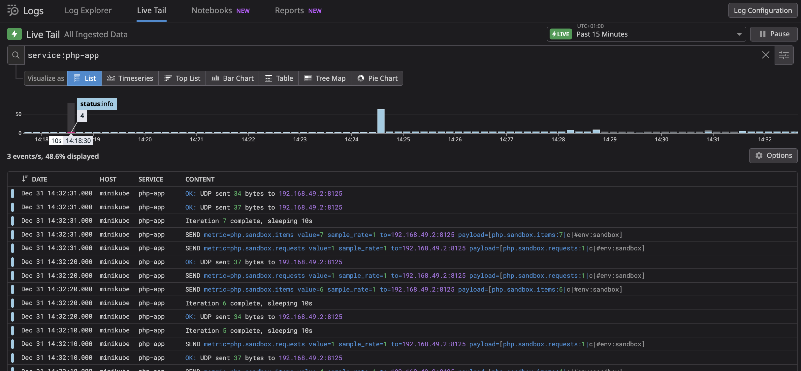

# DogStatsD PHP Custom Metrics Sandbox


## 📋 Overview

This sandbox demonstrates how to send custom metrics from a PHP application to the Datadog Agent via DogStatsD (UDP) in Kubernetes.

**Features:**
- PHP app sending custom metrics via UDP
- Detailed logging with all key variables in message
- Automatic log collection by Agent
- Continuous metric sending every 10 seconds

## 📊 Sample Rate Explanation

The `sampleRate` parameter controls what percentage of metrics are sent:

| Sample Rate | Meaning | Result |
|-------------|---------|--------|
| `1` (default) | No sampling | **100% of metrics sent** |
| `0.5` | 50% sampling | 50% of metrics sent |
| `0.1` | 90% sampling | 10% of metrics sent |
| `0` | Everything sampled | **0% of metrics sent** |

> **Note:** Sample rate `0` means everything is sampled (dropped), so nothing is sent.
> Sample rate `1` means no sampling, so everything is sent.

---

## 🔧 Sandbox Setup

### Step 1: Start Minikube

```bash
minikube delete --all
minikube start --driver=docker --memory=4096 --cpus=2
```

### Step 2: Deploy Datadog Agent

```bash
# Create namespace and secret
kubectl create namespace datadog
kubectl create secret generic datadog-secret \
  --from-literal=api-key="<YOUR_API_KEY>" \
  -n datadog

# Create values.yaml
cat <<'EOF' > /tmp/values.yaml
datadog:
  apiKeyExistingSecret: "datadog-secret"
  site: "datadoghq.com"
  
  # Required for minikube
  kubelet:
    tlsVerify: false
  
  # DogStatsD Configuration
  dogstatsd:
    useHostPort: true
    hostPort: 8125
    nonLocalTraffic: true      # CRITICAL: Allow traffic from other pods
    originDetection: true
    tagCardinality: "orchestrator"

  # Logs collection
  logs:
    enabled: true
    containerCollectAll: true

  tags:
    - "env:sandbox"

agents:
  enabled: true
  tolerations:
    - operator: Exists

clusterAgent:
  enabled: true
  replicas: 1
EOF

# Install Agent
helm repo add datadog https://helm.datadoghq.com
helm install datadog-agent datadog/datadog -f /tmp/values.yaml -n datadog
```

### Step 3: Verify Agent DogStatsD

```bash
# Check Agent status
kubectl exec -it <agent-pod> -n datadog -c agent -- agent status | grep -A 15 "DogStatsD"

# Verify DogStatsD environment variables
kubectl get pod <agent-pod> -n datadog -o jsonpath='{.spec.containers[0].env}' | jq '.[] | select(.name | contains("STATSD"))'
```

---

## 🐘 PHP DogStatsD Test

### Step 1: Create PHP Code ConfigMap

```bash
cat <<'EOF' | kubectl apply -f -
apiVersion: v1
kind: ConfigMap
metadata:
  name: php-dogstatsd-code
  namespace: default
data:
  test.php: |
    <?php
    /**
     * DogStatsD PHP UDP Test - All values in message for easy debugging
     */
    class DogStatsd {
        private string $host;
        private int $port;
        
        public function __construct() {
            $envHost = getenv('DD_AGENT_HOST');
            $envPort = getenv('DD_DOGSTATSD_PORT');
            $this->host = $envHost ?: 'localhost';
            $this->port = (int)($envPort ?: 8125);
            
            $hostSrc = $envHost ? 'from DD_AGENT_HOST' : 'DEFAULT (localhost)';
            $portSrc = $envPort ? 'from DD_DOGSTATSD_PORT' : 'DEFAULT (8125)';
            $this->log("DogStatsD initialized: host={$this->host} ({$hostSrc}), port={$this->port} ({$portSrc})");
        }
        
        public function increment(string $metric, int $value = 1, array $tags = [], float $sampleRate = 1.0): void {
            $payload = "{$metric}:{$value}|c" . $this->formatTags($tags);
            $this->log("SEND metric={$metric} value={$value} sample_rate={$sampleRate} to={$this->host}:{$this->port} payload=[{$payload}]");
            $this->sendUdp($payload);
        }
        
        private function formatTags(array $tags): string {
            if (empty($tags)) return '';
            $pairs = [];
            foreach ($tags as $k => $v) { $pairs[] = "{$k}:{$v}"; }
            return '|#' . implode(',', $pairs);
        }
        
        private function sendUdp(string $message): void {
            $fp = @fsockopen("udp://{$this->host}", $this->port, $errno, $errstr, 1);
            if (!$fp) {
                $this->log("ERROR: UDP failed to {$this->host}:{$this->port} errno={$errno} errstr={$errstr}");
                return;
            }
            $bytes = fwrite($fp, $message);
            fclose($fp);
            $this->log("OK: UDP sent {$bytes} bytes to {$this->host}:{$this->port}");
        }
        
        private function log(string $message): void {
            echo json_encode(['timestamp' => date('c'), 'service' => 'php-app', 'message' => $message]) . "\n";
        }
    }
    
    // Startup log
    $h = getenv('DD_AGENT_HOST') ?: 'NOT SET';
    $p = getenv('DD_DOGSTATSD_PORT') ?: 'NOT SET';
    echo json_encode(['timestamp' => date('c'), 'service' => 'php-app', 
        'message' => "STARTUP: DD_AGENT_HOST={$h} DD_DOGSTATSD_PORT={$p} PHP=" . PHP_VERSION]) . "\n";
    
    $statsd = new DogStatsd();
    $counter = 0;
    while (true) {
        $counter++;
        $statsd->increment('php.sandbox.requests', 1, ['env' => 'sandbox']);
        $statsd->increment('php.sandbox.items', rand(1, 10), ['env' => 'sandbox']);
        echo json_encode(['timestamp' => date('c'), 'service' => 'php-app', 'message' => "Iteration {$counter} complete"]) . "\n";
        sleep(10);
    }
EOF
```

### Step 2: Create PHP Pod

```bash
cat <<'EOF' | kubectl apply -f -
apiVersion: v1
kind: Pod
metadata:
  name: php-dogstatsd-test
  namespace: default
  labels:
    app: php-dogstatsd-test
    tags.datadoghq.com/service: "php-app"
    tags.datadoghq.com/env: "sandbox"
  annotations:
    ad.datadoghq.com/php.logs: '[{"source": "php", "service": "php-app"}]'
spec:
  containers:
  - name: php
    image: php:8.2-cli
    command: ["php", "/app/test.php"]
    env:
    - name: DD_AGENT_HOST
      valueFrom:
        fieldRef:
          fieldPath: status.hostIP
    - name: DD_DOGSTATSD_PORT
      value: "8125"
    volumeMounts:
    - name: php-code
      mountPath: /app
  volumes:
  - name: php-code
    configMap:
      name: php-dogstatsd-code
EOF

kubectl wait --for=condition=Ready pod/php-dogstatsd-test --timeout=60s
```

### Step 3: View Logs

```bash
# Watch PHP app logs (sends metrics every 10s)
kubectl logs -f php-dogstatsd-test
```

### Expected Output

```json
{"message":"STARTUP: DD_AGENT_HOST=192.168.49.2 DD_DOGSTATSD_PORT=8125 PHP=8.2.30"}
{"message":"DogStatsD initialized: host=192.168.49.2 (from DD_AGENT_HOST), port=8125 (from DD_DOGSTATSD_PORT)"}
{"message":"SEND metric=php.sandbox.requests value=1 sample_rate=1 to=192.168.49.2:8125 payload=[php.sandbox.requests:1|c|#env:sandbox]"}
{"message":"OK: UDP sent 37 bytes to 192.168.49.2:8125"}
{"message":"Iteration 1 complete"}
```

**Key values in message:**
- `DD_AGENT_HOST=192.168.49.2` - Actual host value
- `(from DD_AGENT_HOST)` - Source (env var vs default)
- `sample_rate=1` - Sample rate used
- `payload=[...]` - Exact UDP message sent

### Step 4: Verify Agent Received Metrics

```bash
kubectl exec <agent-pod> -n datadog -c agent -- agent status | grep "Udp Packets"
```

### 📸 Expected Results in Datadog

**Custom Metrics:**


**PHP App Logs:**



---

## 🔌 Alternative: Unix Domain Socket (UDS)

UDS is more reliable than UDP (no packet loss).

**Agent values.yaml:**
```yaml
datadog:
  dogstatsd:
    useSocketVolume: true
    socketPath: /var/run/datadog/dsd.socket
```

**PHP App Pod:**
```yaml
volumes:
  - name: dsdsocket
    hostPath:
      path: /var/run/datadog/
containers:
  - name: php-app
    volumeMounts:
      - name: dsdsocket
        mountPath: /var/run/datadog
        readOnly: true
```

**PHP Code:**
```php
$statsd = new DogStatsd([
    'socket_path' => '/var/run/datadog/dsd.socket',
]);
```

---

## 🔍 Troubleshooting

### Metrics Not Received

1. **Check Agent DogStatsD status:**
   ```bash
   kubectl exec <agent-pod> -c agent -- agent status | grep -A 15 "DogStatsD"
   ```

2. **Test UDP connectivity:**
   ```bash
   kubectl exec <php-pod> -- sh -c 'echo "test:1|c" | nc -u -w1 $DD_AGENT_HOST 8125'
   ```

3. **Verify `nonLocalTraffic: true`:**
   ```bash
   kubectl get pod <agent-pod> -n datadog -o jsonpath='{.spec.containers[0].env}' | grep NON_LOCAL
   ```

4. **Check `DD_AGENT_HOST` is set in PHP pod:**
   ```bash
   kubectl exec <php-pod> -- env | grep DD_
   ```

### Logs Not Collected

1. **Verify logs are enabled:**
   ```bash
   kubectl exec <agent-pod> -c agent -- agent status | grep -A 10 "Logs Agent"
   ```

2. **For minikube, ensure `kubelet.tlsVerify: false`**

---

## 📚 Reference Documentation

- [DogStatsD PHP Client GitHub](https://github.com/DataDog/php-datadogstatsd)
- [DogStatsD Documentation](https://docs.datadoghq.com/developers/dogstatsd/)
- [Troubleshooting DogStatsD](https://docs.datadoghq.com/developers/dogstatsd/troubleshooting/)
- [Unix Domain Socket Setup](https://docs.datadoghq.com/developers/dogstatsd/unix_socket/)

---
