# Bottlerocket SELinux + Datadog system-probe Sandbox

## 🎯 Issue Summary

**system-probe** running as `container_t` with MCS labels is **blocked by SELinux** from inspecting other containers on Bottlerocket nodes.

This sandbox reproduces the issue and demonstrates the workaround using `seLinuxOptions`.

---

## 📋 Environment

| Component | Version |
|-----------|---------|
| **Kubernetes** | 1.33 on EKS |
| **Bottlerocket OS** | 1.52.0 |
| **Datadog Helm Chart** | 3.85.0 |
| **Datadog Agent Image** | 7.60.1 |
| **Cluster Name** | `dd-bottlerocket-repro` |
| **Region** | `us-east-1` |

---

## 🔴 Reproduced SELinux Denials

### 1. `signull` Denial (Process Checking)
```
avc:  denied  { signull } for  pid=33121 comm="kill" 
  scontext=system_u:system_r:container_t:s0:c133,c439 
  tcontext=system_u:system_r:container_t:s0:c565,c975 
  tclass=process permissive=0
```
**Impact:** system-probe cannot check if processes in other containers exist (kill -0)

### 2. `search` Denial (Filesystem Access)
```
avc:  denied  { search } for  pid=29591 comm="system-probe" name="/" dev="overlay" 
  scontext=system_u:system_r:container_t:s0:c133,c439 
  tcontext=system_u:object_r:data_t:s0:c565,c975 
  tclass=dir permissive=0
```
**Impact:** system-probe cannot access other containers' overlay filesystems

### 3. `search` Denial (Secrets Access)
```
avc:  denied  { search } for  pid=29591 comm="system-probe" 
  scontext=system_u:system_r:container_t:s0:c133,c439 
  tcontext=system_u:object_r:secret_t:s0 
  tclass=dir permissive=0
```
**Impact:** system-probe cannot access Kubernetes secrets directories

---

## 🏗️ Architecture

### Security Layers Stack

```mermaid
flowchart TB
    subgraph app["Application Layer"]
        sysprobe["🔍 system-probe<br/>wants to call kill -0"]
    end
    
    subgraph security["Security Layers (must pass ALL)"]
        direction TB
        
        subgraph caps["1️⃣ Linux Capabilities"]
            cap_check{"CAP_KILL?"}
        end
        
        subgraph seccomp["2️⃣ Seccomp Filter"]
            seccomp_check{"kill syscall<br/>with signal=0?"}
        end
        
        subgraph selinux["3️⃣ SELinux Policy"]
            selinux_check{"container_t can<br/>signull container_t<br/>with different MCS?"}
        end
    end
    
    subgraph result["Result"]
        success["✅ Success"]
        denied["❌ Permission denied"]
    end
    
    sysprobe --> cap_check
    cap_check -->|"✅ Helm grants CAP_KILL"| seccomp_check
    seccomp_check -->|"✅ Helm allows kill -0"| selinux_check
    selinux_check -->|"❌ MCS isolation"| denied
    selinux_check -->|"✅ With spc_t"| success
    
    style cap_check fill:#69db7c,stroke:#2f9e44,color:#000
    style seccomp_check fill:#69db7c,stroke:#2f9e44,color:#000
    style selinux_check fill:#ff6b6b,stroke:#c92a2a,color:#fff
    style denied fill:#ff6b6b,stroke:#c92a2a,color:#fff
    style success fill:#69db7c,stroke:#2f9e44,color:#000
```



### Before vs After Fix

```mermaid
flowchart TB
    subgraph before["❌ Before Fix - container_t with MCS"]
        sp1["system-probe<br/>container_t:s0:c133,c439"]
        nginx1["nginx<br/>container_t:s0:c565,c975"]
        sp1 -. "❌ signull denied<br/>(different MCS labels)" .-> nginx1
    end
    
    subgraph after["✅ After Fix - spc_t without MCS"]
        sp2["system-probe<br/>control_t:s0"]
        nginx2["nginx<br/>container_t:s0:c565,c975"]
        sp2 -- "✅ signull allowed<br/>(spc_t bypasses MCS)" --> nginx2
    end
    
    before --> |"Add seLinuxOptions"| after
```



---

## 🔐 Security Layers Explained

### Three Layers Must ALL Allow the Operation

| Layer | What it controls | Configured by | Status for kill -0 |
|-------|------------------|---------------|---------------------|
| **1. Capabilities** | Privileged operations | Helm chart | ✅ `CAP_KILL` granted |
| **2. Seccomp** | Which syscalls allowed | Helm chart | ✅ `kill -0` in allowlist |
| **3. SELinux** | Resource access control | **You** | ❌ Blocks cross-container |

### Verified Seccomp Configuration

The Helm chart includes this seccomp rule ([source](https://github.com/DataDog/helm-charts/blob/datadog-3.85.0/charts/datadog/templates/system-probe-configmap.yaml#L93)):

```json
{
  "names": ["kill"],
  "action": "SCMP_ACT_ALLOW",
  "args": [{"index": 1, "value": 0, "op": "SCMP_CMP_EQ"}],
  "comment": "allow process detection via kill"
}
```

**Verify on cluster:**
```bash
kubectl get configmap datadog-agent-security -n datadog \
  -o jsonpath='{.data.system-probe-seccomp\.json}' | jq '.syscalls[] | select(.names[] == "kill")'
```

---

## 🚀 Quick Start

### Prerequisites
- AWS CLI configured with appropriate permissions
- `aws-vault` for credential management
- `kubectl` installed
- `helm` installed
- `eksctl` installed

### 0. Authenticate with AWS Vault

```bash
# Set your AWS profile
export AWS_PROFILE=sso-tse-sandbox-account-admin

# Login to AWS SSO (opens browser for authentication)
aws-vault login $AWS_PROFILE

# Verify credentials work
aws-vault exec $AWS_PROFILE -- aws sts get-caller-identity
```

> **Note:** If your session expires during long operations, re-run `aws-vault login $AWS_PROFILE`

### 1. Create EKS Cluster with Bottlerocket Nodes

```bash
aws-vault exec $AWS_PROFILE -- eksctl create cluster \
  --name dd-bottlerocket-repro \
  --region us-east-1 \
  --version 1.31 \
  --nodegroup-name bottlerocket-ng \
  --node-ami-family Bottlerocket \
  --node-type t3.medium \
  --nodes 1
```

### 2. Install EKS Add-ons (if nodes stuck in NotReady)

```bash
for addon in vpc-cni coredns kube-proxy; do
  aws-vault exec $AWS_PROFILE -- aws eks create-addon \
    --cluster-name dd-bottlerocket-repro \
    --addon-name $addon \
    --region us-east-1
done
```

### 3. Deploy Datadog Agent WITHOUT seLinuxOptions

```bash
# Create namespace and secret
aws-vault exec $AWS_PROFILE -- kubectl create namespace datadog
aws-vault exec $AWS_PROFILE -- kubectl create secret generic datadog-secret \
  --from-literal=api-key=YOUR_API_KEY -n datadog

# Deploy without seLinuxOptions
helm install datadog-agent datadog/datadog -n datadog \
  --set datadog.apiKeyExistingSecret=datadog-secret \
  --set datadog.networkMonitoring.enabled=true \
  --set datadog.serviceMonitoring.enabled=true
```

### 4. Reproduce SELinux Denial

```bash
# Deploy test workload
kubectl run nginx-test --image=nginx

# Check SELinux context (should show container_t with MCS labels)
kubectl exec -n datadog daemonset/datadog-agent -c system-probe -- cat /proc/self/attr/current

# Try signull (should fail)
NGINX_PID=$(kubectl exec -n datadog daemonset/datadog-agent -c system-probe -- ps aux | grep "nginx: master" | awk '{print $2}')
kubectl exec -n datadog daemonset/datadog-agent -c system-probe -- kill -0 $NGINX_PID
# Expected: kill: (XXXXX): Permission denied
```

---

## ❓ Does Upgrading Helm Chart / Agent Fix This?

**No.** Upgrading to the latest versions does not automatically fix this issue.

| Version | Tested | Auto-detects Bottlerocket? | Auto-applies seLinuxOptions? |
|---------|--------|---------------------------|------------------------------|
| Helm 3.85.0 / Agent 7.60.1 | ✅ Yes | ❌ No | ❌ No |
| Helm 3.160.3 / Agent 7.x (latest) | ❌ No | ❌ No | ❌ No |

### Why Upgrading Doesn't Help

The Helm chart:
- ✅ Provides `seLinuxOptions` as a configurable value
- ✅ Configures seccomp to allow `kill -0`
- ✅ Grants `CAP_KILL` capability
- ❌ Does **NOT** auto-detect Bottlerocket nodes
- ❌ Does **NOT** automatically apply `spc_t` SELinux type

### The Gap

```
┌─────────────────────────────────────────────────────────────────┐
│  Helm Chart (any version)         │  Bottlerocket SELinux       │
├───────────────────────────────────┼─────────────────────────────┤
│  ✅ CAP_KILL granted              │  ❌ MCS isolation blocks    │
│  ✅ Seccomp allows kill -0        │  ❌ container_t restricted  │
│  ❌ No seLinuxOptions by default  │  ← YOU MUST CONFIGURE THIS  │
└───────────────────────────────────┴─────────────────────────────┘
```

> **Potential Feature Request:** The Helm chart could detect Bottlerocket nodes (via node labels or OS detection) and automatically apply appropriate SELinux settings.

---

## ✅ Workaround: Apply seLinuxOptions

### Helm Values

```yaml
datadog:
  securityContext:
    seLinuxOptions:
      user: "system_u"
      role: "system_r"
      type: "spc_t"  # Super Privileged Container
      level: "s0"
```

> **Note:** Correct path is `datadog.securityContext.seLinuxOptions`

### Verify Fix

```bash
# After applying seLinuxOptions
kubectl exec -n datadog daemonset/datadog-agent -c system-probe -- cat /proc/self/attr/current
# Expected: system_u:system_r:control_t:s0 (no MCS labels)

kubectl exec -n datadog daemonset/datadog-agent -c system-probe -- kill -0 $NGINX_PID
# Expected: exit code 0 (success)
```

| Test | Before | After |
|------|--------|-------|
| SELinux context | `container_t:s0:c133,c439` | `control_t:s0` |
| `kill -0` | ❌ Permission denied | ✅ OK |
| `/proc/<pid>` access | ❌ Permission denied | ✅ OK |

---

## 🧹 Cleanup

```bash
aws-vault exec $AWS_PROFILE -- eksctl delete cluster \
  --name dd-bottlerocket-repro \
  --region us-east-1
```

---

## 📚 References

### Datadog
- [Cloud Network Monitoring Setup](https://docs.datadoghq.com/network_monitoring/cloud_network_monitoring/setup/?tab=helm)
- [Helm Chart Seccomp Rule](https://github.com/DataDog/helm-charts/blob/datadog-3.85.0/charts/datadog/templates/system-probe-configmap.yaml#L93)

### SELinux
- [Bottlerocket SELinux Guide](https://github.com/bottlerocket-os/bottlerocket/blob/develop/SECURITY_GUIDANCE.md#selinux)
- [Kubernetes SELinux Context](https://kubernetes.io/docs/tasks/configure-pod-container/security-context/#assign-selinux-labels-to-a-container)
- [Red Hat SELinux MCS](https://access.redhat.com/documentation/en-us/red_hat_enterprise_linux/8/html/using_selinux/assembly_using-multi-level-security-mls_using-selinux)

### Seccomp
- [Kubernetes Seccomp Tutorial](https://kubernetes.io/docs/tutorials/security/seccomp/)
- [Linux Seccomp Man Page](https://man7.org/linux/man-pages/man2/seccomp.2.html)
- [Docker Seccomp Profiles](https://docs.docker.com/engine/security/seccomp/)

---

## 📝 Reproduction Log

**Date:** 2026-01-15  
**Reproduced by:** Alexandre VEA

- ✅ `signull` denial reproduced
- ✅ `search` on overlay directories reproduced
- ✅ `search` on secret_t reproduced
- ✅ Seccomp configuration verified
- ✅ Workaround verified working
