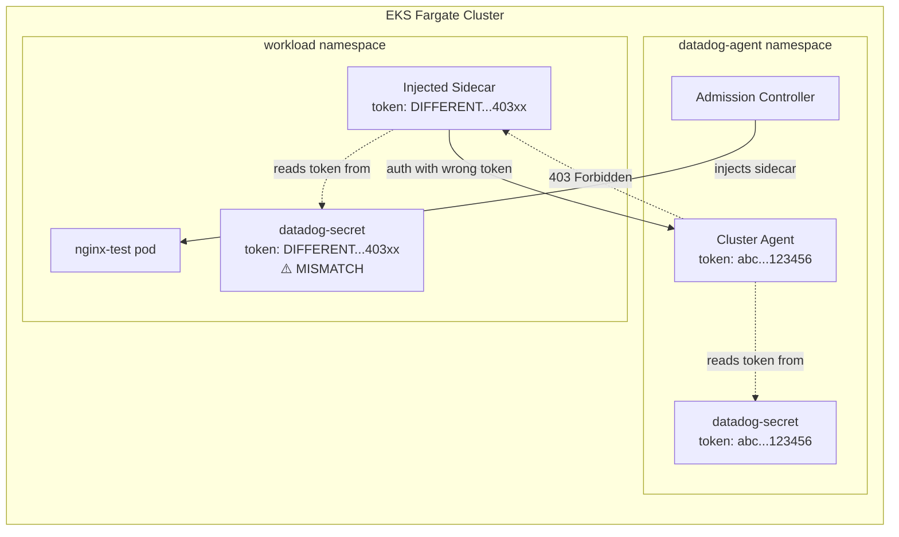

# EKS Fargate Sidecar - 403 Forbidden Token Mismatch

## Context

This sandbox reproduces a 403 Forbidden error when the Datadog Agent sidecar (injected by the Admission Controller on EKS Fargate) tries to communicate with the Cluster Agent.

The root cause is a token mismatch: the `datadog-secret` in the workload namespace has a different `token` value than the one in the `datadog-agent` namespace. The Cluster Agent rejects the authentication, breaking orchestrator data, node labels, and metadata collection.

```
CORE | ERROR | check:orchestrator_kubelet_config | Error running check:
temporary failure in clusterAgentClient, will retry later:
"https://datadog-agent-cluster-agent.datadog-agent.svc.cluster.local:5005/version"
is unavailable: 403 Forbidden
```

## Environment

- **Agent Version:** latest
- **Platform:** AWS EKS Fargate (Kubernetes 1.31)
- **Integration:** Cluster Agent + Admission Controller sidecar injection

## Schema



## Quick Start

### 1. Create EKS Fargate cluster

```bash
eksctl create cluster -f - <<'EOF'
apiVersion: eksctl.io/v1alpha5
kind: ClusterConfig

metadata:
  name: fargate-403-repro
  region: eu-west-2
  version: "1.31"

fargateProfiles:
  - name: fp-default
    selectors:
      - namespace: default
      - namespace: kube-system
  - name: fp-datadog
    selectors:
      - namespace: datadog-agent
  - name: fp-workload
    selectors:
      - namespace: workload
EOF
```

### 2. Create namespaces and secrets with MISMATCHED tokens

```bash
kubectl create namespace datadog-agent
kubectl create namespace workload

# Secret in datadog-agent namespace (Cluster Agent reads this)
kubectl create secret generic datadog-secret -n datadog-agent \
  --from-literal api-key=YOUR_API_KEY \
  --from-literal token=abcdefghijklmnopqrstuvwxyz123456

# Secret in workload namespace with DIFFERENT token (causes 403)
kubectl create secret generic datadog-secret -n workload \
  --from-literal api-key=YOUR_API_KEY \
  --from-literal token=DIFFERENT_TOKEN_WILL_CAUSE_403xx
```

### 3. Deploy Datadog Agent with Admission Controller

Create `values.yaml`:

```yaml
datadog:
  site: datadoghq.com
  clusterName: fargate-403-repro
  apiKeyExistingSecret: datadog-secret

clusterAgent:
  enabled: true
  tokenExistingSecret: datadog-secret
  tokenExistingSecretKey: token
  admissionController:
    enabled: true
    agentSidecarInjection:
      enabled: true
      provider: fargate
      clusterAgentCommunicationEnabled: true

agents:
  enabled: false
```

Install the agent:

```bash
helm repo add datadog https://helm.datadoghq.com && helm repo update
helm install datadog-agent datadog/datadog -n datadog-agent -f values.yaml
```

### 4. Apply RBAC and deploy test workload

```bash
# RBAC for sidecar
kubectl apply -f - <<'EOF'
apiVersion: rbac.authorization.k8s.io/v1
kind: ClusterRole
metadata:
  name: datadog-agent-fargate
rules:
  - apiGroups: [""]
    resources: [nodes, namespaces, endpoints]
    verbs: [get, list]
  - apiGroups: [""]
    resources: [nodes/metrics, nodes/spec, nodes/stats, nodes/proxy, nodes/pods, nodes/healthz]
    verbs: [get]
---
apiVersion: rbac.authorization.k8s.io/v1
kind: ClusterRoleBinding
metadata:
  name: datadog-agent-fargate
roleRef:
  apiGroup: rbac.authorization.k8s.io
  kind: ClusterRole
  name: datadog-agent-fargate
subjects:
  - kind: ServiceAccount
    name: default
    namespace: workload
EOF

# Test workload with sidecar injection label
kubectl apply -f - <<'EOF'
apiVersion: apps/v1
kind: Deployment
metadata:
  name: nginx-test
  namespace: workload
spec:
  replicas: 1
  selector:
    matchLabels:
      app: nginx-test
  template:
    metadata:
      labels:
        app: nginx-test
        agent.datadoghq.com/sidecar: fargate
    spec:
      containers:
      - name: nginx
        image: nginx:alpine
        ports:
        - containerPort: 80
EOF
```

### 5. Wait and observe errors

```bash
# Wait for Fargate scheduling (~2 min)
sleep 120

# Verify sidecar was injected (should show 2/2)
kubectl get pods -n workload

# Check for 403 errors
kubectl logs -n workload -l app=nginx-test -c datadog-agent-injected 2>&1 | grep "403 Forbidden"
```

## Test Commands

### Check for 403 errors in sidecar

```bash
kubectl logs -n workload -l app=nginx-test -c datadog-agent-injected 2>&1 | grep -i "403\|Forbidden\|clusterAgentClient"
```

### Check Cluster Agent status

```bash
kubectl get pods -n datadog-agent
kubectl logs -n datadog-agent -l app=datadog-agent-cluster-agent --tail=100
```

### Verify token mismatch

```bash
# Compare tokens
echo "datadog-agent ns token:"
kubectl get secret datadog-secret -n datadog-agent -o jsonpath='{.data.token}' | base64 -d && echo
echo "workload ns token:"
kubectl get secret datadog-secret -n workload -o jsonpath='{.data.token}' | base64 -d && echo
```

## Expected vs Actual

| Behavior | Expected (Matching Tokens) | Actual (Mismatched Tokens) |
|----------|---------------------------|----------------------------|
| Sidecar pod status | 2/2 Running | 2/2 Running |
| Cluster Agent auth | 200 OK | **403 Forbidden** |
| Orchestrator checks | Data collected | **Error running check** |
| Node labels | Auto-discovered | **Unable to auto discover** |
| K8s Monitoring | Pods visible | **Pods in Error state** |

### Observed Errors - 403 REPRODUCED

**Pod Status:**
```
NAME                          READY   STATUS    RESTARTS   AGE
nginx-test-865875fd7c-d2xdd   2/2     Running   0          101s
```

**Sidecar Logs - 403 Forbidden:**
```
2026-02-23 09:26:26 UTC | CORE | ERROR | (pkg/collector/worker/check_logger.go:71 in Error) |
check:orchestrator_kubelet_config | Error running check: temporary failure in clusterAgentClient,
will retry later: "https://datadog-agent-cluster-agent.datadog-agent.svc.cluster.local:5005/version"
is unavailable: 403 Forbidden

2026-02-23 09:27:01 UTC | CORE | ERROR | (comp/core/workloadmeta/collectors/internal/kubemetadata/kubemetadata.go:90 in Start) |
Could not initialise the communication with the cluster agent: temporary failure in clusterAgentClient,
will retry later: "https://datadog-agent-cluster-agent.datadog-agent.svc.cluster.local:5005/version"
is unavailable: 403 Forbidden
```

## Fix / Workaround

Fix the token in the workload namespace to match the one in the datadog-agent namespace:

```bash
# Delete the mismatched secret
kubectl delete secret datadog-secret -n workload

# Create with the SAME token as the datadog-agent namespace
kubectl create secret generic datadog-secret -n workload \
  --from-literal api-key=YOUR_API_KEY \
  --from-literal token=abcdefghijklmnopqrstuvwxyz123456

# Restart the workload to pick up the new secret
kubectl delete pod -n workload -l app=nginx-test
```

### After Fix - 403 Gone

```bash
# Wait for new pod (~2 min on Fargate)
sleep 120

# Verify no more 403
kubectl logs -n workload -l app=nginx-test -c datadog-agent-injected 2>&1 | grep "403 Forbidden"
# No output = fixed

# Verify successful initialization
kubectl logs -n workload -l app=nginx-test -c datadog-agent-injected 2>&1 | grep "successfully"
# Should show: "successfully loaded the IPC auth primitives"
```

**Verified result after fix:**
```
2026-02-23 09:29:32 UTC | TRACE | INFO | successfully loaded the IPC auth primitives (fingerprint: 6071065a260698ad)
2026-02-23 09:29:34 UTC | SYS-PROBE | INFO | workloadmeta store initialized successfully
2026-02-23 09:29:34 UTC | SYS-PROBE | INFO | remote tagger initialized successfully
2026-02-23 09:29:34 UTC | SYS-PROBE | INFO | remote workloadmeta initialized successfully
```

Zero 403 errors. All components initialized successfully.

## Troubleshooting

```bash
# Sidecar logs
kubectl logs -n workload -l app=nginx-test -c datadog-agent-injected --tail=100

# Cluster Agent logs
kubectl logs -n datadog-agent -l app=datadog-agent-cluster-agent --tail=100

# Describe pod (check sidecar injection)
kubectl describe pod -n workload -l app=nginx-test

# Check admission webhook
kubectl get mutatingwebhookconfigurations

# Get events
kubectl get events -n workload --sort-by='.lastTimestamp'
kubectl get events -n datadog-agent --sort-by='.lastTimestamp'
```

## Cleanup

```bash
helm uninstall datadog-agent -n datadog-agent
kubectl delete namespace workload
kubectl delete namespace datadog-agent
kubectl delete clusterrole datadog-agent-fargate
kubectl delete clusterrolebinding datadog-agent-fargate
exksctl delete cluster --name fargate-403-repro --region eu-west-2
```

## References

- [EKS Fargate Integration](https://docs.datadoghq.com/integrations/eks_fargate/)
- [EKS Fargate Prerequisites - Secret for Keys and Tokens](https://docs.datadoghq.com/integrations/eks_fargate/#secret-for-keys-and-tokens)
- [Cluster Agent Setup](https://docs.datadoghq.com/containers/cluster_agent/setup/)
- [Admission Controller](https://docs.datadoghq.com/containers/cluster_agent/admission_controller/)
- [Helm Chart Values](https://github.com/DataDog/helm-charts/blob/main/charts/datadog/values.yaml)
