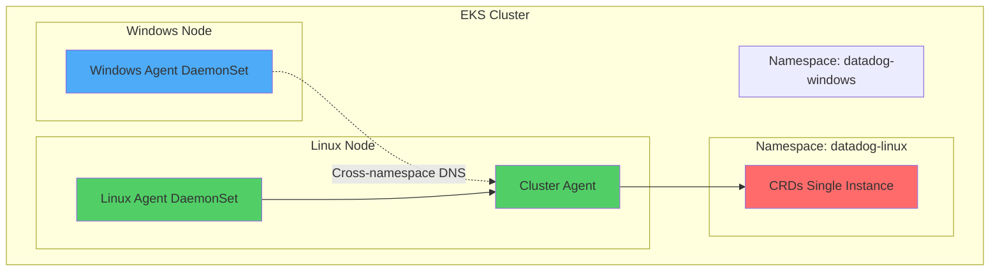

# Mixed Kubernetes Cluster (Linux + Windows) - CRD Ownership Conflict

**Note:** All configurations are included inline for easy copy-paste reproduction. Never put API keys directly in manifests - use Kubernetes secrets.

## Context

When deploying Datadog Agents to a mixed Kubernetes cluster with both Linux and Windows nodes using Helm, a CustomResourceDefinition (CRD) ownership conflict occurs if attempting to deploy two separate Helm releases in the same namespace. This sandbox demonstrates the CRD conflict and provides **two solutions**: separate namespaces (recommended) and same namespace with `--skip-crds` (simpler).

**Error:** 
```
Error: unable to continue with install: CustomResourceDefinition "datadogdashboards.datadoghq.com" 
exists and cannot be imported into the current release: invalid ownership metadata; 
annotation validation error: key "meta.helm.sh/release-name" must equal "datadog-windows": 
current value is "datadog-linux"
```

## Environment

* **Agent Version:** 7.x
* **Platform:** AWS EKS / Kubernetes 1.31+
* **Node Types:** Linux (Amazon Linux 2) + Windows Server 2022
* **Helm Chart:** datadog/datadog 3.164.1+

**Commands to get versions:**

```bash
# Agent version
kubectl exec -n datadog-linux daemonset/datadog-agent -c agent -- agent version

# Kubernetes version
kubectl version --short

# Node OS details
kubectl get nodes -o wide
```

## Schema



## Quick Start

**Two deployment options available:**
- **Option 1 (Recommended):** Separate namespaces - Better isolation
- **Option 2 (Simpler):** Same namespace with `--skip-crds` - Less complexity

### 1. Start EKS Cluster

```bash
# Set AWS profile for authentication
export AWS_PROFILE=your-aws-profile
export AWS_REGION=us-east-1

# Create EKS cluster with Linux nodes
aws-vault exec $AWS_PROFILE -- eksctl create cluster \
  --name mixed-cluster-repro \
  --region $AWS_REGION \
  --version 1.31 \
  --nodegroup-name linux-ng \
  --node-type t3.medium \
  --nodes 1 \
  --managed

# Wait ~15 minutes for cluster creation
```

### 2. Add Windows Node Group

```bash
# Create Windows node group
aws-vault exec $AWS_PROFILE -- eksctl create nodegroup \
  --cluster mixed-cluster-repro \
  --region $AWS_REGION \
  --name windows-ng \
  --node-type t3.large \
  --nodes 1 \
  --node-ami-family WindowsServer2022CoreContainer

# Wait ~10 minutes for Windows nodes to be ready
```

### 3. Wait for nodes to be ready

```bash
# Verify both Linux and Windows nodes are Ready
aws-vault exec $AWS_PROFILE -- kubectl get nodes -o wide

# Expected output:
# NAME                            STATUS   ROLES    OS       
# ip-xxx.ec2.internal             Ready    <none>   linux    
# ip-xxx.ec2.internal             Ready    <none>   windows  
```

### 4. Deploy Datadog Agent

Choose your deployment option:

---

## OPTION 1: Separate Namespaces (Recommended)

### 4a. Create namespaces and secrets

```bash
# Add Helm repo
helm repo add datadog https://helm.datadoghq.com
helm repo update

# Create Linux namespace and secret
kubectl create namespace datadog-linux
kubectl create secret generic datadog-secret \
  --from-literal=api-key=YOUR_API_KEY \
  -n datadog-linux

# Create Windows namespace and secret
kubectl create namespace datadog-windows
kubectl create secret generic datadog-secret \
  --from-literal=api-key=YOUR_API_KEY \
  -n datadog-windows
```

### 4b. Create values-linux.yaml

```yaml
datadog:
  apiKeyExistingSecret: datadog-secret
  site: datadoghq.com
  clusterName: mixed-cluster-repro
  targetSystem: linux
  kubeStateMetricsEnabled: true

clusterAgent:
  enabled: true
  replicas: 1
  nodeSelector:
    kubernetes.io/os: linux

agents:
  image:
    tag: 7.x  # https://hub.docker.com/r/datadog/agent/tags
  nodeSelector:
    kubernetes.io/os: linux

datadog-crds:
  crds:
    datadogMetrics: true  # Linux release owns CRDs
```

### 4c. Create values-windows.yaml

```yaml
datadog:
  apiKeyExistingSecret: datadog-secret
  site: datadoghq.com
  clusterName: mixed-cluster-repro
  targetSystem: windows
  kubeStateMetricsEnabled: false

clusterAgent:
  enabled: false  # Windows uses Linux Cluster Agent

existingClusterAgent:
  join: true  # Connect to Linux Cluster Agent
  serviceName: datadog-linux-cluster-agent  # Cross-namespace DNS
  tokenSecretName: datadog-linux-cluster-agent-token

agents:
  image:
    tag: 7.x  # https://hub.docker.com/r/datadog/agent/tags
  nodeSelector:
    kubernetes.io/os: windows

datadog-crds:
  crds:
    datadogMetrics: false  # CRITICAL: Disable to prevent conflict
```

### 4d. Install releases

```bash
# Linux release FIRST (owns CRDs)
helm install datadog-linux datadog/datadog \
  --namespace datadog-linux \
  --values values-linux.yaml \
  --wait --timeout 10m

# Windows release SECOND (connects to Linux CA)
helm install datadog-windows datadog/datadog \
  --namespace datadog-windows \
  --values values-windows.yaml \
  --skip-crds \
  --wait --timeout 10m
```

---

## OPTION 2: Same Namespace with --skip-crds (Simpler)

### 4a. Create namespace and secret

```bash
# Add Helm repo
helm repo add datadog https://helm.datadoghq.com
helm repo update

# Create single namespace and secret
kubectl create namespace datadog
kubectl create secret generic datadog-secret \
  --from-literal=api-key=YOUR_API_KEY \
  -n datadog
```

### 4b. Deploy Linux release (owns CRDs)

```bash
helm install datadog-linux datadog/datadog \
  --namespace datadog \
  --set datadog.site=datadoghq.com \
  --set datadog.apiKeyExistingSecret=datadog-secret \
  --set datadog.clusterName=mixed-cluster-repro \
  --set targetSystem=linux \
  --set clusterAgent.enabled=true \
  --set agents.nodeSelector."kubernetes\.io/os"=linux \
  --set clusterAgent.nodeSelector."kubernetes\.io/os"=linux \
  --set datadog-crds.crds.datadogMetrics=true \
  --wait --timeout 10m
```

### 4c. Deploy Windows release (skips CRDs)

```bash
helm install datadog-windows datadog/datadog \
  --namespace datadog \
  --set datadog.site=datadoghq.com \
  --set datadog.apiKeyExistingSecret=datadog-secret \
  --set datadog.clusterName=mixed-cluster-repro \
  --set targetSystem=windows \
  --set clusterAgent.enabled=false \
  --set existingClusterAgent.join=true \
  --set existingClusterAgent.serviceName=datadog-linux-cluster-agent \
  --set existingClusterAgent.tokenSecretName=datadog-linux-cluster-agent-token \
  --set agents.nodeSelector."kubernetes\.io/os"=windows \
  --skip-crds \
  --wait --timeout 10m
```

### Option Comparison

| Aspect | Option 1: Separate Namespaces | Option 2: Same Namespace |
|--------|-------------------------------|-------------------------|
| **Complexity** | Higher | Lower |
| **Isolation** | Better | Same release namespace |
| **DNS** | Cross-namespace | Simple service name |
| **Secrets** | Two secrets | One secret |
| **RBAC** | Cross-namespace permissions | Simpler |
| **Cleanup** | Delete two namespaces | Delete one namespace |
| **Best For** | Production, strict isolation | Testing, simplicity |

---

## Test Commands

### Agent Status

```bash
# Linux Agent status (adjust namespace if using Option 2)
kubectl exec -n datadog-linux daemonset/datadog-agent -c agent -- agent status

# Cluster Agent status
kubectl exec -n datadog-linux deployment/datadog-cluster-agent -- agent status

# Windows Agent status (adjust namespace if using Option 2)
kubectl exec -n datadog-windows <windows-pod-name> -- powershell -c "& 'C:\Program Files\Datadog\Datadog Agent\bin\agent.exe' status"
```

### Verify CRD Ownership

```bash
# Check which release owns CRDs (should be datadog-linux only)
kubectl get crd datadogdashboards.datadoghq.com -o yaml | grep "meta.helm.sh/release"

# Expected output:
# meta.helm.sh/release-name: datadog-linux
# meta.helm.sh/release-namespace: datadog-linux (or datadog if Option 2)
```

### Verify Connectivity

```bash
# Option 1: Test cross-namespace connectivity
kubectl exec -n datadog-windows <windows-pod-name> -- \
  powershell -c "Test-NetConnection datadog-linux-cluster-agent.datadog-linux -Port 5005"

# Option 2: Test same-namespace connectivity
kubectl exec -n datadog <windows-pod-name> -- \
  powershell -c "Test-NetConnection datadog-linux-cluster-agent -Port 5005"

# Check connection status
kubectl logs -n datadog-windows <windows-pod-name> | grep "Cluster Agent"
```

## Expected vs Actual

| Behavior | Expected | Actual |
|----------|----------|--------|
| **CRD Ownership** | ✅ datadog-linux only | ❌ Conflict if same namespace without --skip-crds |
| **Linux Agent** | ✅ Running on Linux nodes | ✅ Running |
| **Windows Agent** | ✅ Running on Windows nodes | ✅ Running |
| **Cluster Agent** | ✅ Running in Linux namespace | ✅ Running |
| **Connectivity** | ✅ Windows → Linux CA | ✅ Connected |
| **Helm Releases** | ✅ Two separate releases | ✅ datadog-linux + datadog-windows |

### Issue Reproduction

**Attempt deploying Windows release in SAME namespace WITHOUT --skip-crds (reproduces error):**

```bash
# This will FAIL with CRD conflict:
helm install datadog-windows datadog/datadog \
  --namespace datadog-linux \
  --set targetSystem=windows \
  --set clusterAgent.enabled=false

# Error output:
# Error: unable to continue with install: CustomResourceDefinition exists 
# and cannot be imported: invalid ownership metadata
```

## Fix / Workaround

**Two solutions available:**

### Solution 1: Separate Namespaces (Recommended)

1. Deploy Linux release in `datadog-linux` namespace (owns CRDs)
2. Deploy Windows release in `datadog-windows` namespace
3. Use cross-namespace DNS: `serviceName.namespace.svc.cluster.local`

**Pros:** Better isolation, clear separation of concerns  
**Cons:** Slightly more complex networking

### Solution 2: Same Namespace with --skip-crds

1. Deploy Linux release in `datadog` namespace (owns CRDs)
2. Deploy Windows release in same `datadog` namespace with `--skip-crds` flag
3. Simple service DNS: `serviceName`

**Pros:** Simpler networking, easier secret management  
**Cons:** Less isolation between releases

**Key Configuration (both options):**

```yaml
# Windows values.yaml
existingClusterAgent:
  join: true
  serviceName: datadog-linux-cluster-agent  # Add .namespace for Option 1
  tokenSecretName: datadog-linux-cluster-agent-token
```

## Troubleshooting

```bash
# Check pod status
kubectl get pods -n datadog-linux  # or -n datadog for Option 2
kubectl get pods -n datadog-windows  # or -n datadog for Option 2

# Describe pods
kubectl describe pod -n datadog-linux -l app=datadog-agent
kubectl describe pod -n datadog-windows

# Check logs
kubectl logs -n datadog-linux -l app=datadog-cluster-agent --tail=100
kubectl logs -n datadog-windows <pod-name> --tail=100

# Get events
kubectl get events -n datadog-linux --sort-by='.lastTimestamp'
kubectl get events -n datadog-windows --sort-by='.lastTimestamp'

# Verify CRD ownership
kubectl get crd | grep datadog
kubectl get crd datadogdashboards.datadoghq.com -o jsonpath='{.metadata.annotations}'

# Check Helm releases
helm list -A | grep datadog

# Verify services
kubectl get svc -n datadog-linux
kubectl get endpoints -n datadog-linux

# Test DNS resolution (Option 1)
kubectl run -n datadog-windows test-dns --image=busybox --rm -it --restart=Never -- \
  nslookup datadog-linux-cluster-agent.datadog-linux.svc.cluster.local

# Test DNS resolution (Option 2)
kubectl run -n datadog test-dns --image=busybox --rm -it --restart=Never -- \
  nslookup datadog-linux-cluster-agent
```

## Cleanup

### Option 1: Separate Namespaces

```bash
# Uninstall Helm releases
helm uninstall datadog-windows -n datadog-windows
helm uninstall datadog-linux -n datadog-linux

# Delete namespaces
kubectl delete namespace datadog-linux
kubectl delete namespace datadog-windows
```

### Option 2: Same Namespace

```bash
# Uninstall Helm releases
helm uninstall datadog-windows -n datadog
helm uninstall datadog-linux -n datadog

# Delete namespace
kubectl delete namespace datadog
```

### Delete EKS Cluster

```bash
# Delete EKS cluster (WARNING: Deletes all resources)
eksctl delete cluster --name mixed-cluster-repro --region us-east-1
```

## References

* [Datadog Kubernetes Installation](https://docs.datadoghq.com/containers/kubernetes/installation/)
* [Datadog Windows Containers](https://docs.datadoghq.com/agent/troubleshooting/windows_containers/)
* [EKS Mixed Cluster Setup](https://docs.aws.amazon.com/eks/latest/userguide/mixed-node-types.html)
* [Helm CRD Management](https://helm.sh/docs/chart_best_practices/custom_resource_definitions/)
* [Datadog Agent Docker Tags](https://hub.docker.com/r/datadog/agent/tags)
