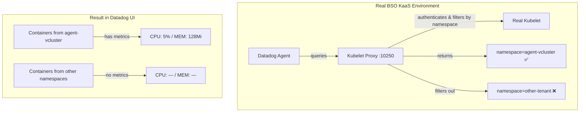

# Kubelet Proxy Filtering - Missing Container CPU/Memory Metrics

## Context

When using a **kubelet proxy** (common in multi-tenant vcluster/KaaS environments like BSO KaaS), some containers may show "—" (dash) instead of CPU/Memory Usage/Limits percentages in the Datadog UI.

This happens when the kubelet proxy **filters metrics by namespace**, returning data only for pods in the agent's vcluster, not all pods on the shared node.

**Symptoms:**
- Agent sees containers on the node (via container runtime)
- Agent cannot get metrics for containers in filtered namespaces
- Agent logs may show: `"Metrics provider returned nil stats for container"`
- Datadog UI shows "—" for CPU/Memory Usage/Limits

## Environment

* **Agent Version:** 7.72.1
* **Platform:** minikube / Kubernetes
* **Integration:** container, kubelet

## Schema



## What This Sandbox Demonstrates

### ✅ Can Reproduce (Terminal Proof)

| Evidence | Command | Result |
|----------|---------|--------|
| Direct kubelet has sandbox metrics | `curl .../metrics/resource \\| grep sandbox` | ✅ Lines present |
| Filtered output missing sandbox | Compare filtered vs original | ❌ 0 lines |
| Namespace filtering concept | grep comparison | Proven |

### ⚠️ Partial Reproduction

The real BSO KaaS kubelet proxy:
1. Handles **authentication at infrastructure level** (not reproducible in minikube)
2. Returns **valid Prometheus metrics** (just filtered by namespace)
3. Agent connects successfully but receives **incomplete data**

### ❌ Cannot Fully Reproduce

- The exact "—" UI display for pods WITH limits requires the customer's actual infrastructure
- The proxy needs to properly forward authentication tokens (complex in minikube)

## Quick Start

### 1. Start minikube

```bash
minikube delete --all
minikube start --memory=4096 --cpus=2
```

### 2. Deploy test pods

```bash
kubectl apply -f - <<'MANIFEST'
---
apiVersion: v1
kind: Namespace
metadata:
  name: sandbox
---
# Pod WITH limits - should show percentage when kubelet accessible
apiVersion: v1
kind: Pod
metadata:
  name: pod-with-limits
  namespace: sandbox
  labels:
    app: test-limits
spec:
  containers:
  - name: nginx
    image: nginx:alpine
    resources:
      requests:
        cpu: 100m
        memory: 128Mi
      limits:
        cpu: 200m
        memory: 256Mi
---
# Pod WITHOUT limits - will show "—" (expected BestEffort behavior)
apiVersion: v1
kind: Pod
metadata:
  name: pod-without-limits
  namespace: sandbox
  labels:
    app: test-limits
spec:
  containers:
  - name: nginx
    image: nginx:alpine
MANIFEST

kubectl wait --for=condition=ready pod -l app=test-limits -n sandbox --timeout=120s
```

### 3. Deploy Datadog Agent

```bash
kubectl create namespace datadog
kubectl create secret generic datadog-secret -n datadog --from-literal=api-key=YOUR_API_KEY
helm repo add datadog https://helm.datadoghq.com && helm repo update
helm upgrade --install datadog-agent datadog/datadog -n datadog \
  --set datadog.apiKeyExistingSecret=datadog-secret \
  --set datadog.site=datadoghq.com \
  --set datadog.clusterName=sandbox \
  --set datadog.kubelet.tlsVerify=false \
  --set clusterAgent.enabled=true \
  --set agents.image.tag=7.72.1
```

### 4. Capture Kubelet Data for Comparison

```bash
AGENT_POD=$(kubectl get pods -n datadog -l app=datadog-agent -o jsonpath='{.items[0].metadata.name}')

# Capture metrics with ALL namespaces (direct kubelet)
kubectl exec $AGENT_POD -n datadog -c agent -- sh -c \
  'TOKEN=$(cat /var/run/secrets/kubernetes.io/serviceaccount/token); \
   curl -sSk -H "Authorization: Bearer ${TOKEN}" \
   https://${DD_KUBERNETES_KUBELET_HOST}:10250/metrics/resource' > /tmp/metrics_original.txt

# Count sandbox lines
echo "Sandbox metrics in original: $(grep -c 'namespace=\"sandbox\"' /tmp/metrics_original.txt)"

# Create filtered version (simulates proxy filtering)
grep -v 'namespace=\"sandbox\"' /tmp/metrics_original.txt > /tmp/metrics_filtered.txt
echo "Sandbox metrics in filtered: $(grep -c 'namespace=\"sandbox\"' /tmp/metrics_filtered.txt || echo 0)"
```

## Key Evidence (Terminal Proof)

### Direct Kubelet - Sandbox Present

```bash
kubectl exec $AGENT_POD -n datadog -c agent -- sh -c \
  'TOKEN=$(cat /var/run/secrets/kubernetes.io/serviceaccount/token); \
   curl -sSk -H "Authorization: Bearer ${TOKEN}" \
   https://${DD_KUBERNETES_KUBELET_HOST}:10250/metrics/resource' | \
   grep 'namespace=\"sandbox\"' | head -5
```

**Expected output:**
```
container_cpu_usage_seconds_total{container=\"nginx\",namespace=\"sandbox\",pod=\"pod-with-limits\"} 0.123
container_memory_working_set_bytes{container=\"nginx\",namespace=\"sandbox\",pod=\"pod-with-limits\"} 12345678
...
```

### Filtered Output - Sandbox Missing

```bash
# Simulate what the proxy returns (filter out sandbox)
kubectl exec $AGENT_POD -n datadog -c agent -- sh -c \
  'TOKEN=$(cat /var/run/secrets/kubernetes.io/serviceaccount/token); \
   curl -sSk -H "Authorization: Bearer ${TOKEN}" \
   https://${DD_KUBERNETES_KUBELET_HOST}:10250/metrics/resource' | \
   grep -v 'namespace=\"sandbox\"' | \
   grep 'namespace=\"sandbox\"' || echo "❌ NO SANDBOX METRICS - THIS IS WHAT THE PROXY RETURNS"
```

## Expected vs Actual

| Source | Namespaces Visible | sandbox namespace |
|--------|-------------------|-------------------|
| Direct Kubelet (`:10250`) | datadog, kube-system, sandbox | ✅ Present |
| Via Filtering Proxy | datadog, kube-system | ❌ Filtered |

| Metric | Direct Kubelet | Via Proxy |
|--------|----------------|-----------|
| `container_cpu_usage_seconds_total` (sandbox) | ✅ Present | ❌ Missing |
| `container_memory_working_set_bytes` (sandbox) | ✅ Present | ❌ Missing |
| `container_spec_cpu_quota` (sandbox) | ✅ `20000` | ❌ Missing |
| `container_spec_memory_limit_bytes` (sandbox) | ✅ `268435456` | ❌ Missing |

## Why "—" Appears in Datadog UI

The Datadog UI shows "—" for CPU/Memory USAGE/LIMITS when:

1. **Pod has no limits** (BestEffort QoS) → Expected behavior, can't calculate percentage
2. **Kubelet metrics filtered** → Agent can't get usage data for the container

### Differentiating the Two Cases

```bash
# Check if pod has limits defined
kubectl get pods -n sandbox -o custom-columns="\
NAME:.metadata.name,\
QOS:.status.qosClass,\
CPU_LIM:.spec.containers[0].resources.limits.cpu,\
MEM_LIM:.spec.containers[0].resources.limits.memory"
```

| Pod | QoS Class | CPU Limit | MEM Limit | "—" Reason |
|-----|-----------|-----------|-----------|------------|
| pod-with-limits | Burstable | 200m | 256Mi | Proxy filtering (if "—") |
| pod-without-limits | BestEffort | `<none>` | `<none>` | No limits defined (expected) |

## Root Cause Analysis

```
┌─────────────────────────────────────────────────────────────┐
│                    BSO KaaS Architecture                     │
├─────────────────────────────────────────────────────────────┤
│                                                              │
│  ┌──────────────┐     ┌──────────────┐     ┌──────────────┐ │
│  │   vCluster   │     │   vCluster   │     │   vCluster   │ │
│  │  (Tenant A)  │     │  (Tenant B)  │     │  (Tenant C)  │ │
│  │              │     │              │     │              │ │
│  │ DD Agent ────┼─────┼──────────────┼─────┼───────────┐  │ │
│  └──────────────┘     └──────────────┘     └───────────┼──┘ │
│                                                        │    │
│  ┌─────────────────────────────────────────────────────▼──┐ │
│  │              Kubelet Proxy (per node)                  │ │
│  │  - Authenticates vCluster service accounts             │ │
│  │  - Filters /pods, /metrics, /stats by namespace        │ │
│  │  - Tenant A only sees Tenant A's data                  │ │
│  └────────────────────────────────────────────────────────┘ │
│                              │                              │
│                              ▼                              │
│  ┌────────────────────────────────────────────────────────┐ │
│  │                  Real Kubelet :10250                   │ │
│  │           (has ALL pods on the shared node)            │ │
│  └────────────────────────────────────────────────────────┘ │
│                                                              │
└─────────────────────────────────────────────────────────────┘
```

**Problem:** Agent in vCluster A can only see metrics for its own namespace. If the agent discovers containers from other namespaces (via container runtime), it won't have kubelet metrics for them → "—" in UI.

## Fix / Workaround

This is an **infrastructure limitation**, not a Datadog bug.

### Solutions

1. **Configure kubelet proxy** to return metrics for all namespaces visible to the Datadog agent
2. **Deploy separate agents per vcluster** that only monitor their own namespaces
3. **Work with BSO/KaaS provider** to allow cross-namespace metrics access for monitoring

### Verification Command for Customers

```bash
# Run from inside the Datadog Agent pod
# Check which namespaces appear in kubelet response
kubectl exec $AGENT_POD -n datadog -c agent -- sh -c \
  'TOKEN=$(cat /var/run/secrets/kubernetes.io/serviceaccount/token); \
   curl -sSk -H "Authorization: Bearer ${TOKEN}" \
   https://${DD_KUBERNETES_KUBELET_HOST}:${DD_KUBERNETES_HTTPS_KUBELET_PORT}/metrics/resource' | \
   grep -oh 'namespace=\"[^\"]*\"' | sort -u
```

**If the application namespace is missing from this output, the kubelet proxy is filtering it.**

## Troubleshooting

```bash
# Agent logs - look for nil stats
kubectl logs -n datadog daemonset/datadog-agent -c agent --tail=100 | grep -i "nil stats"

# Kubelet check status
kubectl exec -n datadog daemonset/datadog-agent -c agent -- agent check kubelet

# Container check - see if containers are discovered
kubectl exec -n datadog daemonset/datadog-agent -c agent -- agent check container | grep -i sandbox
```

## Cleanup

```bash
kubectl delete namespace sandbox
helm uninstall datadog-agent -n datadog
kubectl delete namespace datadog
```

## References

* [Datadog Container Metrics](https://docs.datadoghq.com/containers/)
* [Kubernetes QoS Classes](https://kubernetes.io/docs/tasks/configure-pod-container/quality-service-pod/)
* [Agent Docker Tags](https://hub.docker.com/r/datadog/agent/tags)
* [Kubelet Metrics Endpoints](https://kubernetes.io/docs/concepts/cluster-administration/system-metrics/)
