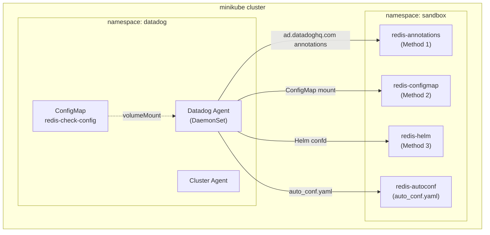

# Kubernetes Integrations Configuration Methods

## Context

This sandbox demonstrates all the different methods to configure Datadog integrations in Kubernetes, as documented at [Configure integrations with Autodiscovery on Kubernetes](https://docs.datadoghq.com/containers/kubernetes/integrations/?tab=annotations).

**Methods covered:**
1. **Pod Annotations** - `ad.datadoghq.com/<container>.checks`
2. **ConfigMap** - Mounted to agent's conf.d directory
3. **Helm confd** - `datadog.confd` in values.yaml
4. **Datadog Operator extraConfd** - `override.nodeAgent.extraConfd`

## Environment

- **Agent Version:** Latest (Helm chart default)
- **Platform:** minikube / Kubernetes
- **Integration:** Redis (example)

## Schema



## Quick Start

### 1. Start minikube

```bash
minikube delete --all
minikube start --memory=4096 --cpus=2
```

### 2. Deploy Redis Instances

Deploy Redis pods for testing each configuration method:

```bash
kubectl apply -f - <<'MANIFEST'
---
apiVersion: v1
kind: Namespace
metadata:
  name: sandbox
---
# Method 1: Pod with Annotations (ad.datadoghq.com/container.checks)
apiVersion: v1
kind: Pod
metadata:
  name: redis-annotations
  namespace: sandbox
  labels:
    app: redis
    method: annotations
  annotations:
    ad.datadoghq.com/redis.checks: |
      {
        "redisdb": {
          "instances": [
            {
              "host": "%%host%%",
              "port": "6379",
              "tags": ["method:annotations", "env:sandbox"]
            }
          ]
        }
      }
spec:
  containers:
  - name: redis
    image: redis:7-alpine
    ports:
    - containerPort: 6379
---
# Method 2: Pod to be configured via ConfigMap
apiVersion: v1
kind: Pod
metadata:
  name: redis-configmap
  namespace: sandbox
  labels:
    app: redis
    method: configmap
spec:
  containers:
  - name: redis
    image: redis:7-alpine
    ports:
    - containerPort: 6379
---
# Method 3: Pod to be configured via Helm confd
apiVersion: v1
kind: Pod
metadata:
  name: redis-helm
  namespace: sandbox
  labels:
    app: redis
    method: helm-confd
spec:
  containers:
  - name: redis
    image: redis:7-alpine
    ports:
    - containerPort: 6379
---
# Pod for auto-discovery (default auto_conf.yaml)
apiVersion: v1
kind: Pod
metadata:
  name: redis-autoconf
  namespace: sandbox
  labels:
    app: redis
    method: autoconf
spec:
  containers:
  - name: redis
    image: redis:7-alpine
    ports:
    - containerPort: 6379
MANIFEST
```

### 3. Wait for Redis pods

```bash
kubectl wait --for=condition=ready pod -l app=redis -n sandbox --timeout=120s
```

---

## Method 1: Pod Annotations

The simplest method - add annotations directly to the pod.

**Already deployed above with annotations:**
```yaml
annotations:
  ad.datadoghq.com/redis.checks: |
    {
      "redisdb": {
        "instances": [
          {
            "host": "%%host%%",
            "port": "6379",
            "tags": ["method:annotations", "env:sandbox"]
          }
        ]
      }
    }
```

---

## Method 2: ConfigMap

Mount a ConfigMap containing the integration configuration to the agent.

### Create the ConfigMap

```bash
kubectl create namespace datadog

kubectl apply -f - <<'MANIFEST'
apiVersion: v1
kind: ConfigMap
metadata:
  name: redis-check-config
  namespace: datadog
data:
  redisdb-configmap.yaml: |-
    ad_identifiers:
      - redis
    init_config:
    instances:
      - host: "%%host%%"
        port: "6379"
        tags:
          - "method:configmap"
          - "env:sandbox"
MANIFEST
```

### Deploy Agent with ConfigMap Mount (Helm)

Create `values-configmap.yaml`:

```yaml
datadog:
  site: "datadoghq.com"
  apiKeyExistingSecret: "datadog-secret"
  clusterName: "sandbox-integrations"
  kubelet:
    tlsVerify: false

clusterAgent:
  enabled: true
  replicas: 1

agents:
  volumes:
    - name: redis-configmap-conf
      configMap:
        name: redis-check-config
  volumeMounts:
    - name: redis-configmap-conf
      mountPath: /etc/datadog-agent/conf.d/redisdb.d/configmap-conf.yaml
      subPath: redisdb-configmap.yaml
```

```bash
kubectl create secret generic datadog-secret -n datadog --from-literal=api-key=$DD_API_KEY
helm repo add datadog https://helm.datadoghq.com && helm repo update
helm upgrade --install datadog-agent datadog/datadog -n datadog -f values-configmap.yaml
```

---

## Method 3: Helm `datadog.confd`

Define integration configurations directly in Helm values.

Create `values-confd.yaml`:

```yaml
datadog:
  site: "datadoghq.com"
  apiKeyExistingSecret: "datadog-secret"
  clusterName: "sandbox-integrations"
  kubelet:
    tlsVerify: false
  # Integration configuration via Helm confd
  confd:
    redisdb.yaml: |-
      ad_identifiers:
        - redis
      init_config:
      instances:
        - host: "%%host%%"
          port: "6379"
          tags:
            - "method:helm-confd"
            - "env:sandbox"

clusterAgent:
  enabled: true
  replicas: 1
```

```bash
helm upgrade --install datadog-agent datadog/datadog -n datadog -f values-confd.yaml
```

---

## Method 4: Datadog Operator `extraConfd`

Use the Datadog Operator CRD to configure integrations.

### Install Datadog Operator

```bash
helm install datadog-operator datadog/datadog-operator -n datadog
```

### Create DatadogAgent Resource

```bash
kubectl apply -f - <<'MANIFEST'
apiVersion: datadoghq.com/v2alpha1
kind: DatadogAgent
metadata:
  name: datadog
  namespace: datadog
spec:
  global:
    site: datadoghq.com
    credentials:
      apiSecret:
        secretName: datadog-secret
        keyName: api-key
    clusterName: sandbox-operator
    kubelet:
      tlsVerify: false
  features:
    logCollection:
      enabled: true
      containerCollectAll: true
  override:
    clusterAgent:
      replicas: 1
    nodeAgent:
      extraConfd:
        configDataMap:
          redisdb.yaml: |-
            ad_identifiers:
              - redis
            init_config:
            instances:
              - host: "%%host%%"
                port: "6379"
                tags:
                  - "method:operator-extraconfd"
                  - "env:sandbox"
MANIFEST
```

---

## How to Identify Which Configuration Method is Used

### Quick Identification Guide

| Indicator | Method | Example |
|-----------|--------|---------|
| **Configuration provider:** `kubernetes-container-allinone` | Annotations | Pod has `ad.datadoghq.com/` annotations |
| **Configuration source:** `container:docker://...` | Annotations | Source is a container ID |
| **Configuration source:** `file:...configmap-conf.yaml` | ConfigMap | Custom filename in mount path |
| **Configuration source:** `file:.../conf.d/redisdb.yaml` | Helm confd | File directly in conf.d/ |
| **Configuration source:** `file:.../redisdb.d/auto_conf.yaml` | Auto-discovery | Built-in auto_conf.yaml |
| **Tag:** `method:annotations` | Annotations | Custom tag we added |
| **Tag:** `method:configmap` | ConfigMap | Custom tag we added |
| **Tag:** `method:helm-confd` | Helm confd | Custom tag we added |
| **Tag:** `method:operator-extraconfd` | Operator | Custom tag we added |

### Detailed configcheck Output Examples

#### Method 1: Annotations Output
```
=== redisdb check ===
Configuration provider: kubernetes-container-allinone      <-- IDENTIFIES ANNOTATIONS
Configuration source: container:docker://7c076b8d4380...  <-- Container ID, not file path
Config for instance ID: redisdb:56674756a4f303
host: 10.244.0.28
port: "6379"
tags:
  - method:annotations    <-- Custom tag confirms method
  - env:sandbox
  - kube_namespace:sandbox
  ...
Auto-discovery IDs:
* docker://7c076b8d4380...  <-- Docker container ID
```

#### Method 2: ConfigMap Output
```
=== redisdb check ===
Configuration provider: file                               <-- File-based config
Configuration source: file:/etc/datadog-agent/conf.d/redisdb.d/configmap-conf.yaml  <-- Custom mount path
Config for instance ID: redisdb:d5ccd2641a9aa0ca
host: 10.244.0.27
port: "6379"
tags:
  - method:configmap      <-- Custom tag confirms method
  - env:sandbox
  ...
Auto-discovery IDs:
* redis                   <-- ad_identifiers value
```

#### Method 3: Helm confd Output
```
=== redisdb check ===
Configuration provider: file
Configuration source: file:/etc/datadog-agent/conf.d/redisdb.yaml  <-- Directly in conf.d/
Config for instance ID: redisdb:6e30718fcc1794f4
host: 10.244.0.26
port: "6379"
tags:
  - method:helm-confd     <-- Custom tag confirms method
  - env:sandbox
  ...
Auto-discovery IDs:
* redis
```

#### Method 4: Operator extraConfd Output
```
=== redisdb check ===
Configuration provider: file
Configuration source: file:/etc/datadog-agent/conf.d/redisdb.yaml  <-- Same as Helm confd
Config for instance ID: redisdb:93908787fd0f0ca6
host: 10.244.0.28
port: "6379"
tags:
  - method:operator-extraconfd  <-- Custom tag differentiates from Helm
  - env:sandbox
  ...
Auto-discovery IDs:
* redis
```

#### Auto-discovery Output (no custom config)
```
=== redisdb check ===
Configuration provider: file
Configuration source: file:/etc/datadog-agent/conf.d/redisdb.d/auto_conf.yaml  <-- Built-in auto_conf
Config for instance ID: redisdb:d97f9b9d8608defe
host: 10.244.0.26
port: 6379                <-- Note: integer, not string
tags:                     <-- NO custom method tag
  - kube_namespace:sandbox
  ...
Auto-discovery IDs:
* redis
```

---

## Verification Commands

### Get Agent Pod Name

```bash
# For Helm-deployed agent
POD=$(kubectl get pods -n datadog -l app=datadog-agent -o jsonpath='{.items[0].metadata.name}')

# For Operator-deployed agent
POD=$(kubectl get pods -n datadog -l app.kubernetes.io/component=agent -o jsonpath='{.items[0].metadata.name}')

echo "Agent pod: $POD"
```

### Match Redis Pods to Configurations

```bash
# Get Redis pod IPs
echo "=== Redis Pod IPs ==="
kubectl get pods -n sandbox -o wide | grep redis

# Get all Redis configurations with IPs
echo ""
echo "=== Redis Configurations by IP ==="
kubectl exec -n datadog $POD -c agent -- agent configcheck 2>/dev/null | \
  grep -E "=== redis|host: 10\.|method:|Configuration source:" | \
  sed 's/^/  /'
```

### Show Only Configuration Method Tags

```bash
kubectl exec -n datadog $POD -c agent -- agent configcheck 2>/dev/null | \
  grep -E "method:" | sort | uniq -c
```

### Check Which Files Exist in conf.d

```bash
echo "=== Files in conf.d related to redis ==="
kubectl exec -n datadog $POD -c agent -- find /etc/datadog-agent/conf.d -name "*redis*" -type f

echo ""
echo "=== Content of each file ==="
for f in $(kubectl exec -n datadog $POD -c agent -- find /etc/datadog-agent/conf.d -name "*redis*" -type f); do
  echo "--- $f ---"
  kubectl exec -n datadog $POD -c agent -- cat "$f" 2>/dev/null | head -20
  echo ""
done
```

### Check Agent Status for Running Checks

```bash
echo "=== Redis Check Status ==="
kubectl exec -n datadog $POD -c agent -- agent status 2>/dev/null | \
  grep -A 10 "redisdb"
```

### Verify Template Variables Resolved

```bash
# Should show actual IPs instead of %%host%%
kubectl exec -n datadog $POD -c agent -- agent configcheck 2>/dev/null | \
  grep -E "host: [0-9]" | sort -u
```

---

## Debugging: Why Is My Configuration Not Working?

### Issue: Annotations not picked up

**Check:**
```bash
# Verify annotation exists on pod
kubectl get pod redis-annotations -n sandbox -o jsonpath='{.metadata.annotations}' | jq .

# Check agent logs for annotation discovery
kubectl logs -n datadog $POD -c agent | grep -i "annotation"
```

**Common causes:**
- Annotation key typo (`ad.datadoghq.com/redis.checks` - container name must match)
- Invalid JSON in annotation
- Agent pod restarted before pod was discovered

### Issue: ConfigMap not mounted

**Check:**
```bash
# Verify ConfigMap exists
kubectl get configmap redis-check-config -n datadog -o yaml

# Check if file exists in agent
kubectl exec -n datadog $POD -c agent -- ls -la /etc/datadog-agent/conf.d/redisdb.d/

# Check agent pod volumes
kubectl get pod $POD -n datadog -o jsonpath='{.spec.volumes}' | jq .
```

**Common causes:**
- ConfigMap in wrong namespace
- Volume mount path incorrect
- subPath doesn't match ConfigMap key

### Issue: Helm confd not applied

**Check:**
```bash
# Verify Helm values
helm get values datadog-agent -n datadog

# Check file in agent
kubectl exec -n datadog $POD -c agent -- cat /etc/datadog-agent/conf.d/redisdb.yaml
```

**Common causes:**
- YAML indentation issues in values file
- Agent pod not restarted after Helm upgrade

### Issue: Duplicate checks running

**Symptom:** Same Redis pod monitored multiple times

**Check:**
```bash
kubectl exec -n datadog $POD -c agent -- agent configcheck 2>/dev/null | \
  grep -E "host: 10.244" | sort | uniq -c
```

**Solution:** Disable auto-configuration:
```yaml
datadog:
  ignoreAutoConfig:
    - redisdb
```

---

## Expected vs Actual

| Method | Configuration Source | Expected Tag | Status |
|--------|---------------------|--------------|--------|
| Annotations | `container:docker://...` | `method:annotations` | ✅ Verified |
| ConfigMap | `file:.../configmap-conf.yaml` | `method:configmap` | ✅ Verified |
| Helm confd | `file:.../redisdb.yaml` | `method:helm-confd` | ✅ Verified |
| Operator extraConfd | `file:.../redisdb.yaml` | `method:operator-extraconfd` | ✅ Verified |
| Auto-discovery | `file:.../auto_conf.yaml` | (no custom tag) | ✅ Verified |

## Configuration Precedence

From the documentation:
1. **Kubernetes annotations** take highest precedence
2. **Docker Labels** (not applicable in K8s)
3. **auto_conf.yaml** files
4. **Operator/Helm configurations** (require disabling auto_conf if same integration)

> **Note:** If using both auto_conf.yaml and custom configuration for the same integration, you may need to disable auto-configuration with `datadog.ignoreAutoConfig: [redisdb]`.

---

## Log Messages to Look For

### Successful Autodiscovery

```
# In agent logs
kubernetes-container-allinone provider: collected 1 new configurations
```

### Configuration Loaded from File

```
file provider: collected 67 new configurations
```

### Check Running Successfully

```
check:redisdb | Running check...
check:redisdb | Done running check
```

### Template Variable Resolution

```
# Look for resolved IPs in logs
host: 10.244.0.28
```

---

## Cleanup

```bash
kubectl delete namespace sandbox
kubectl delete datadogagent datadog -n datadog 2>/dev/null
helm uninstall datadog-agent -n datadog 2>/dev/null
helm uninstall datadog-operator -n datadog 2>/dev/null
kubectl delete namespace datadog
minikube delete
```

## References

- [Configure integrations with Autodiscovery on Kubernetes](https://docs.datadoghq.com/containers/kubernetes/integrations/?tab=annotations)
- [Autodiscovery Template Variables](https://docs.datadoghq.com/containers/guide/template_variables/)
- [Autodiscovery Auto-Configuration](https://docs.datadoghq.com/containers/guide/auto_conf/)
- [Datadog Operator](https://docs.datadoghq.com/containers/datadog_operator/)
- [Datadog Helm Chart](https://github.com/DataDog/helm-charts/tree/main/charts/datadog)
