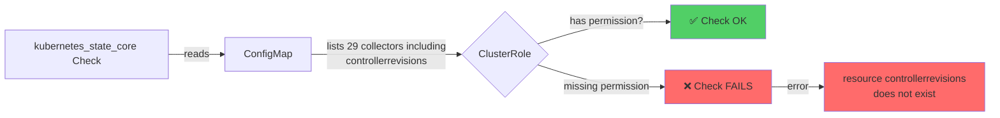

# kubernetes_state_core Check - ControllerRevisions Permission Error

## Context

The `kubernetes_state_core` integration check fails with the error:

```
Error: resource controllerrevisions does not exist. Available resources: ...
```

**Impact:** Complete loss of Kubernetes state metrics (0 metrics collected). This typically occurs when custom Helm values or GitOps configuration adds `controllerrevisions` to the collectors list without the corresponding ClusterRole RBAC permissions.

## Environment

- **Agent Version:** 7.68.2+
- **Platform:** EKS, GKE, AKS, or any Kubernetes cluster
- **Deployment:** Datadog Operator (Helm chart)

**Commands to get versions:**
```bash
# Agent version
kubectl exec -n datadog daemonset/datadog-agent -c agent -- agent version

# Operator version
helm list -n datadog

# Kubernetes version
kubectl version --short
```

## Schema



## Quick Diagnosis

### 1. Check if you have this issue

```bash
kubectl exec -n datadog $(kubectl get pods -n datadog \
  -l app.kubernetes.io/component=cluster-agent -o name | head -1) \
  -- agent status | grep -A 20 kubernetes_state_core
```

**Look for:**
```
kubernetes_state_core
---------------------
  Instance ID: kubernetes_state_core:... [ERROR]
  Metric Samples: Last Run: 0, Total: 0
  Error: resource controllerrevisions does not exist
```

### 2. Confirm controllerrevisions is in your config

```bash
kubectl get configmap datadog-kube-state-metrics-core-config -n datadog \
  -o jsonpath='{.data.kubernetes_state_core\.yaml\.default}' | \
  grep controllerrevisions
```

If this shows `- controllerrevisions`, continue to Step 3.

### 3. Check ClusterRole permission

```bash
kubectl auth can-i list controllerrevisions \
  --as=system:serviceaccount:datadog:datadog-cluster-agent -A
```

**If this shows `no`**, you're missing the permission → proceed to fix.

### 4. Run automated diagnostic

For a complete diagnostic report:

```bash
kubectl apply -f - <<'EOF'
apiVersion: v1
kind: ConfigMap
metadata:
  name: ksc-diagnostic
  namespace: datadog
data:
  diagnose.sh: |
    #!/bin/bash
    set -e
    
    echo "=== kubernetes_state_core Diagnostic ==="
    echo ""
    
    # Get cluster agent pod
    CLUSTER_AGENT_POD=$(kubectl get pods -n datadog \
      -l app.kubernetes.io/component=cluster-agent \
      -o name 2>/dev/null | head -1)
    
    if [ -z "$CLUSTER_AGENT_POD" ]; then
        echo "❌ No cluster agent pod found"
        exit 1
    fi
    
    echo "✅ Found cluster agent: $CLUSTER_AGENT_POD"
    echo ""
    
    # Check 1: Agent status
    echo "1️⃣ kubernetes_state_core status:"
    echo "-----------------------------------"
    kubectl exec -n datadog "$CLUSTER_AGENT_POD" -- agent status 2>&1 | \
      grep -A 20 "kubernetes_state_core"
    echo ""
    
    # Check 2: ConfigMap content
    echo "2️⃣ Checking collectors configuration:"
    echo "-----------------------------------"
    if kubectl get configmap datadog-kube-state-metrics-core-config -n datadog \
       -o jsonpath='{.data.kubernetes_state_core\.yaml\.default}' 2>/dev/null | \
       grep -q "controllerrevisions"; then
        echo "❌ FOUND: controllerrevisions in collectors list"
        HAS_CR=true
    else
        echo "✅ Good: controllerrevisions NOT in collectors list"
        HAS_CR=false
    fi
    echo ""
    
    # Check 3: Permission
    echo "3️⃣ Checking ClusterRole permissions:"
    echo "-----------------------------------"
    if kubectl auth can-i list controllerrevisions \
       --as=system:serviceaccount:datadog:datadog-cluster-agent -A 2>&1 | \
       grep -q "yes"; then
        echo "✅ Has permission"
        HAS_PERM=true
    else
        echo "❌ Missing permission"
        HAS_PERM=false
    fi
    echo ""
    
    # Check 4: Resource exists
    echo "4️⃣ Verifying resource exists:"
    echo "-----------------------------------"
    kubectl api-resources | grep controllerrevisions
    echo ""
    kubectl get controllerrevisions -A 2>/dev/null | head -5
    echo ""
    
    # Summary
    echo "📊 DIAGNOSIS:"
    echo "-----------------------------------"
    if [ "$HAS_CR" = true ] && [ "$HAS_PERM" = false ]; then
        echo "🔴 ISSUE CONFIRMED!"
        echo "   controllerrevisions in config but no permission"
        echo ""
        echo "Solutions: See README.md"
    elif [ "$HAS_CR" = false ]; then
        echo "✅ Configuration OK"
    fi
EOF

# Run the diagnostic
kubectl exec -n datadog $(kubectl get pods -n datadog \
  -l app.kubernetes.io/component=cluster-agent -o name | head -1) \
  -- /bin/bash -c "$(kubectl get configmap ksc-diagnostic -n datadog -o jsonpath='{.data.diagnose\.sh}')"

# Cleanup
kubectl delete configmap ksc-diagnostic -n datadog
```

## Expected vs Actual

| Behavior | Expected | Actual |
|----------|----------|--------|
| kubernetes_state_core status | ✅ [OK] | ❌ [ERROR] |
| Metric samples collected | ✅ 600+ per run | ❌ 0 per run |
| Last successful execution | ✅ Recent timestamp | ❌ Never |
| Error message | ✅ None | ❌ resource controllerrevisions does not exist |

## Fix / Workaround

### Solution 1: Delete ConfigMap (Recommended)

Let the Datadog Operator regenerate the ConfigMap with correct defaults:

```bash
# Delete the ConfigMap
kubectl delete configmap datadog-kube-state-metrics-core-config -n datadog

# Restart cluster agent
kubectl rollout restart deployment/datadog-cluster-agent -n datadog

# Wait for rollout
kubectl rollout status deployment/datadog-cluster-agent -n datadog --timeout=120s

# Wait 60 seconds for check to run
sleep 60

# Verify fix
kubectl exec -n datadog $(kubectl get pods -n datadog \
  -l app.kubernetes.io/component=cluster-agent -o name | head -1) \
  -- agent status | grep -A 15 kubernetes_state_core
```

**Expected output:**
```
kubernetes_state_core
---------------------
  Instance ID: kubernetes_state_core:... [OK]
  Metric Samples: Last Run: 660+
  Last Successful Execution Date: <recent timestamp>
```

⚠️ **Important:** If using ArgoCD or GitOps, check if your repository will re-apply the custom configuration.

### Solution 2: Add ClusterRole Permission

If you need `controllerrevisions` monitoring, add the permission:

```bash
kubectl apply -f - <<'EOF'
apiVersion: rbac.authorization.k8s.io/v1
kind: ClusterRole
metadata:
  name: datadog-cluster-agent
  labels:
    app.kubernetes.io/managed-by: datadog-operator
rules:
# Existing rules...
- apiGroups:
  - apps
  resources:
  - daemonsets
  - deployments
  - replicasets
  - statefulsets
  - controllerrevisions  # ← ADD THIS
  verbs:
  - get
  - list   # ← ADD THIS
  - watch  # ← ADD THIS
EOF

# Restart cluster agent
kubectl rollout restart deployment/datadog-cluster-agent -n datadog

# Verify
kubectl auth can-i list controllerrevisions \
  --as=system:serviceaccount:datadog:datadog-cluster-agent -A
```

### Solution 3: Update Helm Values

If using custom Helm values with `kubeStateMetricsCore.conf`, remove `controllerrevisions`:

```yaml
# values.yaml
clusterAgent:
  confd:
    kubernetes_state_core.yaml: |
      ---
      cluster_check: false
      init_config:
      instances:
        - skip_leader_election: false
          collectors:
          - pods
          - nodes
          - deployments
          # ... other resources ...
          # DO NOT include: controllerrevisions
```

Then re-deploy:

```bash
helm upgrade datadog-operator datadog/datadog-operator \
  -n datadog -f values.yaml
```

## Troubleshooting

### Check agent logs

```bash
# Cluster agent logs
kubectl logs -n datadog -l app.kubernetes.io/component=cluster-agent --tail=100

# Node agent logs (if needed)
kubectl logs -n datadog -l app=datadog-agent -c agent --tail=100
```

### Check ConfigMap content

```bash
# Full config
kubectl get configmap datadog-kube-state-metrics-core-config -n datadog -o yaml

# Just collectors list
kubectl get configmap datadog-kube-state-metrics-core-config -n datadog \
  -o jsonpath='{.data.kubernetes_state_core\.yaml\.default}' | \
  grep -A 50 "collectors:"
```

### Check ClusterRole

```bash
# Get full ClusterRole
kubectl get clusterrole datadog-cluster-agent -o yaml

# Check apps apiGroup rules
kubectl get clusterrole datadog-cluster-agent -o yaml | \
  grep -A 10 "apiGroups.*apps"
```

### Verify controllerrevisions exist

```bash
# Check resource type
kubectl api-resources | grep controllerrevisions

# List instances
kubectl get controllerrevisions -A

# Count instances
kubectl get controllerrevisions -A --no-headers | wc -l
```

### Force check execution

```bash
# Run check with trace logging
kubectl exec -n datadog $(kubectl get pods -n datadog \
  -l app.kubernetes.io/component=cluster-agent -o name | head -1) \
  -- agent check kubernetes_state_core -l trace
```

## Prevention

When customizing `kubernetes_state_core` collectors:

1. ✅ **Check resource permissions** - Verify if the resource needs special RBAC
2. ✅ **Update ClusterRole** - Add permissions before adding collectors
3. ✅ **Test in dev first** - Don't apply untested configs to production
4. ✅ **Document changes** - Note why custom collectors were added
5. ✅ **Monitor check status** - Set up alerts for check failures

### Common Resources Requiring Special Permissions

| Resource | Requires Permission | Default in Config |
|----------|---------------------|-------------------|
| `pods` | ✅ Yes | ✅ Included |
| `nodes` | ✅ Yes | ✅ Included |
| `deployments` | ✅ Yes | ✅ Included |
| `controllerrevisions` | ✅ Yes | ❌ Not included |
| `leases` | ✅ Yes | ❌ Not included |
| `verticalpodautoscalers` | ✅ Yes (custom CRD) | ❌ Not included |

## Cleanup

```bash
# If you created test resources
kubectl delete configmap ksc-diagnostic -n datadog
```

## References

- [Datadog Operator Documentation](https://github.com/DataDog/datadog-operator)
- [kubernetes_state_core Integration](https://docs.datadoghq.com/integrations/kubernetes_state_core/)
- [Kubernetes RBAC](https://kubernetes.io/docs/reference/access-authn-authz/rbac/)
- [Datadog Helm Chart](https://github.com/DataDog/helm-charts)
