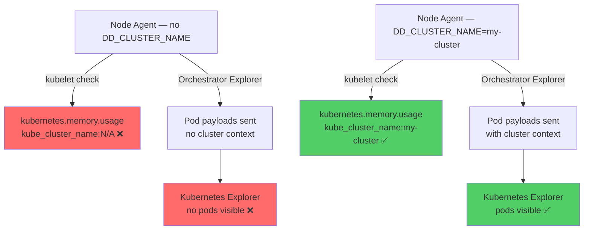

# Kubernetes — Missing DD_CLUSTER_NAME: kube_cluster_name:N/A and Empty Kubernetes Explorer

All manifests and configurations are included inline for easy copy-paste reproduction. Never put API keys directly in manifests — use Kubernetes secrets.

## Context

When `datadog.clusterName` is not set in the Datadog Helm values, the agent has no cluster name and two symptoms appear simultaneously:

1. All Kubernetes metrics (e.g. `kubernetes.memory.usage`, `kubernetes.cpu.usage`) are emitted with the tag `kube_cluster_name:N/A` instead of the actual cluster name.
2. The Kubernetes Explorer live view shows no pods, nodes, or deployments, even though the Orchestrator Explorer is enabled and running.

These two symptoms are caused by the same missing config, but they look unrelated at first glance because the metrics pipeline and the Orchestrator Explorer pipeline are independent:

- The kubelet check collects metrics directly from the local kubelet API on each node. It does not need the Cluster Agent or a cluster name. This is why `kubernetes.memory.usage` exists even when everything else is broken.
- The Orchestrator Explorer sends pod specs and metadata to Datadog indexed by cluster name. When the cluster name is absent, payloads are sent without a valid cluster context and the Kubernetes Explorer cannot find or display them.

The combination of "metrics exist but carry kube_cluster_name:N/A" + "pods not visible in K8s Explorer" is the diagnostic fingerprint for this misconfiguration.

## Environment

- **Agent Version:** 7.49.0+ (any version affected)
- **Platform:** minikube / EKS / any Kubernetes
- **Integration:** Orchestrator Explorer, kubelet check

Commands to get versions:

    kubectl exec -n datadog daemonset/datadog-agent -c agent -- agent version
    kubectl version --short

## Schema

## Quick Start

### 1. Start minikube

    minikube status || minikube start --memory=4096 --cpus=2

### 2. Create namespace and secret

    kubectl create namespace datadog
    kubectl create secret generic datadog-secret -n datadog --from-literal=api-key=YOUR_API_KEY

### 3. Deploy Helm repo

    helm repo add datadog https://helm.datadoghq.com && helm repo update

## Reproduce the Bug

### Deploy agent WITHOUT clusterName

    helm upgrade --install datadog-agent datadog/datadog -n datadog \
      --set datadog.site=datadoghq.com \
      --set datadog.apiKeyExistingSecret=datadog-secret \
      --set datadog.kubelet.tlsVerify=false \
      --set datadog.orchestratorExplorer.enabled=true \
      --set clusterAgent.enabled=true \
      --set agents.image.tag=7.49.0

Wait for the DaemonSet to be ready:

    kubectl rollout status daemonset/datadog-agent -n datadog --timeout=300s

### Deploy a sample workload

    kubectl apply -f - <<'MANIFEST'
    apiVersion: apps/v1
    kind: Deployment
    metadata:
      name: sample-app
      namespace: default
      labels:
        tags.datadoghq.com/service: my-service
        tags.datadoghq.com/env: sandbox
        tags.datadoghq.com/version: "1.0.0"
    spec:
      replicas: 2
      selector:
        matchLabels:
          app: sample-app
      template:
        metadata:
          labels:
            app: sample-app
            tags.datadoghq.com/service: my-service
            tags.datadoghq.com/env: sandbox
            tags.datadoghq.com/version: "1.0.0"
        spec:
          containers:
          - name: app
            image: python:3.11-slim
            command: ["python3", "-c", "import time; [time.sleep(60) for _ in iter(int, 1)]"]
            resources:
              requests:
                memory: "32Mi"
                cpu: "50m"
    MANIFEST

    kubectl rollout status deployment/sample-app -n default --timeout=120s

## Test Commands — Bug State

### Check kubelet metrics — confirm kube_cluster_name is absent

    kubectl exec -n datadog daemonset/datadog-agent -c agent -- agent check kubelet 2>&1 \
      | grep -E "kube_cluster_name|kubernetes.memory" | head -20

Expected: `kube_cluster_name` tag is absent from all metrics. In Datadog UI it will surface as `kube_cluster_name:N/A`.

### Confirm orchestrator checks are failing or have no cluster context

    kubectl exec -n datadog daemonset/datadog-agent -c agent -- agent status 2>&1 \
      | grep -A8 "orchestrator_pod"

Expected: checks run but cluster name is empty — errors like "cluster name is empty" or "orchestrator check is configured but the cluster name is empty".

### Confirm Cluster Agent also has no cluster name

    kubectl exec -n datadog deploy/datadog-agent-cluster-agent -- agent status 2>&1 \
      | grep -i "cluster.name\|clusterName"

## Expected vs Actual — Bug State

| Behavior | Expected | Actual |
|---|---|---|
| `kube_cluster_name` tag on metrics | `kube_cluster_name:my-cluster` | `kube_cluster_name:N/A` |
| Pods visible in Kubernetes Explorer | Yes | No |
| Orchestrator Explorer | Sends with cluster context | Sends without cluster context |
| `kubernetes.memory.usage` metric | Exists with correct tags | Exists but kube_cluster_name:N/A |

## Apply the Fix

### Update Helm release to add clusterName

    helm upgrade datadog-agent datadog/datadog -n datadog \
      --set datadog.site=datadoghq.com \
      --set datadog.apiKeyExistingSecret=datadog-secret \
      --set datadog.kubelet.tlsVerify=false \
      --set datadog.orchestratorExplorer.enabled=true \
      --set clusterAgent.enabled=true \
      --set agents.image.tag=7.49.0 \
      --set datadog.clusterName=my-sandbox-cluster

Wait for rollout:

    kubectl rollout status daemonset/datadog-agent -n datadog --timeout=300s

Alternatively in values.yaml:

    datadog:
      site: "datadoghq.com"
      apiKeyExistingSecret: "datadog-secret"
      clusterName: "my-sandbox-cluster"    # <-- this is the only required change
      kubelet:
        tlsVerify: false
      orchestratorExplorer:
        enabled: true
    clusterAgent:
      enabled: true
    agents:
      image:
        tag: "7.49.0"

## Test Commands — Fixed State

### Confirm kube_cluster_name tag is now present

    kubectl exec -n datadog daemonset/datadog-agent -c agent -- agent check kubelet 2>&1 \
      | grep "kube_cluster_name"

Expected: `kube_cluster_name:my-sandbox-cluster` appears on kubelet metrics.

### Confirm orchestrator checks succeed

    kubectl exec -n datadog daemonset/datadog-agent -c agent -- agent status 2>&1 \
      | grep -A8 "orchestrator_pod"

Expected: checks run without cluster name errors, payload counts > 0.

## Key Insight — Why Metrics Exist but Explorer Is Empty

This is the most confusing aspect of this bug. The answer is that the two pipelines have different dependencies:

    kubelet check:
      node agent → kubelet API (localhost) → metrics to Datadog
      requires: nothing except a running kubelet
      cluster name: optional tag, defaults to N/A if missing

    Orchestrator Explorer:
      node agent → Cluster Agent → orchestrator payloads to Datadog
      requires: cluster name for indexing
      without cluster name: payloads sent but unindexed → K8s Explorer empty

So "metrics exist" does not mean "the agent is fully functional". The kubelet check is the most resilient component and will produce data even when the rest of the pipeline is broken.

## Troubleshooting

    # Pod logs
    kubectl logs -n datadog -l app=datadog-agent -c agent --tail=50
    kubectl logs -n datadog -l app=datadog-cluster-agent --tail=50

    # Agent status (full)
    kubectl exec -n datadog daemonset/datadog-agent -c agent -- agent status

    # Config check
    kubectl exec -n datadog daemonset/datadog-agent -c agent -- agent config | grep -i cluster

    # Cluster Agent status
    kubectl exec -n datadog deploy/datadog-agent-cluster-agent -- agent status

    # Events
    kubectl get events -n datadog --sort-by='.lastTimestamp' | tail -20

## Cleanup

    kubectl delete deployment sample-app -n default
    helm uninstall datadog-agent -n datadog
    kubectl delete namespace datadog

## References

- [Datadog Docs — Unified Service Tagging in Kubernetes](https://docs.datadoghq.com/getting_started/tagging/unified_service_tagging/?tab=kubernetes)
- [Datadog Docs — Kubernetes Orchestrator Explorer](https://docs.datadoghq.com/infrastructure/containers/orchestrator_explorer/)
- [Datadog Helm Chart — clusterName parameter](https://github.com/DataDog/helm-charts/blob/main/charts/datadog/values.yaml)
- [Agent Docker Tags](https://hub.docker.com/r/datadog/agent/tags)
