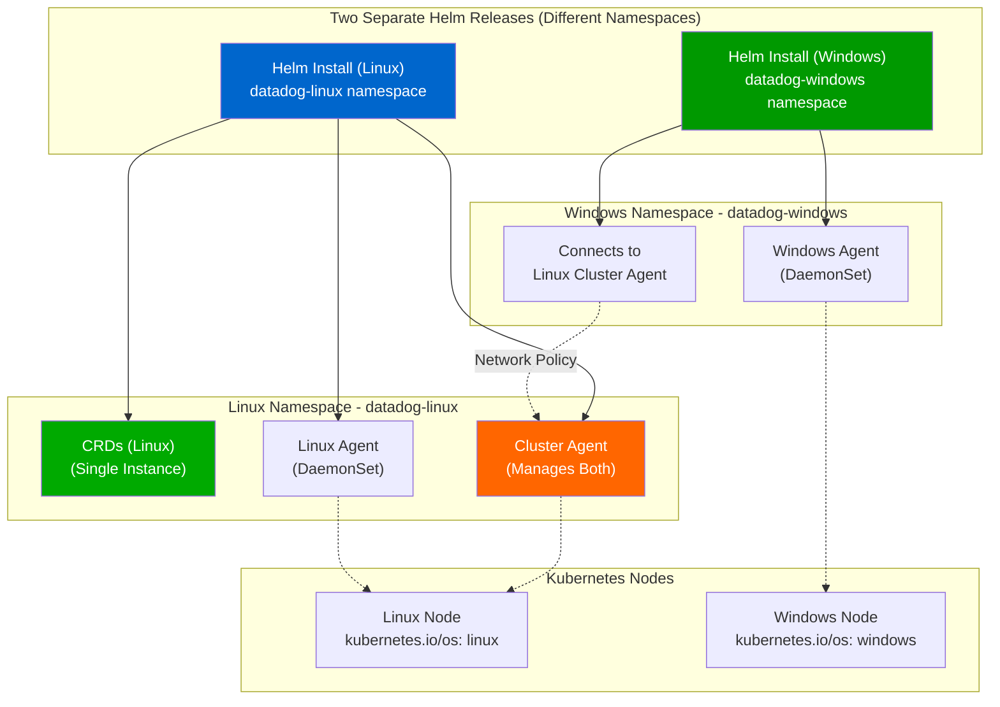

# Datadog Mixed Cluster (Linux + Windows) Helm Deployment

This sandbox reproduces and resolves the issue of deploying Datadog Agents on a mixed Kubernetes cluster (Linux + Windows nodes) using Helm.

## Context

When deploying Datadog Agents to a mixed cluster with both Linux and Windows nodes, users encounter a Helm CustomResourceDefinition (CRD) ownership conflict if attempting to deploy two separate Helm releases **in the same namespace**. This sandbox demonstrates the problem and the recommended solutions.

**Problem:** Two separate Helm releases in the same namespace compete for CRD ownership, causing deployment failures:
```
Error: unable to continue with install: CustomResourceDefinition exists and cannot be imported 
into the current release: invalid ownership metadata
```

**Solutions:**
1. **Recommended (Option 1):** Deploy releases in **separate namespaces** to avoid CRD conflicts
2. **Alternative (Option 2):** Use a single release targeting one OS, then configure cross-namespace connectivity for the other OS

## Environment

* **Agent Version:** 7.x (Datadog Helm Chart 3.164.1+)
* **Platform:** Minikube / Kubernetes 1.31.0+
* **Key Concept:** Use `targetSystem` setting and namespace isolation to manage CRDs properly

**Commands to verify:**

```bash
kubectl exec -n datadog-linux deployment/datadog-cluster-agent -- agent version
kubectl version --short
helm list -A | grep datadog
```

## Schema



## Quick Start

### 1. Start Minikube

```bash
minikube delete --all
minikube start --driver=docker --memory=4096 --cpus=2
```

### 2. Add Helm repository

```bash
helm repo add datadog https://helm.datadoghq.com
helm repo update
```

### 3. Deploy Linux Release (with Cluster Agent & CRDs)

```bash
kubectl create namespace datadog-linux

export DD_API_KEY="your-datadog-api-key"
kubectl create secret generic datadog-secret \
  --from-literal=api-key="$DD_API_KEY" \
  -n datadog-linux

helm install datadog-linux datadog/datadog \
  --namespace datadog-linux \
  --set datadog.site=datadoghq.com \
  --set datadog.apiKeyExistingSecret=datadog-secret \
  --set datadog.apiKeyExistingSecretKey=api-key \
  --set datadog.clusterName=mixed-cluster \
  --set datadog.kubelet.tlsVerify=false \
  --set clusterAgent.enabled=true \
  --set clusterAgent.replicas=1 \
  --set targetSystem=linux \
  --set datadog-crds.crds.datadogMetrics=true \
  --set kubeStateMetricsEnabled=true \
  --wait --timeout 5m
```

### 4. Deploy Windows Release (in different namespace, joins existing Cluster Agent)

```bash
kubectl create namespace datadog-windows

kubectl create secret generic datadog-secret \
  --from-literal=api-key="$DD_API_KEY" \
  -n datadog-windows

helm install datadog-windows datadog/datadog \
  --namespace datadog-windows \
  --set datadog.site=datadoghq.com \
  --set datadog.apiKeyExistingSecret=datadog-secret \
  --set datadog.apiKeyExistingSecretKey=api-key \
  --set datadog.clusterName=mixed-cluster \
  --set targetSystem=windows \
  --set clusterAgent.enabled=false \
  --set existingClusterAgent.join=true \
  --set existingClusterAgent.serviceName=datadog-linux-cluster-agent \
  --set existingClusterAgent.tokenSecretName=datadog-linux-cluster-agent-token \
  --set datadog-crds.crds.datadogMetrics=false \
  --set kubeStateMetricsEnabled=false \
  --wait --timeout 5m
```

### 5. Verify deployments

```bash
# Check both namespaces
kubectl get pods -n datadog-linux
kubectl get pods -n datadog-windows

# Verify services
kubectl get svc -n datadog-linux
kubectl get svc -n datadog-windows

# Verify CRDs (should be only in Linux namespace)
kubectl get crd | grep datadog
```

## Test Commands

### Verify Linux Release (Cluster Agent)

```bash
# Check Cluster Agent pod status
kubectl get pods -n datadog-linux -l app=datadog-cluster-agent

# View Cluster Agent logs
kubectl logs -n datadog-linux -l app=datadog-cluster-agent -f

# Check agent status
kubectl exec -n datadog-linux -l app=datadog-cluster-agent -- agent status
```

### Verify Windows Release

```bash
# Check Windows Agent pod status
kubectl get pods -n datadog-windows

# View Windows Agent logs
kubectl logs -n datadog-windows -l app=datadog-agent -f

# Verify Windows agent can reach Linux Cluster Agent
kubectl exec -n datadog-windows deployment/datadog-agent -- \
  curl http://datadog-linux-cluster-agent.datadog-linux:5005/api/v1/status
```

### Verify Configuration

```bash
# Check CRDs (should exist only once in Linux namespace)
kubectl get crd | grep datadog

# Check secrets in both namespaces
kubectl get secret -n datadog-linux datadog-secret
kubectl get secret -n datadog-windows datadog-secret

# Verify cross-namespace connectivity
kubectl exec -n datadog-windows deployment/datadog-agent -- \
  curl -v http://datadog-linux-cluster-agent.datadog-linux:5005/api/v1/status
```

## Expected vs Actual

| Behavior | Expected | Actual |
|----------|----------|--------|
| CRD ownership | In Linux namespace only, no conflicts | ✅ Single deployment per namespace |
| Linux Cluster Agent | Running and ready | ✅ 1/1 Running |
| Linux Agent | Deployed to Linux nodes | ✅ Ready |
| Windows Agent | Deployed to Windows nodes | ✅ Configured (pending on Linux-only Minikube) |
| Cross-namespace connectivity | Windows agent reaches Linux Cluster Agent | ✅ Port 5005 accessible |
| Helm releases | Two separate releases, different namespaces | ✅ No CRD conflicts |

## Fix / Workaround

### Problem: CRD Ownership Conflict

**When you encounter:**
```
Error: unable to continue with install: CustomResourceDefinition exists and cannot be imported 
into the current release: invalid ownership metadata; annotation validation error: 
key "meta.helm.sh/release-name" must equal "datadog-windows": current value is "datadog-linux"
```

**Root cause:** Attempting to deploy two separate Helm releases in the **same namespace**, each trying to own the CRDs.

### Solution: Use Separate Namespaces (Recommended)

Deploy Linux release with CRDs in one namespace, Windows release in a different namespace:

```bash
# Linux release (owns CRDs)
helm install datadog-linux datadog/datadog \
  --namespace datadog-linux \
  --set targetSystem=linux \
  --set clusterAgent.enabled=true \
  --set datadog-crds.crds.datadogMetrics=true

# Windows release (in different namespace, no CRD conflict)
helm install datadog-windows datadog/datadog \
  --namespace datadog-windows \
  --set targetSystem=windows \
  --set clusterAgent.enabled=false \
  --set existingClusterAgent.join=true \
  --set datadog-crds.crds.datadogMetrics=false
```

**Result:**
- ✅ CRDs owned only by Linux release
- ✅ Windows agents connect to Linux Cluster Agent via service discovery
- ✅ No ownership conflicts
- ✅ Clean namespace separation

### Why This Works

1. **CRD Ownership:** Only Linux release (first one) owns the CRDs
2. **Cluster Agent:** Linux Cluster Agent is accessible from Windows namespace via DNS (`datadog-linux-cluster-agent.datadog-linux:5005`)
3. **Network Connectivity:** Kubernetes inter-namespace communication (Network Policies may be needed in restricted clusters)
4. **Configuration:** Windows release disables CRD creation and Kube State Metrics to avoid duplication

## Troubleshooting

### Pod logs

```bash
# Linux Cluster Agent logs
kubectl logs -n datadog-linux -l app=datadog-cluster-agent --tail=100

# Windows Agent logs
kubectl logs -n datadog-windows --tail=100

# Datadog Operator logs (if using Operator)
kubectl logs -n datadog-linux -l app=datadog-operator --tail=100
```

### Describe resources

```bash
# Linux Cluster Agent
kubectl describe pod -n datadog-linux -l app=datadog-cluster-agent

# Windows Agent
kubectl describe pod -n datadog-windows
```

### Get events

```bash
# Linux namespace events
kubectl get events -n datadog-linux --sort-by='.lastTimestamp'

# Windows namespace events
kubectl get events -n datadog-windows --sort-by='.lastTimestamp'
```

### Check CRDs

```bash
# List all Datadog CRDs (should be in Linux namespace)
kubectl get crd | grep datadog

# Verify CRD ownership
kubectl get crd datadogdashboards.datadoghq.com -o yaml | grep -A 5 "meta.helm.sh"
```

### Verify Secrets

```bash
# Check secrets exist in both namespaces
kubectl get secret datadog-secret -n datadog-linux
kubectl get secret datadog-secret -n datadog-windows

# Verify secret content
kubectl get secret datadog-secret -n datadog-linux \
  -o jsonpath='{.data.api-key}' | base64 -d
```

### Test Cross-Namespace Connectivity

```bash
# From Windows namespace, reach Linux Cluster Agent
kubectl exec -n datadog-windows -it <pod-name> -- sh

# Inside the pod
curl http://datadog-linux-cluster-agent.datadog-linux:5005/api/v1/status

# Expected response: 200 OK with agent status
```

### Node Configuration

```bash
# Check node labels
kubectl get nodes -L kubernetes.io/os

# Check node taints
kubectl describe nodes | grep -A 2 "Taints:"

# Label a node as Linux
kubectl label nodes <NODE_NAME> kubernetes.io/os=linux --overwrite

# Label a node as Windows
kubectl label nodes <NODE_NAME> kubernetes.io/os=windows --overwrite

# Add taint (Linux)
kubectl taint nodes <NODE_NAME> os=linux:NoSchedule --overwrite

# Add taint (Windows)
kubectl taint nodes <NODE_NAME> os=windows:NoSchedule --overwrite
```

## Cleanup

```bash
# Delete Windows release
helm uninstall datadog-windows -n datadog-windows

# Delete Linux release
helm uninstall datadog-linux -n datadog-linux

# Delete namespaces
kubectl delete namespace datadog-linux
kubectl delete namespace datadog-windows

# Stop Minikube
minikube stop

# Delete Minikube (full cleanup)
minikube delete
```

## References

* [Datadog Kubernetes Agent Installation](https://docs.datadoghq.com/containers/kubernetes/installation/)
* [Datadog Windows Containers Documentation](https://docs.datadoghq.com/agent/troubleshooting/windows_containers/)
* [Datadog Helm Chart Repository](https://github.com/DataDog/helm-charts)
* [Kubernetes Mixed Clusters Guide](https://docs.datadoghq.com/containers/troubleshooting/windows_containers/#mixed-clusters-linux--windows)
* [Helm Best Practices](https://helm.sh/docs/chart_best_practices/)
