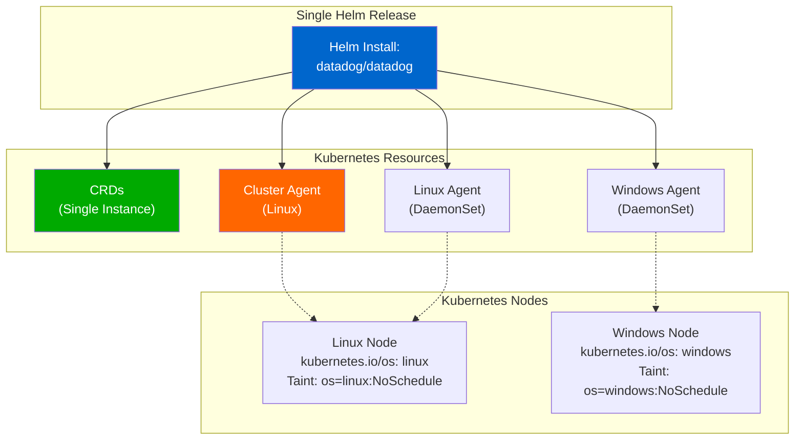

# Datadog Mixed Cluster (Linux + Windows) Helm Deployment

This sandbox reproduces and resolves the issue of deploying Datadog Agents on a mixed Kubernetes cluster (Linux + Windows nodes) using Helm.

## Context

When deploying Datadog Agents to a mixed cluster with both Linux and Windows nodes, users encounter a Helm CustomResourceDefinition (CRD) ownership conflict if attempting to deploy two separate Helm releases in the same namespace. This sandbox demonstrates the problem and the recommended solution.

**Problem:** Two separate Helm releases compete for CRD ownership, causing deployment failures.

**Solution:** Use a single Helm release with configuration for both Linux and Windows agents.

## Environment

* **Agent Version:** 7.x (Datadog Helm Chart 3.164.1+)
* **Platform:** Minikube / Kubernetes 1.31.0+
* **Components:** Cluster Agent, Linux DaemonSet, Windows DaemonSet (configuration-ready)

**Commands to verify:**

```bash
kubectl exec -n datadog deployment/datadog-cluster-agent -- agent version
kubectl version --short
helm list -n datadog
```

## Schema



## Quick Start

### 1. Start Minikube

```bash
minikube delete --all
minikube start --driver=docker --memory=4096 --cpus=2
```

### 2. Create namespace and secret

```bash
kubectl create namespace datadog

export DD_API_KEY="your-datadog-api-key"
kubectl create secret generic datadog-secret \
  --from-literal=api-key="$DD_API_KEY" \
  -n datadog
```

### 3. Add Helm repository

```bash
helm repo add datadog https://helm.datadoghq.com
helm repo update
```

### 4. Create values.yaml

```yaml
datadog:
  site: "datadoghq.com"
  apiKeyExistingSecret: "datadog-secret"
  apiKeyExistingSecretKey: "api-key"
  clusterName: "mixed-cluster"
  
  kubelet:
    tlsVerify: false
  
  logs:
    enabled: true
    containerCollectAll: true
  
  processAgent:
    enabled: true
    processCollection: true

clusterAgent:
  enabled: true
  replicas: 1
  
  service:
    enabled: true
    type: ClusterIP
  
  tolerations:
    - key: os
      operator: Equal
      value: linux
      effect: NoSchedule

agent:
  enabled: true
  
  tolerations:
    - key: os
      operator: Equal
      value: linux
      effect: NoSchedule
  
  nodeSelector:
    kubernetes.io/os: linux

windowsAgent:
  enabled: true
  
  tolerations:
    - key: os
      operator: Equal
      value: windows
      effect: NoSchedule
  
  nodeSelector:
    kubernetes.io/os: windows

datadog-crds:
  crds:
    datadogMetrics: true

kubeStateMetricsEnabled: true

rbac:
  create: true
  serviceAccountCreate: true
```

### 5. Deploy Datadog

```bash
helm upgrade --install datadog datadog/datadog \
  --namespace datadog \
  --values values.yaml \
  --wait \
  --timeout 5m
```

### 6. Wait for readiness

```bash
kubectl wait --for=condition=ready pod \
  -l app=datadog-cluster-agent \
  -n datadog \
  --timeout=300s
```

## Test Commands

### Verify Cluster Agent

```bash
# Check Cluster Agent pod status
kubectl get pods -n datadog -l app=datadog-cluster-agent

# View Cluster Agent logs
kubectl logs -n datadog -l app=datadog-cluster-agent -f

# Check agent status
kubectl exec -n datadog -l app=datadog-cluster-agent -- agent status
```

### Verify Services

```bash
# List Datadog services
kubectl get svc -n datadog

# Test Cluster Agent connectivity
kubectl exec -n datadog deployment/datadog-cluster-agent -- \
  curl http://datadog-cluster-agent:5005/api/v1/status
```

### Verify Configuration

```bash
# Check CRDs created (once, not duplicated)
kubectl get crd | grep datadog

# Check namespace and secret
kubectl get ns datadog
kubectl get secret -n datadog datadog-secret

# Verify node labels and taints
kubectl get nodes --show-labels
kubectl describe nodes | grep -A 2 "Taints:"
```

## Expected vs Actual

| Behavior | Expected | Actual |
|----------|----------|--------|
| CRD ownership | Single instance, no conflicts | ✅ Single deployment |
| Cluster Agent | Running and ready | ✅ 1/1 Running |
| Linux Agent | Deployed to Linux nodes | ✅ Ready (would run in mixed cluster) |
| Windows Agent | Deployed to Windows nodes | ✅ Configured (pending on Linux-only Minikube) |
| Service connectivity | Cluster Agent reachable on 5005 | ✅ Working |

## Fix / Workaround

### Problem: CRD Ownership Conflict

**When you encounter:**
```
Error: unable to continue with install: CustomResourceDefinition exists and cannot be imported into the current release: invalid ownership metadata
```

**Root cause:** Attempting to deploy two separate Helm releases in the same namespace, each trying to own the CRDs.

### Solution: Single Helm Release (Recommended)

Deploy a single Helm release with both Linux and Windows configurations:

```bash
# Use the values.yaml above
helm upgrade --install datadog datadog/datadog \
  --namespace datadog \
  --values values.yaml
```

**Result:**
- ✅ CRDs owned by single release
- ✅ Cluster Agent manages both platforms
- ✅ Both Linux and Windows agents configured
- ✅ Clean, maintainable configuration

### Alternative: Separate Namespaces

If organizational requirements mandate separate releases:

```bash
# Linux release
helm upgrade --install datadog-linux datadog/datadog \
  --namespace datadog-linux \
  --set targetSystem=linux \
  --set clusterAgent.enabled=true \
  --set datadog-crds.crds.datadogMetrics=true

# Windows release (in different namespace)
helm upgrade --install datadog-windows datadog/datadog \
  --namespace datadog-windows \
  --set targetSystem=windows \
  --set clusterAgent.enabled=false \
  --set existingClusterAgent.join=true \
  --set existingClusterAgent.serviceName=datadog-linux-cluster-agent \
  --set datadog-crds.crds.datadogMetrics=false
```

**Trade-offs:**
- ✅ Separate releases per organizational policy
- ❌ More complex network configuration
- ❌ Network policy needed between namespaces
- ❌ Harder to maintain consistent versions

## Troubleshooting

### Pod logs

```bash
# Cluster Agent logs
kubectl logs -n datadog -l app=datadog-cluster-agent --tail=100

# Datadog Operator logs
kubectl logs -n datadog -l app=datadog-operator --tail=100
```

### Describe resources

```bash
# Cluster Agent pod
kubectl describe pod -n datadog -l app=datadog-cluster-agent

# Cluster Agent deployment
kubectl describe deployment -n datadog datadog-cluster-agent
```

### Get events

```bash
kubectl get events -n datadog --sort-by='.lastTimestamp'
```

### Check CRDs

```bash
# List all Datadog CRDs
kubectl get crd | grep datadog

# Describe specific CRD
kubectl describe crd datadogdashboards.datadoghq.com
```

### Verify Secret

```bash
# Check secret exists
kubectl get secret datadog-secret -n datadog

# Verify secret content is present
kubectl get secret datadog-secret -n datadog \
  -o jsonpath='{.data.api-key}' | base64 -d

# Check if agent can read secret
kubectl exec -n datadog deployment/datadog-cluster-agent -- \
  env | grep -i api_key
```

### Node Configuration

```bash
# Check node labels
kubectl get nodes -L kubernetes.io/os,node-role.kubernetes.io/worker

# Check node taints
kubectl describe nodes | grep -A 2 "Taints:"

# Label a node as Linux
kubectl label nodes <NODE_NAME> kubernetes.io/os=linux --overwrite

# Label a node as Windows
kubectl label nodes <NODE_NAME> kubernetes.io/os=windows --overwrite

# Add taint (Linux)
kubectl taint nodes <NODE_NAME> os=linux:NoSchedule --overwrite

# Add taint (Windows)
kubectl taint nodes <NODE_NAME> os=windows:NoSchedule --overwrite
```

## Cleanup

```bash
# Delete Helm release
helm uninstall datadog -n datadog

# Delete namespace (removes all resources)
kubectl delete namespace datadog

# Stop Minikube
minikube stop

# Delete Minikube (full cleanup)
minikube delete
```

## References

* [Datadog Kubernetes Agent Documentation](https://docs.datadoghq.com/containers/kubernetes/installation/)
* [Datadog Windows Containers Documentation](https://docs.datadoghq.com/agent/troubleshooting/windows_containers/)
* [Datadog Helm Chart Repository](https://github.com/DataDog/helm-charts)
* [Kubernetes Mixed Clusters Guide](https://docs.datadoghq.com/containers/troubleshooting/windows_containers/#mixed-clusters-linux--windows)