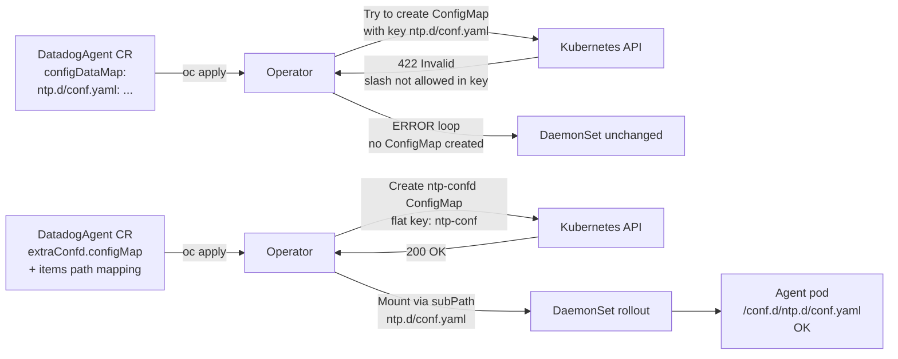

# Datadog Operator — extraConfd configDataMap slash-key bug and NTP check override fix

## Context

When using `extraConfd.configDataMap` in a `v2alpha1` DatadogAgent CR, using a key that contains a forward slash (e.g. `ntp.d/conf.yaml`) causes Kubernetes to reject the ConfigMap creation. The Operator enters a reconcile error loop, the `nodeagent-extra-confd` ConfigMap is never created, and the DaemonSet is never updated — even though `oc get datadogagent` shows the CR was accepted and no obvious error is visible.

This sandbox reproduces the bug and verifies the fix: using an external ConfigMap with a flat key and an `items` path mapping.

**Applies to:** Any integration check whose config lives in a subdirectory (`<check>.d/conf.yaml`) — NTP is used as the example but the pattern is identical for `redis.d/conf.yaml`, `postgres.d/conf.yaml`, etc.

## Environment

- **Agent Version:** 7.71.1 (Operator default)
- **Operator Version:** 1.19.1 (Helm chart `datadog/datadog-operator` 2.14.3)
- **Platform:** minikube v1.31.0, Kubernetes v1.31.0
- **Integration:** NTP check (`ntp.d/conf.yaml`)

## Schema



## Quick Start

### 1. Start minikube and install Operator 1.19.x

```bash
minikube status || minikube start --memory=4096 --cpus=2

kubectl create namespace datadog-operator-sandbox

kubectl create secret generic datadog-secret \
  -n datadog-operator-sandbox \
  --from-literal=api-key=<DD_API_KEY>

helm repo add datadog https://helm.datadoghq.com && helm repo update
helm upgrade --install datadog-operator datadog/datadog-operator \
  --version 2.14.3 \
  -n datadog-operator-sandbox \
  --set replicaCount=1 \
  --wait --timeout=120s
```

### 2. Reproduce the bug — apply the broken CR

```bash
kubectl apply -f - <<'EOF'
apiVersion: datadoghq.com/v2alpha1
kind: DatadogAgent
metadata:
  name: datadog
  namespace: datadog-operator-sandbox
spec:
  global:
    credentials:
      apiSecret:
        keyName: api-key
        secretName: datadog-secret
    site: datadoghq.com
    kubelet:
      tlsVerify: false
  override:
    nodeAgent:
      extraConfd:
        configDataMap:
          ntp.d/conf.yaml: |-
            init_config:
            instances:
              - hosts:
                  - 0.pool.ntp.org
EOF
```

### 3. Observe the failure

```bash
# Operator error loop — repeats every few seconds
kubectl logs -n datadog-operator-sandbox \
  -l app.kubernetes.io/name=datadog-operator --tail=5 | grep ERROR

# Expected:
# "error":"ConfigMap \"nodeagent-extra-confd\" is invalid:
#   data[ntp.d/conf.yaml]: Invalid value: \"ntp.d/conf.yaml\":
#   a valid config key must consist of alphanumeric characters,
#   '-', '_' or '.' ... regex used for validation is '[-._a-zA-Z0-9]+'"

# Confirm no ConfigMap was created
kubectl get configmaps -n datadog-operator-sandbox | grep extra-confd
# Expected: (no output)
```

### 4. Apply the fix

```bash
# Step 1 — create ConfigMap with a valid (flat, slash-free) key
kubectl apply -f - <<'EOF'
apiVersion: v1
kind: ConfigMap
metadata:
  name: ntp-confd
  namespace: datadog-operator-sandbox
data:
  ntp-conf: |
    init_config:
    instances:
      - hosts:
          - 0.pool.ntp.org
EOF

# Step 2 — update DatadogAgent CR to use configMap + items
kubectl apply -f - <<'EOF'
apiVersion: datadoghq.com/v2alpha1
kind: DatadogAgent
metadata:
  name: datadog
  namespace: datadog-operator-sandbox
spec:
  global:
    credentials:
      apiSecret:
        keyName: api-key
        secretName: datadog-secret
    site: datadoghq.com
    kubelet:
      tlsVerify: false
  override:
    nodeAgent:
      extraConfd:
        configMap:
          name: ntp-confd
          items:
            - key: ntp-conf
              path: ntp.d/conf.yaml
EOF
```

### 5. Verify the fix

```bash
# Wait for DaemonSet rollout
kubectl rollout status daemonset/datadog-agent \
  -n datadog-operator-sandbox --timeout=120s

AGENT_POD=$(kubectl get pod -n datadog-operator-sandbox \
  -l app.kubernetes.io/component=agent \
  -o jsonpath='{.items[0].metadata.name}')

# Confirm the file is mounted inside the agent
kubectl exec -n datadog-operator-sandbox $AGENT_POD -c agent -- \
  cat /etc/datadog-agent/conf.d/ntp.d/conf.yaml

# Confirm NTP check uses the new config source (not .default)
kubectl exec -n datadog-operator-sandbox $AGENT_POD -c agent -- \
  agent status 2>/dev/null | grep -A6 "^    ntp$"
# Expected: Configuration Source: file:.../ntp.d/conf.yaml[0]
```

## Expected vs Actual

| Behavior | Buggy CR (`configDataMap: ntp.d/conf.yaml`) | Fixed CR (`configMap` + `items`) |
|----------|----------------------------------------------|-----------------------------------|
| ConfigMap created | No | Yes (`ntp-confd`) |
| Operator errors | Yes — ERROR loop | None |
| DaemonSet rollout triggered | No | Yes |
| `/conf.d/ntp.d/conf.yaml` inside pod | Missing | Present |
| NTP check config source | `conf.yaml.default` | `conf.yaml` |

## Root Cause

Kubernetes ConfigMap data keys must match `[-._a-zA-Z0-9]+`. A forward slash `/` is not permitted. When `configDataMap` contains a key like `ntp.d/conf.yaml`, the Operator attempts to create a ConfigMap with that key at reconcile time. Kubernetes rejects the request (HTTP 422 Unprocessable Entity). The Operator logs the error but does **not** surface it to the DatadogAgent CR `.status` conditions — from the user's perspective the CR looks accepted but the DaemonSet is silently never updated.

The `configDataMap` field is designed for **flat keys** (e.g. `ntp.yaml`, `my-check.yaml`). To place a file inside a subdirectory of `conf.d/`, use `extraConfd.configMap` with an `items` path mapping instead.

## Fix

```yaml
# Step 1 — ConfigMap with flat (slash-free) key
apiVersion: v1
kind: ConfigMap
metadata:
  name: ntp-confd
  namespace: <DATADOG_NAMESPACE>
data:
  ntp-conf: |
    init_config:
    instances:
      - hosts:
          - <INTERNAL_NTP_SERVER>
---
# Step 2 — Reference in DatadogAgent CR
spec:
  override:
    nodeAgent:
      extraConfd:
        configMap:
          name: ntp-confd
          items:
            - key: ntp-conf
              path: ntp.d/conf.yaml
```

> **Note:** `customConfigurations.datadog.yaml` with `ntp_config.hosts` does NOT work — the agent flags it as an unknown config key and the NTP check continues sourcing from `conf.yaml.default`.

## Troubleshooting

```bash
# Check Operator logs for ConfigMap errors
kubectl logs -n datadog-operator-sandbox \
  -l app.kubernetes.io/name=datadog-operator --tail=20 | grep ERROR

# List ConfigMaps in namespace (look for nodeagent-extra-confd)
kubectl get configmaps -n datadog-operator-sandbox

# Check NTP check config source inside agent
kubectl exec -n datadog-operator-sandbox $AGENT_POD -c agent -- \
  agent status 2>/dev/null | grep -A6 ntp
```

## Cleanup

```bash
kubectl delete namespace datadog-operator-sandbox
```

## References

- [Datadog Operator extraConfd docs](https://docs.datadoghq.com/containers/kubernetes/integrations/?tab=datadogoperator)
- [Operator v2alpha1 configuration reference](https://github.com/DataDog/datadog-operator/blob/main/docs/configuration.v2alpha1.md)
- [Official extraConfd YAML example](https://github.com/DataDog/datadog-operator/blob/main/examples/datadogagent/datadog-agent-with-extraconfd.yaml)
- [Kubernetes ConfigMap key validation](https://kubernetes.io/docs/concepts/configuration/configmap/)
- [NTP integration docs](https://docs.datadoghq.com/integrations/ntp/?tab=host)
