# Datadog Operator - Automatic Agent Version Updates on Upgrade

## Context

When upgrading the Datadog Operator helm chart, the Cluster Agent and Node Agent versions are automatically updated to versions that are hardcoded in the new operator binary. This sandbox demonstrates this behavior by:

1. Installing Datadog Operator helm chart **2.12.0** (operator v1.17.0) and checking agent versions
2. Upgrading to helm chart **2.17.0** (operator v1.22.0) and observing the automatic version change

This helps understand:
- How the operator manages agent versions automatically
- Why manual image overrides via CRD don't work (field doesn't exist in v2alpha1)
- What happens during operator upgrades

## Environment

* **Operator Helm Chart Versions:** 2.12.0 → 2.17.0
* **Operator App Versions:** 1.17.0 → 1.22.0
* **Platform:** minikube
* **Kubernetes API:** v2alpha1

## Schema

```mermaid
sequenceDiagram
    participant User
    participant Helm as Helm Chart 2.12.0
    participant Op1 as Operator 1.17.0
    participant K8s as Kubernetes
    
    User->>Helm: helm install
    Helm->>Op1: Deploy operator pod
    Op1->>K8s: Create DatadogAgent CR
    Op1->>K8s: Deploy agents with hardcoded v7.XX.X
    
    Note over User,K8s: UPGRADE PHASE
    
    User->>Helm: helm upgrade to 2.17.0
    Helm->>Op1: Replace operator pod → 1.22.0
    Op1->>K8s: Reconcile DatadogAgent CR
    Op1->>K8s: Update agents to new hardcoded v7.75.0
```



## Quick Start

### 1. Start minikube

```bash
minikube delete --all
minikube start --memory=4096 --cpus=2
```

### 2. Create Datadog secret

```bash
kubectl create namespace datadog

# Replace YOUR_API_KEY with your actual Datadog API key
kubectl create secret generic datadog-secret \
  --from-literal=api-key=YOUR_API_KEY \
  -n datadog
```

### 3. Install Datadog Operator v2.12.0

```bash
helm repo add datadog https://helm.datadoghq.com
helm repo update

helm install datadog-operator datadog/datadog-operator \
  --version 2.12.0 \
  -n datadog
```

### 4. Wait for operator ready

```bash
kubectl wait --for=condition=ready pod \
  -l app.kubernetes.io/name=datadog-operator \
  -n datadog \
  --timeout=300s
```

### 5. Deploy DatadogAgent resource

```bash
kubectl apply -f - <<'MANIFEST'
apiVersion: datadoghq.com/v2alpha1
kind: DatadogAgent
metadata:
  name: datadog
  namespace: datadog
spec:
  global:
    clusterName: operator-upgrade-test
    site: datadoghq.com
    credentials:
      apiSecret:
        secretName: datadog-secret
        keyName: api-key
    kubelet:
      tlsVerify: false
  features:
    logCollection:
      enabled: false
    apm:
      enabled: false
MANIFEST
```

### 6. Wait for agents to be ready

```bash
# Wait for DaemonSet
kubectl wait --for=condition=ready pod \
  -l app.kubernetes.io/component=agent \
  -n datadog \
  --timeout=300s

# Wait for Cluster Agent
kubectl wait --for=condition=ready pod \
  -l app.kubernetes.io/component=cluster-agent \
  -n datadog \
  --timeout=300s
```

## Test Commands

### Check Operator Version (Before Upgrade)

```bash
# Check operator helm chart version
helm list -n datadog

# Check operator pod image
kubectl get deployment datadog-operator \
  -n datadog \
  -o jsonpath='{.spec.template.spec.containers[0].image}'

# Expected: gcr.io/datadoghq/operator:1.17.0
```

### Check Agent Versions (Before Upgrade)

```bash
# Check Cluster Agent image
kubectl get deployment datadog-cluster-agent \
  -n datadog \
  -o jsonpath='{.spec.template.spec.containers[0].image}'

# Check Node Agent image
kubectl get daemonset datadog-agent \
  -n datadog \
  -o jsonpath='{.spec.template.spec.containers[?(@.name=="agent")].image}'

# Check actual running version
kubectl exec -n datadog deployment/datadog-cluster-agent \
  -- agent version
```

### Upgrade to Operator v2.17.0

```bash
helm upgrade datadog-operator datadog/datadog-operator \
  --version 2.17.0 \
  -n datadog
```

**Note:** Don't use `--reuse-values` as it may cause schema issues between versions.

### Wait for upgrade to complete

```bash
# Wait for operator to be replaced
kubectl rollout status deployment/datadog-operator -n datadog
```

### ⚠️ Handle Label Selector Change

The operator v1.22.0 changes metadata labels (as warned in release notes). The deployment selector is immutable in Kubernetes, so we need to delete and let the operator recreate:

```bash
# Delete existing deployments
kubectl delete deployment datadog-cluster-agent -n datadog
kubectl delete daemonset datadog-agent -n datadog

# Operator will automatically recreate them with new labels and versions
sleep 10
```

### Check Agent Versions (After Upgrade)

```bash
# Check operator version
kubectl get deployment datadog-operator \
  -n datadog \
  -o jsonpath='{.spec.template.spec.containers[0].image}'

# Expected: gcr.io/datadoghq/operator:1.22.0

# Check Cluster Agent image (SHOULD BE UPDATED)
kubectl get deployment datadog-cluster-agent \
  -n datadog \
  -o jsonpath='{.spec.template.spec.containers[0].image}'

# Check Node Agent image (SHOULD BE UPDATED)
kubectl get daemonset datadog-agent \
  -n datadog \
  -o jsonpath='{.spec.template.spec.containers[?(@.name=="agent")].image}'

# Check actual running version
kubectl exec -n datadog deployment/datadog-cluster-agent \
  -- agent version
```

## Expected vs Actual

| Behavior | Expected | Actual |
|----------|----------|--------|
| **Operator 2.12.0** | Operator v1.17.0 | ✅ v1.17.0 |
| **Agent version with 2.12.0** | ~7.68.0 (hardcoded in operator binary) | ✅ **7.68.2** |
| **Operator 2.17.0** | Operator v1.22.0 | ✅ v1.22.0 |
| **Agent version with 2.17.0** | ~7.74.0 (hardcoded in operator binary) | ✅ **7.74.0** |
| **Automatic version upgrade** | ✅ Agents automatically updated | ✅ **Yes - 7.68.2 → 7.74.0** |

### Version Mapping Reference (Verified)

| Operator Helm Chart | Operator Version | Actual Agent Version Deployed |
|---------------------|------------------|-------------------------------|
| 2.12.0 | 1.17.0 | **7.68.2** |
| 2.17.0 | 1.22.0 | **7.74.0** |

Source: https://github.com/DataDog/datadog-operator/blob/main/pkg/images/images.go

## Key Findings

### ✅ Automatic Version Management

The operator **automatically** sets agent versions based on constants hardcoded in its binary:

```go
// From operator source code: pkg/images/images.go
const (
    AgentLatestVersion = "7.75.0"        // For operator v1.22.0
    ClusterAgentLatestVersion = "7.75.0"
)
```

### ❌ No Manual Image Override in CRD

The `DatadogAgent` v2alpha1 CRD does **NOT** support image overrides:

```bash
# This will fail - field doesn't exist
kubectl explain datadogagent.spec.override.clusterAgent.image
# error: field "image" does not exist
```

### 🔄 Upgrade Behavior

When upgrading the operator:
1. New operator pod is deployed with new binary
2. Operator reconciles existing `DatadogAgent` CR
3. Operator updates agent deployments/daemonsets with new hardcoded versions
4. Kubernetes performs rolling update of agents

## Alternative: Using Direct Helm Chart

If you need manual control over agent versions, use the **direct Datadog Helm Chart** instead:

```yaml
# values.yaml for datadog/datadog (not datadog/datadog-operator)
clusterAgent:
  image:
    tag: "7.71.0"  # Manual override - THIS WORKS!

agents:
  image:
    tag: "7.71.0"
```

```bash
helm install datadog-agent datadog/datadog \
  -n datadog \
  -f values.yaml
```

## Troubleshooting

### Check operator logs

```bash
kubectl logs -n datadog deployment/datadog-operator --tail=100
```

### Check agent status

```bash
kubectl exec -n datadog deployment/datadog-cluster-agent -- agent status
kubectl exec -n datadog daemonset/datadog-agent -c agent -- agent status
```

### Check reconciliation

```bash
# Watch operator reconciling the DatadogAgent CR
kubectl logs -n datadog deployment/datadog-operator -f | grep -i reconcil
```

### Verify upgrade completion

```bash
# All pods should be running
kubectl get pods -n datadog

# Check rollout history
kubectl rollout history deployment/datadog-cluster-agent -n datadog
kubectl rollout history daemonset/datadog-agent -n datadog
```

## Cleanup

```bash
helm uninstall datadog-operator -n datadog
kubectl delete namespace datadog
minikube delete --all
```

## References

* [Datadog Operator GitHub](https://github.com/DataDog/datadog-operator)
* [Datadog Operator Helm Chart Versions](https://github.com/DataDog/helm-charts/tree/main/charts/datadog-operator)
* [Operator Image Defaults Source Code](https://github.com/DataDog/datadog-operator/blob/main/pkg/images/images.go)
* [Datadog Operator Documentation](https://docs.datadoghq.com/containers/datadog_operator)
