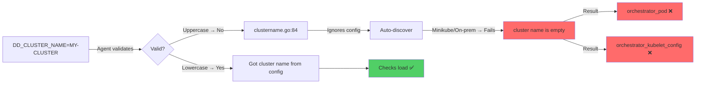

# Orchestrator Checks - "Cluster Name Is Empty" (Uppercase Rejection)

**Note:** All manifests and configurations are included inline in this README for easy copy-paste reproduction. Never put API keys directly in manifests - use Kubernetes secrets.

## Context

The `orchestrator_pod` and `orchestrator_kubelet_config` checks fail with:

```
orchestrator check is configured but the cluster name is empty
orchestrator kubelet_config check is configured but the cluster name is empty
```

**Root Cause:** The Datadog Agent rejects cluster names containing uppercase letters as invalid (clustername.go:84). Valid names must be dot-separated tokens starting with a lowercase letter, followed by lowercase letters, numbers, or hyphens. When an invalid name (e.g. `MY-EKS-CLUSTER-NAME`) is provided, the Agent logs the error, ignores the config, falls back to cloud metadata auto-discovery (which fails on minikube/on-prem), and both orchestrator checks fail to initialize.

**Common Scenario:** EKS cluster names often use uppercase (e.g. `MyEKSCluster-Prod`). If set as-is in `DD_CLUSTER_NAME` or `clusterName`, orchestrator checks will not load.

## Environment

- **Agent Version:** 7.76.1+ (tested)
- **Platform:** minikube / EKS / any Kubernetes
- **Integration:** Orchestrator Explorer (orchestrator_pod, orchestrator_kubelet_config)

**Commands to get versions:**
- Agent: `kubectl exec -n datadog daemonset/datadog-agent -c agent -- agent version`
- Kubernetes: `kubectl version --short`

## Schema



## Quick Start

### 1. Start minikube

```bash
minikube delete --all
minikube start --memory=4096 --cpus=2
```

### 2. Deploy Datadog Agent with Orchestrator Explorer

Create namespace, secret, and deploy via Helm:

```bash
kubectl create namespace datadog
kubectl create secret generic datadog-secret -n datadog --from-literal=api-key=YOUR_API_KEY

helm repo add datadog https://helm.datadoghq.com && helm repo update
helm upgrade --install datadog-agent datadog/datadog -n datadog \
  --set datadog.site=datadoghq.com \
  --set datadog.apiKeyExistingSecret=datadog-secret \
  --set datadog.clusterName=my-sandbox-cluster \
  --set datadog.orchestratorExplorer.enabled=true \
  --set datadog.kubelet.tlsVerify=false \
  --set clusterAgent.enabled=true \
  --set agents.image.tag=7.76.1
```

### 3. Wait for pods

```bash
kubectl wait --for=condition=ready pod -l app.kubernetes.io/name=datadog -n datadog --timeout=300s
```

## Reproduce the Bug

Get the node agent daemonset name (typically `datadog-agent` or `datadog-agent-datadog`):

```bash
kubectl get daemonset -n datadog
```

### Test 1: Set uppercase cluster name

```bash
kubectl set env daemonset/datadog-agent -n datadog DD_CLUSTER_NAME=MY-SANDBOX-CLUSTER
```

If the daemonset name differs, replace `datadog-agent` with the actual name from the command above.

Wait for pod restart (~30–60 seconds), then check agent logs:

```bash
POD=$(kubectl get pods -n datadog -l app.kubernetes.io/name=datadog -o name | grep -v cluster-agent | head -1)
kubectl logs $POD -n datadog -c agent 2>&1 | grep -E "cluster|orchestrator" -i
```

**Expected output (bug):**
```
Got cluster name MY-SANDBOX-CLUSTER from config
"MY-SANDBOX-CLUSTER" isn't a valid cluster name. It must be dot-separated tokens where tokens start with a lowercase letter...
(pkg/util/kubernetes/clustername/clustername.go:84 in getClusterName)
As a consequence, the cluster name provided by the config will be ignored
core.loader: could not configure check orchestrator_kubelet_config: orchestrator kubelet_config check is configured but the cluster name is empty
core.loader: could not configure check orchestrator_pod: orchestrator check is configured but the cluster name is empty
```

### Test 2: Revert to lowercase (fix)

```bash
kubectl set env daemonset/datadog-agent -n datadog DD_CLUSTER_NAME=my-sandbox-cluster
```

Wait for pod restart, then check logs:

```bash
POD=$(kubectl get pods -n datadog -l app.kubernetes.io/name=datadog -o name | grep -v cluster-agent | head -1)
kubectl logs $POD -n datadog -c agent 2>&1 | grep -E "cluster|orchestrator" -i
```

**Expected output (fixed):**
```
Got cluster name my-sandbox-cluster from config
Core Check Loader: successfully loaded check 'orchestrator_kubelet_config'
Core Check Loader: successfully loaded check 'orchestrator_pod'
```

## Test Commands

### Verify orchestrator checks status

```bash
kubectl exec -n datadog $(kubectl get pods -n datadog -l app.kubernetes.io/name=datadog -o name | grep -v cluster-agent | head -1 | cut -d/ -f2) -c agent -- agent status | grep -A 10 orchestrator
```

### Check current DD_CLUSTER_NAME in pod

```bash
kubectl exec -n datadog $(kubectl get pods -n datadog -l app.kubernetes.io/name=datadog -o name | grep -v cluster-agent | head -1 | cut -d/ -f2) -c agent -- env | grep DD_CLUSTER_NAME
```

## Expected vs Actual

| Behavior | Expected (lowercase) | Actual (uppercase) |
|----------|----------------------|---------------------|
| orchestrator_pod | ✅ Loaded | ❌ cluster name is empty |
| orchestrator_kubelet_config | ✅ Loaded | ❌ cluster name is empty |
| Agent logs | ✅ "Got cluster name X from config" | ❌ "isn't a valid cluster name" |
| Orchestrator Explorer UI | ✅ Data visible | ❌ No orchestrator data |

## Fix / Workaround

### Use lowercase cluster names only

Valid format: dot-separated tokens where each token starts with a lowercase letter, followed by lowercase letters, numbers, or hyphens. Cannot end with a hyphen.

**Helm:**
```yaml
datadog:
  clusterName: my-eks-cluster-prod  # lowercase
  orchestratorExplorer:
    enabled: true
```

**Datadog Operator (v2alpha1):** Explicitly set `DD_CLUSTER_NAME` in override (Operator may not propagate `spec.global.clusterName`):

```yaml
spec:
  global:
    clusterName: my-eks-cluster-prod
  override:
    nodeAgent:
      env:
        - name: DD_CLUSTER_NAME
          value: my-eks-cluster-prod
    clusterAgent:
      env:
        - name: DD_CLUSTER_NAME
          value: my-eks-cluster-prod
```

**If your EKS cluster name is uppercase:** Use a lowercase alias, e.g. `my-eks-cluster-prod` instead of `MyEKSCluster-Prod`.

## Troubleshooting

```bash
# Agent logs (orchestrator-related)
kubectl logs -n datadog -l app.kubernetes.io/name=datadog -c agent --tail=200 | grep -E "cluster|orchestrator"

# Full agent status
kubectl exec -n datadog $(kubectl get pods -n datadog -l app.kubernetes.io/name=datadog -o name | grep -v cluster-agent | head -1 | cut -d/ -f2) -c agent -- agent status

# Describe daemonset (check env vars)
kubectl get daemonset -n datadog -o name
kubectl get daemonset -n datadog -o yaml | grep -A 20 "env:"
```

## Cleanup

```bash
helm uninstall datadog-agent -n datadog
kubectl delete namespace datadog
```

## References

- [Datadog Kubernetes Cluster Name Configuration](https://docs.datadoghq.com/agent/kubernetes/?tab=daemonset#cluster-name-configuration)
- [Orchestrator Explorer](https://docs.datadoghq.com/infrastructure/livecontainers/configuration/)
- [Agent Docker Tags](https://hub.docker.com/r/datadog/agent/tags)
