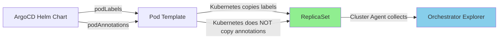

# Kubernetes Orchestrator Explorer - Custom Tags Not Appearing on Workloads

**Note:** All manifests and configurations are included inline in this README for easy copy-paste reproduction. Never put API keys directly in manifests - use Kubernetes secrets.

## Context

Custom tags set via pod annotations (`ad.datadoghq.com/tags`) do not appear on workload resources (Deployments, ReplicaSets, DaemonSets) in Datadog's Orchestrator Explorer UI.

**Root Cause:** Pod annotations are for Datadog Autodiscovery (metrics/logs/traces tagging), NOT for Kubernetes resource labels. Orchestrator Explorer displays actual Kubernetes metadata, which requires labels.

**Common Scenario:** Customers using ArgoCD or Helm charts set unified service tags as pod labels, but set custom tags (like `team`) as pod annotations. This causes unified service tags to appear on workloads in Orchestrator Explorer, while custom tags do not.

## Environment

- **Agent Version:** 7.50.0+
- **Platform:** minikube / Kubernetes 1.28+
- **Feature:** Orchestrator Explorer

**Commands to get versions:**
- Agent: `kubectl exec -n datadog daemonset/datadog-agent -c agent -- agent version`
- Kubernetes: `kubectl version --short`

## Schema



## Quick Start

### 1. Start minikube

```bash
minikube delete --all
minikube start --memory=4096 --cpus=2
```

### 2. Deploy Test Application - BROKEN VERSION

This reproduces the issue where `team` tag is only in annotations:

```bash
kubectl apply -f - <<'MANIFEST'
---
apiVersion: apps/v1
kind: Deployment
metadata:
  name: test-app-broken
  namespace: default
  labels:
    app: test-app-broken
spec:
  replicas: 2
  selector:
    matchLabels:
      app: test-app-broken
  template:
    metadata:
      labels:
        app: test-app-broken
        # ✅ Unified service tags as LABELS
        tags.datadoghq.com/service: test-app
        tags.datadoghq.com/env: sandbox
        tags.datadoghq.com/version: "1.0"
        # ❌ NO team tag as label!
      annotations:
        # ❌ Team tag ONLY as ANNOTATION
        ad.datadoghq.com/tags: '{"team":"platform"}'
    spec:
      containers:
      - name: nginx
        image: nginx:1.21
        ports:
        - containerPort: 80
MANIFEST
```

### 3. Wait for ready

```bash
kubectl wait --for=condition=ready pod -l app=test-app-broken --timeout=300s
```

### 4. Deploy Datadog Agent

Create `values.yaml`:

```yaml
datadog:
  site: "datadoghq.com"
  apiKeyExistingSecret: "datadog-secret"
  clusterName: "sandbox"
  kubelet:
    tlsVerify: false
  orchestratorExplorer:
    enabled: true

clusterAgent:
  enabled: true

agents:
  image:
    tag: 7.60.0  # https://hub.docker.com/r/datadog/agent/tags
```

Install the agent:

```bash
kubectl create namespace datadog
kubectl create secret generic datadog-secret -n datadog --from-literal=api-key=YOUR_API_KEY
helm repo add datadog https://helm.datadoghq.com && helm repo update
helm upgrade --install datadog-agent datadog/datadog -n datadog -f values.yaml
```

## Test Commands

### Verify the Issue

Check ReplicaSet labels (BROKEN - no team tag):

```bash
kubectl get replicaset -l app=test-app-broken -o jsonpath='{.items[0].metadata.labels}' | jq '.'
```

**Expected Output:**
```json
{
  "app": "test-app-broken",
  "pod-template-hash": "abc123",
  "tags.datadoghq.com/env": "sandbox",
  "tags.datadoghq.com/service": "test-app",
  "tags.datadoghq.com/version": "1.0"
  // ❌ NO "tags.datadoghq.com/team"
}
```

Check Pod annotations (team is here):

```bash
kubectl get pod -l app=test-app-broken -o jsonpath='{.items[0].metadata.annotations}' | jq '."ad.datadoghq.com/tags"'
```

### Agent

```bash
kubectl exec -n datadog daemonset/datadog-agent -c agent -- agent status
kubectl exec -n datadog deployment/datadog-agent-cluster-agent -- agent status
```

## Expected vs Actual

| Behavior | Expected | Actual |
|----------|----------|--------|
| `service`, `env`, `version` on ReplicaSet | ✅ Visible in Orchestrator Explorer | ✅ Visible |
| `team` tag on ReplicaSet | ✅ Visible in Orchestrator Explorer | ❌ **NOT visible** |

### Screenshots

In Orchestrator Explorer:
1. Navigate to Infrastructure > Kubernetes > ReplicaSets
2. Search for `test-app-broken`
3. Click on ReplicaSet → Check "Labels" section
4. **Result:** Only `service`, `env`, `version` appear - no `team` tag

## Fix / Workaround

### Option 1: Patch Existing Deployment

Add `team` as a pod label:

```bash
kubectl patch deployment test-app-broken \
  --type='json' \
  -p='[{"op": "add", "path": "/spec/template/metadata/labels/tags.datadoghq.com~1team", "value": "platform"}]'
```

Wait for rollout:

```bash
kubectl rollout status deployment/test-app-broken
```

### Option 2: Deploy Fixed Version

```bash
kubectl apply -f - <<'MANIFEST'
---
apiVersion: apps/v1
kind: Deployment
metadata:
  name: test-app-fixed
  namespace: default
  labels:
    app: test-app-fixed
spec:
  replicas: 2
  selector:
    matchLabels:
      app: test-app-fixed
  template:
    metadata:
      labels:
        app: test-app-fixed
        # ✅ Unified service tags as LABELS
        tags.datadoghq.com/service: test-app
        tags.datadoghq.com/env: sandbox
        tags.datadoghq.com/version: "1.0"
        # ✅ FIXED - Team tag as LABEL!
        tags.datadoghq.com/team: platform
      annotations:
        # ✅ Keep annotation for metrics/logs/traces
        ad.datadoghq.com/tags: '{"team":"platform"}'
    spec:
      containers:
      - name: nginx
        image: nginx:1.21
        ports:
        - containerPort: 80
MANIFEST
```

### Option 3: ArgoCD Helm Values

For ArgoCD deployments, update your `values.yaml`:

```yaml
notifications:
  podLabels:
    tags.datadoghq.com/service: argocd-notifications-controller
    tags.datadoghq.com/env: prod
    tags.datadoghq.com/version: "1.0"
    tags.datadoghq.com/team: platform  # ← Add this!
  podAnnotations:
    ad.datadoghq.com/tags: '{"team":"platform"}'  # Keep for metrics
```

Apply to all components: `notifications`, `applicationSet`, `controller`, `server`, `repo-server`, `redis`, `dex`.

### Verification

Check new ReplicaSet has the team tag:

```bash
# Get the newest ReplicaSet
kubectl get replicaset -l app=test-app-fixed --sort-by=.metadata.creationTimestamp \
  -o jsonpath='{.items[-1].metadata.labels}' | jq '.'
```

**Expected Output:**
```json
{
  "app": "test-app-fixed",
  "pod-template-hash": "xyz789",
  "tags.datadoghq.com/env": "sandbox",
  "tags.datadoghq.com/service": "test-app",
  "tags.datadoghq.com/team": "platform",  // ✅ NOW PRESENT!
  "tags.datadoghq.com/version": "1.0"
}
```

In Orchestrator Explorer (5-10 minutes after rollout):
1. Navigate to Infrastructure > Kubernetes > ReplicaSets
2. Search for `test-app-fixed`
3. Click on ReplicaSet → Check "Labels" section
4. **Result:** All tags including `team` should be visible

## Troubleshooting

```bash
# Check Deployment labels
kubectl get deployment test-app-fixed -o jsonpath='{.metadata.labels}' | jq '.'

# Check Pod labels
kubectl get pod -l app=test-app-fixed -o jsonpath='{.items[0].metadata.labels}' | jq '.'

# Check ReplicaSet labels
kubectl get replicaset -l app=test-app-fixed -o jsonpath='{.items[0].metadata.labels}' | jq '.'

# Check Orchestrator Explorer is enabled
kubectl exec -n datadog deployment/datadog-agent-cluster-agent -- agent status | grep -A 10 "Orchestrator Explorer"

# Cluster Agent logs
kubectl logs -n datadog -l app=datadog-agent-cluster-agent --tail=100

# Check for errors in orchestrator check
kubectl exec -n datadog deployment/datadog-agent-cluster-agent -- agent check orchestrator
```

## Cleanup

```bash
kubectl delete deployment test-app-broken test-app-fixed
helm uninstall datadog-agent -n datadog
kubectl delete namespace datadog
```

## References

- [Unified Service Tagging - Kubernetes](https://docs.datadoghq.com/getting_started/tagging/unified_service_tagging/?tab=kubernetes#containerized-environment)
- [Autodiscovery Annotations](https://docs.datadoghq.com/agent/kubernetes/integrations/?tab=kubernetes#configuration)
- [Kubernetes Labels and Selectors](https://kubernetes.io/docs/concepts/overview/working-with-objects/labels/)
- [Kubernetes Annotations](https://kubernetes.io/docs/concepts/overview/working-with-objects/annotations/)
- [Orchestrator Explorer Documentation](https://docs.datadoghq.com/infrastructure/livecontainers/configuration/)
