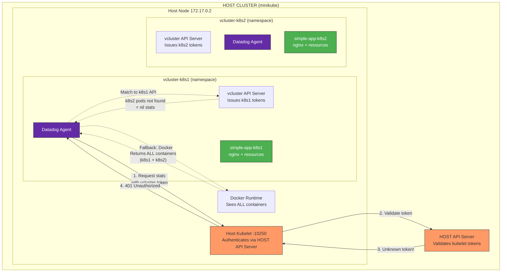

# Datadog Agent Container Metrics - Shared Node in vcluster

## Context

When running Datadog agents inside vclusters that share the same physical node, the agent cannot access the host kubelet because vcluster ServiceAccount tokens are not recognized by the host kubelet. This results in:
- `401 Unauthorized` errors when accessing kubelet endpoints
- `nil stats` for containers (the original customer issue)
- Missing CPU/memory usage metrics for pods

The root cause is that vclusters have their own API server and issue their own tokens, which the host kubelet does not trust.

## Environment

- **Agent Version:** 7.74.0
- **Platform:** minikube with vcluster
- **Integration:** kubelet, container

## Schema



### The Problem Flow

```
1. Agent in k8s1 tries to access kubelet with vcluster token
2. Kubelet validates token against HOST API server  
3. HOST API says "I don't know this token" (it's from vcluster)
4. Kubelet returns 401 Unauthorized
5. Agent falls back to Docker to get container list
6. Docker returns ALL containers (from k8s1 AND k8s2)
7. Agent tries to match containers to pods via k8s1 API
8. k8s2 containers don't exist in k8s1 API → nil stats
```

## Quick Start

### 1. Start minikube

```bash
minikube delete --all
minikube start --memory=6144 --cpus=4
```

### 2. Install vcluster CLI

```bash
curl -L -o vcluster "https://github.com/loft-sh/vcluster/releases/latest/download/vcluster-darwin-arm64"
chmod +x vcluster
sudo mv vcluster /usr/local/bin/
```

### 3. Create vclusters

```bash
# Create vcluster k8s1
vcluster create k8s1 --namespace vcluster-k8s1 --connect=false

# Create vcluster k8s2
vcluster create k8s2 --namespace vcluster-k8s2 --connect=false

# Wait for vclusters to be ready
kubectl wait --for=condition=ready pod -l app=vcluster -n vcluster-k8s1 --timeout=300s
kubectl wait --for=condition=ready pod -l app=vcluster -n vcluster-k8s2 --timeout=300s
```

### 4. Deploy Test Apps in Both vclusters

Deploy a simple nginx app in **k8s1**:

```bash
vcluster connect k8s1 --namespace vcluster-k8s1

kubectl apply -f - <<'MANIFEST'
---
apiVersion: v1
kind: Namespace
metadata:
  name: test-app
---
apiVersion: v1
kind: Pod
metadata:
  name: simple-app-k8s1
  namespace: test-app
  labels:
    app: simple-app-k8s1
spec:
  containers:
  - name: nginx
    image: nginx:alpine
    resources:
      requests:
        cpu: 100m
        memory: 64Mi
      limits:
        cpu: 200m
        memory: 128Mi
    ports:
    - containerPort: 80
MANIFEST

vcluster disconnect
```

Deploy a simple nginx app in **k8s2**:

```bash
vcluster connect k8s2 --namespace vcluster-k8s2

kubectl apply -f - <<'MANIFEST'
---
apiVersion: v1
kind: Namespace
metadata:
  name: test-app
---
apiVersion: v1
kind: Pod
metadata:
  name: simple-app-k8s2
  namespace: test-app
  labels:
    app: simple-app-k8s2
spec:
  containers:
  - name: nginx
    image: nginx:alpine
    resources:
      requests:
        cpu: 100m
        memory: 64Mi
      limits:
        cpu: 200m
        memory: 128Mi
    ports:
    - containerPort: 80
MANIFEST

vcluster disconnect
```

### 5. Create Host RBAC for Kubelet Access

On the **HOST cluster**, create a ServiceAccount with kubelet access:

```bash
kubectl apply -f - <<'MANIFEST'
---
apiVersion: v1
kind: ServiceAccount
metadata:
  name: vcluster-kubelet-access
  namespace: vcluster-k8s1
---
apiVersion: v1
kind: Secret
metadata:
  name: vcluster-kubelet-token
  namespace: vcluster-k8s1
  annotations:
    kubernetes.io/service-account.name: vcluster-kubelet-access
type: kubernetes.io/service-account-token
---
apiVersion: rbac.authorization.k8s.io/v1
kind: ClusterRole
metadata:
  name: kubelet-readonly
rules:
  - apiGroups: [""]
    resources: ["nodes/proxy", "nodes/stats", "nodes/metrics", "nodes/spec", "nodes/log"]
    verbs: ["get", "list"]
  - apiGroups: [""]
    resources: ["nodes"]
    verbs: ["get", "list"]
---
apiVersion: rbac.authorization.k8s.io/v1
kind: ClusterRoleBinding
metadata:
  name: vcluster-kubelet-access-binding
subjects:
  - kind: ServiceAccount
    name: vcluster-kubelet-access
    namespace: vcluster-k8s1
roleRef:
  kind: ClusterRole
  name: kubelet-readonly
  apiGroup: rbac.authorization.k8s.io
MANIFEST
```

### 6. Deploy Datadog Agent in vcluster

Connect to vcluster k8s1:

```bash
vcluster connect k8s1 --namespace vcluster-k8s1
```

Create namespace and secrets:

```bash
kubectl create namespace datadog

# Create API key secret
kubectl create secret generic datadog-secret -n datadog --from-literal=api-key=YOUR_API_KEY

# Get HOST token and create secret in vcluster
HOST_TOKEN=$(kubectl get secret vcluster-kubelet-token -n vcluster-k8s1 -o jsonpath='{.data.token}' --context minikube | base64 -d)
HOST_CA=$(kubectl get secret vcluster-kubelet-token -n vcluster-k8s1 -o jsonpath='{.data.ca\.crt}' --context minikube | base64 -d)

kubectl create secret generic host-kubelet-token -n datadog \
  --from-literal=token="$HOST_TOKEN" \
  --from-literal=ca.crt="$HOST_CA"
```

Create kubelet check config:

```bash
kubectl apply -f - <<'MANIFEST'
apiVersion: v1
kind: ConfigMap
metadata:
  name: kubelet-check-config
  namespace: datadog
data:
  conf.yaml: |
    init_config:
    instances:
      - bearer_token_auth: true
        ssl_verify: false
MANIFEST
```

Create `values.yaml`:

```yaml
datadog:
  site: "datadoghq.com"
  apiKeyExistingSecret: "datadog-secret"
  clusterName: "vcluster-k8s1"
  kubelet:
    tlsVerify: false
  logs:
    enabled: true
    containerCollectAll: true

clusterAgent:
  enabled: true

agents:
  containers:
    agent:
      env:
        - name: DD_LOG_LEVEL
          value: "debug"
  volumes:
    - name: host-kubelet-token
      secret:
        secretName: host-kubelet-token
    - name: kubelet-check-config
      configMap:
        name: kubelet-check-config
  volumeMounts:
    - name: host-kubelet-token
      mountPath: /var/run/secrets/host-kubelet
      readOnly: true
    - name: kubelet-check-config
      mountPath: /etc/datadog-agent/conf.d/kubelet.d/conf.yaml
      subPath: conf.yaml
```

Install the agent:

```bash
helm repo add datadog https://helm.datadoghq.com && helm repo update
helm upgrade --install datadog-agent datadog/datadog -n datadog -f values.yaml
```

### 7. Apply the Workaround

Patch the daemonset to replace vcluster SA token with host token:

```bash
kubectl patch daemonset datadog-agent -n datadog --type='json' -p='[
  {
    "op": "add",
    "path": "/spec/template/spec/volumes/-",
    "value": {
      "name": "sa-token-override",
      "emptyDir": {}
    }
  },
  {
    "op": "add",
    "path": "/spec/template/spec/initContainers/-",
    "value": {
      "name": "copy-host-token",
      "image": "busybox:latest",
      "command": ["sh", "-c", "cp /host-token/token /sa-override/token && cp /host-token/ca.crt /sa-override/ca.crt && echo default > /sa-override/namespace && chmod 444 /sa-override/*"],
      "volumeMounts": [
        {"name": "host-kubelet-token", "mountPath": "/host-token", "readOnly": true},
        {"name": "sa-token-override", "mountPath": "/sa-override"}
      ]
    }
  },
  {
    "op": "add",
    "path": "/spec/template/spec/containers/0/volumeMounts/-",
    "value": {
      "name": "sa-token-override",
      "mountPath": "/var/run/secrets/kubernetes.io/serviceaccount"
    }
  }
]'

kubectl rollout status daemonset/datadog-agent -n datadog --timeout=120s
```

## Test Commands

### Verify kubelet access

```bash
# Check agent status
AGENT_POD=$(kubectl get pods -n datadog -l app=datadog-agent -o jsonpath='{.items[0].metadata.name}')
kubectl exec -n datadog $AGENT_POD -c agent -- agent status | grep -A 15 "kubelet$"

# Run kubelet check
kubectl exec -n datadog $AGENT_POD -c agent -- agent check kubelet

# Test kubelet access manually
kubectl exec -n datadog $AGENT_POD -c agent -- /bin/bash -c '
TOKEN=$(cat /var/run/secrets/kubernetes.io/serviceaccount/token)
curl -sSk -H "Authorization: Bearer ${TOKEN}" https://$(printenv DD_KUBERNETES_KUBELET_HOST):10250/stats/summary | head -10
'
```

## Expected vs Actual

| Behavior | Before Workaround | After Workaround |
|----------|-------------------|------------------|
| Kubelet check | ❌ `[WARNING]` - 401 Unauthorized | ✅ `[OK]` |
| Metric samples | ❌ 0 | ✅ 600+ |
| Container metrics | ❌ nil stats | ✅ Full metrics |
| Service checks | ❌ status: 2 (critical) | ✅ status: 0 (ok) |

### Before (401 Error)

```
kubelet [WARNING]
  Warning: Error reporting metrics: couldn't fetch "statssummary": 
  unexpected status code 401 on https://172.17.0.2:10250/stats/summary: Unauthorized
```

### After (Working)

```
kubelet [OK]
  Metric Samples: Last Run: 600, Total: 600
  Service Checks: Last Run: 4, Total: 4
```

## Fix / Workaround

The workaround uses an init container to copy the HOST kubelet token and mount it over the vcluster ServiceAccount token path:

```yaml
initContainers:
  - name: copy-host-token
    image: busybox:latest
    command: 
      - sh
      - -c
      - |
        cp /host-token/token /sa-override/token
        cp /host-token/ca.crt /sa-override/ca.crt
        echo default > /sa-override/namespace
        chmod 444 /sa-override/*
    volumeMounts:
      - name: host-kubelet-token
        mountPath: /host-token
        readOnly: true
      - name: sa-token-override
        mountPath: /sa-override

volumes:
  - name: host-kubelet-token
    secret:
      secretName: host-kubelet-token  # Contains HOST cluster token
  - name: sa-token-override
    emptyDir: {}

containers:
  - name: agent
    volumeMounts:
      - name: sa-token-override
        mountPath: /var/run/secrets/kubernetes.io/serviceaccount
```

**Note:** This replaces the vcluster SA token entirely. Other vcluster API operations may be affected.

**Alternative solutions:**
1. Deploy the Datadog agent on the HOST cluster instead of inside vclusters
2. Use container metrics from Docker/cgroups (bypasses kubelet)
3. Feature request to Datadog: Add `DD_KUBELET_BEARER_TOKEN_PATH` global config option

## Troubleshooting

```bash
# Check agent pods
kubectl get pods -n datadog

# Agent logs
kubectl logs -n datadog -l app=datadog-agent -c agent --tail=100

# Describe agent pod
kubectl describe pod -n datadog -l app=datadog-agent

# Check init container logs
AGENT_POD=$(kubectl get pods -n datadog -l app=datadog-agent -o jsonpath='{.items[0].metadata.name}')
kubectl logs -n datadog $AGENT_POD -c copy-host-token

# Verify token is mounted
kubectl exec -n datadog $AGENT_POD -c agent -- ls -la /var/run/secrets/kubernetes.io/serviceaccount/

# Test kubelet directly
kubectl exec -n datadog $AGENT_POD -c agent -- curl -sSk https://172.17.0.2:10250/healthz
```

## Cleanup

```bash
# Disconnect from vcluster
vcluster disconnect

# Delete vclusters
vcluster delete k8s1 --namespace vcluster-k8s1
vcluster delete k8s2 --namespace vcluster-k8s2

# Delete namespaces
kubectl delete namespace vcluster-k8s1 vcluster-k8s2

# Stop minikube
minikube delete
```

## References

- [Datadog Kubernetes Agent](https://docs.datadoghq.com/containers/kubernetes/)
- [Datadog Kubelet Integration](https://docs.datadoghq.com/integrations/kubelet/)
- [vcluster Documentation](https://www.vcluster.com/docs)
- [Agent Docker Tags](https://hub.docker.com/r/datadog/agent/tags)
