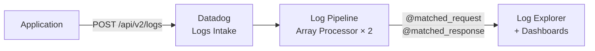
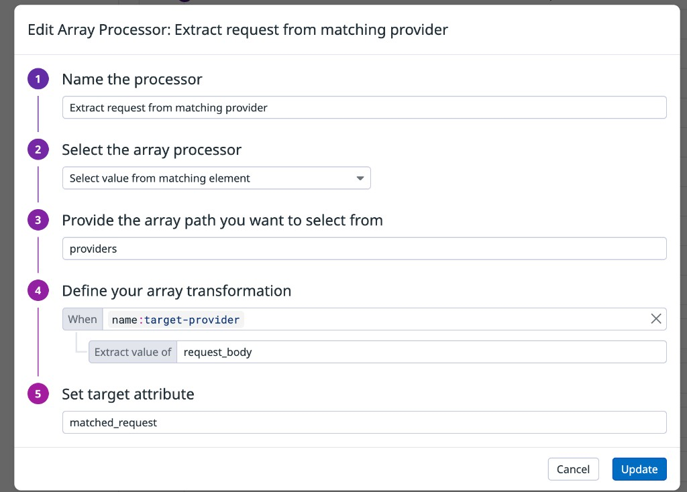
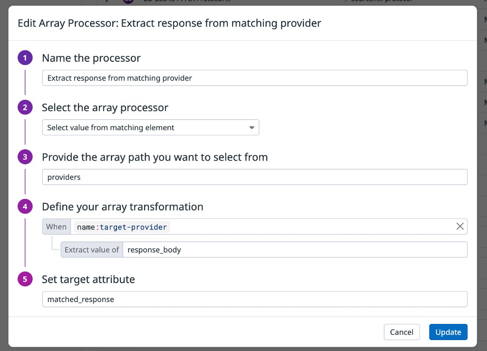
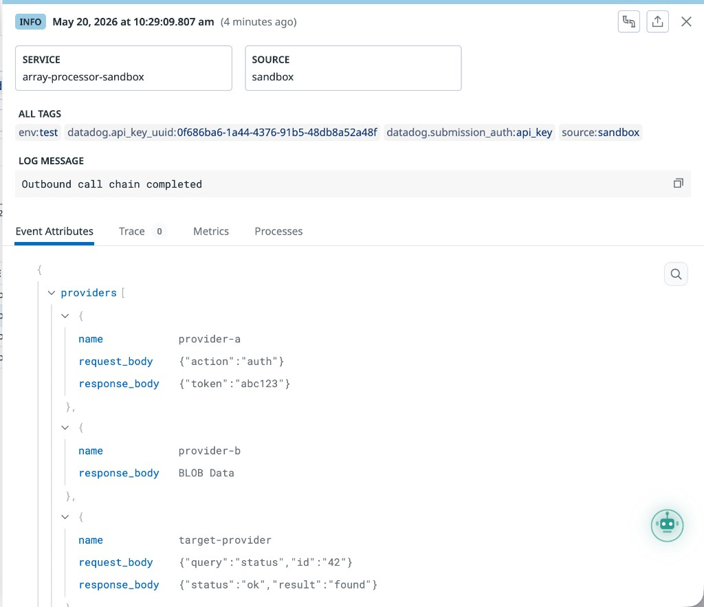
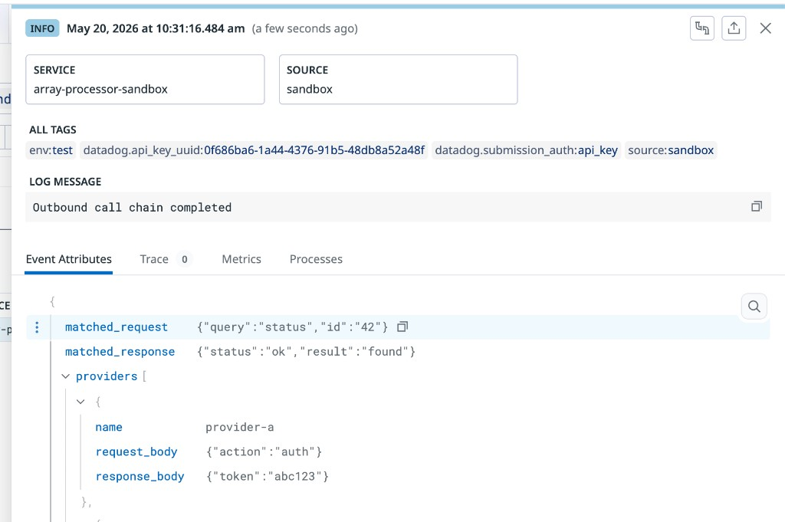

# Log Pipelines - Array Processor: Select Value from Matching Element

## Context

This sandbox demonstrates how to use the **Array Processor** in a Datadog Log Pipeline to extract a specific value from a JSON array element that matches a condition — without relying on array index position.

**Use case:** A log contains a `providers` array where each element has a `name` field and payload fields (`request_body`, `response_body`). You want to promote the payload of one specific provider (e.g., `name:target-provider`) to flat top-level attributes for querying and dashboards.

Without the Array Processor, the only option is positional access (`providers.2.request_body`), which breaks if the element order changes. The Array Processor's **select** operation traverses the array, finds the first element matching a filter expression, and extracts the specified nested attribute into a flat target attribute.

## Architecture



## Environment

- **Platform:** curl / Datadog Logs API (no agent required)
- **Site:** datadoghq.com (us1)
- **API version:** v1 (pipeline management), v2 (log ingestion + search)

## Quick Start

### 1. Set credentials

```bash
export DD_API_KEY="<your-api-key>"
export DD_APP_KEY="<your-app-key>"
```

### 2. Create the pipeline

You can import `pipeline.yaml` directly from the Datadog UI (**Logs → Pipelines → New Pipeline → Import**), or create it via API:

```bash
curl -X POST "https://api.datadoghq.com/api/v1/logs/config/pipelines" \
  -H "DD-API-KEY: ${DD_API_KEY}" \
  -H "DD-APPLICATION-KEY: ${DD_APP_KEY}" \
  -H "Content-Type: application/json" \
  -d '{
    "name": "Array Processor - Select Value Sandbox",
    "is_enabled": true,
    "filter": {"query": "service:array-processor-sandbox"},
    "processors": [
      {
        "type": "array-processor",
        "name": "Extract request from matching provider",
        "is_enabled": true,
        "operation": {
          "type": "select",
          "source": "providers",
          "filter": "name:target-provider",
          "value_to_extract": "request_body",
          "target": "matched_request"
        }
      },
      {
        "type": "array-processor",
        "name": "Extract response from matching provider",
        "is_enabled": true,
        "operation": {
          "type": "select",
          "source": "providers",
          "filter": "name:target-provider",
          "value_to_extract": "response_body",
          "target": "matched_response"
        }
      }
    ]
  }'
```

Save the `id` from the response — you will need it for cleanup.

### Pipeline configuration (UI)

**Processor 1 — extract request:**



**Processor 2 — extract response:**



### 3. Send a test log

The array has 4 providers. Only `target-provider` (index 2) should be extracted.

```bash
curl -X POST "https://http-intake.logs.datadoghq.com/api/v2/logs" \
  -H "DD-API-KEY: ${DD_API_KEY}" \
  -H "Content-Type: application/json" \
  -d '[{
    "ddsource": "sandbox",
    "ddtags": "env:test",
    "service": "array-processor-sandbox",
    "message": "Outbound call chain completed",
    "providers": [
      {
        "name": "provider-a",
        "request_body": "{\"action\":\"auth\"}",
        "response_body": "{\"token\":\"abc123\"}"
      },
      {
        "name": "provider-b",
        "response_body": "BLOB Data"
      },
      {
        "name": "target-provider",
        "request_body": "{\"query\":\"status\",\"id\":\"42\"}",
        "response_body": "{\"status\":\"ok\",\"result\":\"found\"}"
      },
      {
        "name": "provider-c",
        "request_body": "INSERT INTO audit_log VALUES (...)"
      }
    ]
  }]'
```

Expected: `HTTP 202 {}`

### 4. Wait ~30 seconds, then verify

```bash
NOW=$(date -u +%s)
FROM=$((NOW - 120))

curl -X POST "https://api.datadoghq.com/api/v2/logs/events/search" \
  -H "DD-API-KEY: ${DD_API_KEY}" \
  -H "DD-APPLICATION-KEY: ${DD_APP_KEY}" \
  -H "Content-Type: application/json" \
  -d "{
    \"filter\": {
      \"query\": \"service:array-processor-sandbox\",
      \"from\": \"${FROM}000\",
      \"to\": \"${NOW}000\"
    },
    \"page\": {\"limit\": 3}
  }" | python3 -c "
import sys, json
d = json.load(sys.stdin)
for log in d.get('data', []):
    a = log['attributes'].get('attributes', {})
    print('matched_request :', a.get('matched_request', 'NOT FOUND'))
    print('matched_response:', a.get('matched_response', 'NOT FOUND'))
"
```

## Expected Results

### Before pipeline

Without the pipeline, the log arrives with only the raw `providers` array — no flat attributes extracted:



### After pipeline

The Array Processor traverses the array, finds the element where `name == "target-provider"`, and writes the specified fields to flat attributes. `provider-a`, `provider-b`, and `provider-c` are untouched.



| Attribute | Value |
|-----------|-------|
| `@matched_request` | `{"query":"status","id":"42"}` |
| `@matched_response` | `{"status":"ok","result":"found"}` |

### Query examples

```
service:array-processor-sandbox @matched_response.status:ok
service:array-processor-sandbox @matched_request.id:42
```

## Key Concepts

| Field | Description |
|-------|-------------|
| `source` | Dot-path to the array attribute in the log (`providers`, `Data.providers`, etc.) |
| `filter` | Datadog search expression matched against each array element. First match wins. |
| `value_to_extract` | The attribute name to read from the matched element |
| `target` | The flat top-level attribute to write the extracted value into |

**Limitation:** only the **first** matching element is extracted. If the filter matches multiple elements, the rest are ignored.

## Cleanup

```bash
# Replace PIPELINE_ID with the id returned in step 2
curl -X DELETE "https://api.datadoghq.com/api/v1/logs/config/pipelines/PIPELINE_ID" \
  -H "DD-API-KEY: ${DD_API_KEY}" \
  -H "DD-APPLICATION-KEY: ${DD_APP_KEY}"
```

## References

- [Array Processor](https://docs.datadoghq.com/logs/log_configuration/processors/array_processor/)
- [Log Pipelines](https://docs.datadoghq.com/logs/log_configuration/pipelines/)
- [Logs Intake API](https://docs.datadoghq.com/api/latest/logs/#send-logs)
- [Log Pipeline API](https://docs.datadoghq.com/api/latest/logs-pipelines/)
