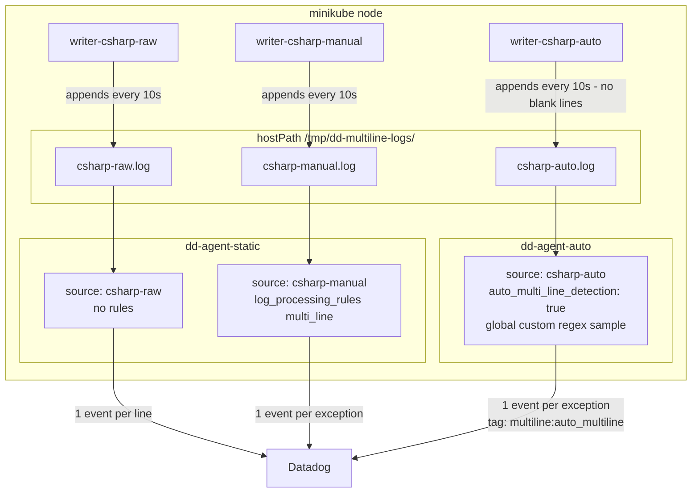

# Auto Multiline Detection - Blank Lines Break Timestamp Threshold

## Context

When a log file contains **blank lines between multiline events** (common in C#/.NET/Java stack traces), the Datadog Agent's auto multiline detection falls back to single-line mode silently.

The root cause is a detection threshold: both the V1 (sampling, 48%) and V2 (datetime, 50%) auto detection algorithms require roughly half of all lines to begin with a timestamp. A typical C# exception block looks like:

```
2026-02-25 00:01:07.808 ERROR Type: ExceptionA   ← timestamp line  (1)
    Message: Something failed                    ← continuation    (2)
    Stack Trace:                                 ← continuation    (3)
       at A()                                    ← continuation    (4)
       at B()                                    ← continuation    (5)
                                                 ← blank line      (6)
```

Only 1 out of 6 lines carries a timestamp = **16.7%**, well below the 48–50% threshold. The agent completes its sampling/learning phase, concludes there is no consistent multiline pattern, and silently reverts to emitting every physical line as a separate log event — without any error or warning in the agent status.

The signal is latency: a working multiline handler buffers lines and shows ~333 ms average pipeline latency; single-line mode dispatches immediately at ~130 µs. You can observe this difference via `agent status`.

Two fixes exist:

- **Fix 1 (agent config)** — add a global custom regex sample to bypass the threshold system entirely. The agent uses the regex to identify the start of each multiline event regardless of what percentage of lines have timestamps.
- **Fix 2 (log format)** — remove blank lines between events, increasing the timestamp ratio from 16.7% to 20%. This alone still does not cross the 48% threshold; it must be combined with Fix 1 or the explicit `log_processing_rules` approach.

Both fixes are verified via `agent stream-logs` in this sandbox.

## Environment

- **Agent Version:** 7.68.0
- **Platform:** minikube (single-node)
- **Integration:** File-based log collection (`type: file`, C# exception format)

## Schema



## Quick Start

### 1. Start minikube

```bash
minikube start --memory=4096 --cpus=2
```

### 2. Create the Datadog API key secret

```bash
kubectl create secret generic datadog-secret \
  --from-literal=api-key="YOUR_API_KEY" \
  --from-literal=app-key="YOUR_APP_KEY"
```

### 3. Create the shared log directory on the minikube node

```bash
minikube ssh "sudo mkdir -p /tmp/dd-multiline-logs && sudo chmod 777 /tmp/dd-multiline-logs"
```

### 4. Deploy all resources

```bash
kubectl apply -f - <<'MANIFEST'
# ── Namespace ────────────────────────────────────────────────────────────────
apiVersion: v1
kind: Namespace
metadata:
  name: sandbox
---
# ── Writer pods — 3 identical writers, one per log file ──────────────────────
apiVersion: v1
kind: Pod
metadata:
  name: writer-csharp-raw
  namespace: sandbox
spec:
  restartPolicy: Always
  containers:
    - name: writer
      image: busybox:1.36
      command:
        - /bin/sh
        - -c
        - |
          LOG=/logs/csharp-raw.log
          i=1
          while true; do
            TS=$(date -u '+%Y-%m-%d %H:%M:%S')
            printf '%s.%03d ERROR Type: ExceptionA [event %d]\n    Message: Something failed\n    Stack Trace:\n       at A()\n       at B()\n\n' "$TS" 0 "$i" >> "$LOG"
            printf '%s.%03d ERROR Type: ExceptionB [event %d]\n    Message: Another failure\n    Stack Trace:\n       at C()\n       at D()\n\n' "$TS" 500 "$i" >> "$LOG"
            printf '%s.%03d ERROR Type: ExceptionC [event %d]\n    Message: Another issue\n    Stack Trace:\n       at X()\n       at Y()\n\n' "$TS" 999 "$i" >> "$LOG"
            i=$((i+1)); sleep 10
          done
      volumeMounts:
        - name: logs
          mountPath: /logs
  volumes:
    - name: logs
      hostPath:
        path: /tmp/dd-multiline-logs
        type: DirectoryOrCreate
---
apiVersion: v1
kind: Pod
metadata:
  name: writer-csharp-manual
  namespace: sandbox
spec:
  restartPolicy: Always
  containers:
    - name: writer
      image: busybox:1.36
      command:
        - /bin/sh
        - -c
        - |
          LOG=/logs/csharp-manual.log
          i=1
          while true; do
            TS=$(date -u '+%Y-%m-%d %H:%M:%S')
            printf '%s.%03d ERROR Type: ExceptionA [event %d]\n    Message: Something failed\n    Stack Trace:\n       at A()\n       at B()\n\n' "$TS" 0 "$i" >> "$LOG"
            printf '%s.%03d ERROR Type: ExceptionB [event %d]\n    Message: Another failure\n    Stack Trace:\n       at C()\n       at D()\n\n' "$TS" 500 "$i" >> "$LOG"
            printf '%s.%03d ERROR Type: ExceptionC [event %d]\n    Message: Another issue\n    Stack Trace:\n       at X()\n       at Y()\n\n' "$TS" 999 "$i" >> "$LOG"
            i=$((i+1)); sleep 10
          done
      volumeMounts:
        - name: logs
          mountPath: /logs
  volumes:
    - name: logs
      hostPath:
        path: /tmp/dd-multiline-logs
        type: DirectoryOrCreate
---
# Fix 2 applied: no blank lines between events (timestamp ratio: 16.7% → 20%)
# Fix 2 alone is not sufficient — Fix 1 (custom regex) is still required.
apiVersion: v1
kind: Pod
metadata:
  name: writer-csharp-auto
  namespace: sandbox
spec:
  restartPolicy: Always
  containers:
    - name: writer
      image: busybox:1.36
      command:
        - /bin/sh
        - -c
        - |
          LOG=/logs/csharp-auto.log
          i=1
          while true; do
            TS=$(date -u '+%Y-%m-%d %H:%M:%S')
            printf '%s.%03d ERROR Type: ExceptionA [event %d]\n    Message: Something failed\n    Stack Trace:\n       at A()\n       at B()\n' "$TS" 0 "$i" >> "$LOG"
            printf '%s.%03d ERROR Type: ExceptionB [event %d]\n    Message: Another failure\n    Stack Trace:\n       at C()\n       at D()\n' "$TS" 500 "$i" >> "$LOG"
            printf '%s.%03d ERROR Type: ExceptionC [event %d]\n    Message: Another issue\n    Stack Trace:\n       at X()\n       at Y()\n' "$TS" 999 "$i" >> "$LOG"
            i=$((i+1)); sleep 10
          done
      volumeMounts:
        - name: logs
          mountPath: /logs
  volumes:
    - name: logs
      hostPath:
        path: /tmp/dd-multiline-logs
        type: DirectoryOrCreate
---
# ── Agent 1: dd-agent-static ─────────────────────────────────────────────────
# DD_LOGS_CONFIG_AUTO_MULTI_LINE_DETECTION=false (default)
# Tails csharp-raw (no rules) and csharp-manual (explicit regex pattern)
apiVersion: v1
kind: ConfigMap
metadata:
  name: dd-confd-static
  namespace: sandbox
data:
  csharp-raw.yaml: |
    logs:
      - type: file
        path: /host-logs/csharp-raw.log
        service: csharp-raw
        source: csharp-raw

  csharp-manual.yaml: |
    logs:
      - type: file
        path: /host-logs/csharp-manual.log
        service: csharp-manual
        source: csharp-manual
        log_processing_rules:
          - type: multi_line
            name: csharp_exception_start
            pattern: \d{4}-\d{2}-\d{2}\s\d{2}:\d{2}:\d{2}
---
apiVersion: v1
kind: Pod
metadata:
  name: dd-agent-static
  namespace: sandbox
spec:
  restartPolicy: Always
  containers:
    - name: agent
      image: gcr.io/datadoghq/agent:7.68.0
      env:
        - name: DD_API_KEY
          valueFrom:
            secretKeyRef:
              name: datadog-secret
              key: api-key
        - name: DD_SITE
          value: datadoghq.com
        - name: DD_HOSTNAME
          value: sandbox-multiline-static
        - name: DD_LOGS_ENABLED
          value: "true"
        - name: DD_LOGS_CONFIG_AUTO_MULTI_LINE_DETECTION
          value: "false"
        - name: DD_LOG_LEVEL
          value: "warn"
        - name: DD_KUBELET_TLS_VERIFY
          value: "false"
        - name: DD_APM_ENABLED
          value: "false"
        - name: DD_PROCESS_AGENT_ENABLED
          value: "false"
      volumeMounts:
        - name: confd
          mountPath: /conf.d
        - name: logs
          mountPath: /host-logs
          readOnly: true
      resources:
        requests:
          cpu: 100m
          memory: 256Mi
  volumes:
    - name: confd
      configMap:
        name: dd-confd-static
    - name: logs
      hostPath:
        path: /tmp/dd-multiline-logs
        type: DirectoryOrCreate
---
# ── Agent 2: dd-agent-auto ───────────────────────────────────────────────────
# DD_LOGS_CONFIG_AUTO_MULTI_LINE_DETECTION=true
# Fix 1 applied: global custom regex bypasses the timestamp line % threshold
# tag_multi_line_logs=true adds multiline:auto_multiline tag for verification
apiVersion: v1
kind: ConfigMap
metadata:
  name: dd-confd-auto
  namespace: sandbox
data:
  csharp-auto.yaml: |
    logs:
      - type: file
        path: /host-logs/csharp-auto.log
        service: csharp-auto
        source: csharp-auto
        auto_multi_line_detection: true
---
apiVersion: v1
kind: Pod
metadata:
  name: dd-agent-auto
  namespace: sandbox
spec:
  restartPolicy: Always
  containers:
    - name: agent
      image: gcr.io/datadoghq/agent:7.68.0
      env:
        - name: DD_API_KEY
          valueFrom:
            secretKeyRef:
              name: datadog-secret
              key: api-key
        - name: DD_SITE
          value: datadoghq.com
        - name: DD_HOSTNAME
          value: sandbox-multiline-auto
        - name: DD_LOGS_ENABLED
          value: "true"
        - name: DD_LOGS_CONFIG_AUTO_MULTI_LINE_DETECTION
          value: "true"
        # Fix 1: global custom regex — bypasses the datetime line % threshold.
        # Without this, auto detection falls back to single-line mode silently
        # because only 16-20% of lines have timestamps (threshold is 48-50%).
        - name: DD_LOGS_CONFIG_AUTO_MULTI_LINE_DETECTION_CUSTOM_SAMPLES
          value: '[{"regex": "\\d{4}-\\d{2}-\\d{2}\\s\\d{2}:\\d{2}:\\d{2}\\.\\d{3}\\sERROR"}]'
        # Adds multiline:auto_multiline tag to aggregated events for verification
        - name: DD_LOGS_CONFIG_TAG_MULTI_LINE_LOGS
          value: "true"
        - name: DD_LOGS_CONFIG_TAG_TRUNCATED_LOGS
          value: "true"
        - name: DD_LOG_LEVEL
          value: "warn"
        - name: DD_KUBELET_TLS_VERIFY
          value: "false"
        - name: DD_APM_ENABLED
          value: "false"
        - name: DD_PROCESS_AGENT_ENABLED
          value: "false"
      volumeMounts:
        - name: confd
          mountPath: /conf.d
        - name: logs
          mountPath: /host-logs
          readOnly: true
      resources:
        requests:
          cpu: 100m
          memory: 256Mi
  volumes:
    - name: confd
      configMap:
        name: dd-confd-auto
    - name: logs
      hostPath:
        path: /tmp/dd-multiline-logs
        type: DirectoryOrCreate
MANIFEST
```

### 5. Wait for all pods to be ready

```bash
kubectl wait --for=condition=ready \
  pod/writer-csharp-raw \
  pod/writer-csharp-manual \
  pod/writer-csharp-auto \
  pod/dd-agent-static \
  pod/dd-agent-auto \
  -n sandbox --timeout=120s
```

## Test Commands

### Agent status — compare pipeline latency across the 3 sources

```bash
# RAW: expect ~130µs latency, no Lines Combined counter
kubectl exec -n sandbox dd-agent-static -- agent status 2>&1 | grep -A 15 "^  csharp-raw"

# MANUAL: expect ~333ms latency, Lines Combined and MultiLine matches counters
kubectl exec -n sandbox dd-agent-static -- agent status 2>&1 | grep -A 15 "^  csharp-manual"

# AUTO: expect ~333ms latency (buffering active), no Lines Combined counter
# (auto multiline does not surface this counter, but latency confirms aggregation)
kubectl exec -n sandbox dd-agent-auto -- agent status 2>&1 | grep -A 15 "^  csharp-auto"
```

### stream-logs — verify event shape and tags

```bash
# RAW: each physical line is a separate event
kubectl exec -n sandbox dd-agent-static -- agent stream-logs 2>&1 | grep "csharp-raw" | head -6

# MANUAL: full exception aggregated into one event, no multiline tag
kubectl exec -n sandbox dd-agent-static -- agent stream-logs 2>&1 | grep "csharp-manual" | head -3

# AUTO + Fix 1: full exception aggregated, tag multiline:auto_multiline present
kubectl exec -n sandbox dd-agent-auto -- agent stream-logs 2>&1 | grep "csharp-auto" | head -3
```

### Verify timestamp line ratio (root cause check)

```bash
# Shows ~16-20% — below the 48-50% auto detection threshold
minikube ssh "grep -c '^[0-9]' /tmp/dd-multiline-logs/csharp-raw.log && wc -l /tmp/dd-multiline-logs/csharp-raw.log"
```

## Expected vs Actual

### Before Fix 1 (auto detection only, no custom sample)

| Behavior | Expected | Actual |
|---|---|---|
| `csharp-auto` pipeline latency | ~333ms (buffering) | ~130µs (single-line fallback) |
| `csharp-auto` Lines Combined | present | absent |
| `csharp-auto` events in Datadog | full exception per event | one line per event |
| `agent status` warning | none | `config key "logs_config.experimental_auto_multi_line_detection" is unknown` |

The `experimental_auto_multi_line_detection` warning fires on **every agent that processes any log source** — including agents where auto multiline is disabled. It is benign: the agent checks for the old experimental key name (removed when the feature went GA), logs the warning, then correctly falls through to `logs_config.auto_multi_line_detection`.

### stream-logs output — RAW (before/after irrelevant: no fix applied)

```
Integration Name: csharp-raw | Source: csharp-raw | Tags: filename:csharp-raw.log,dirname:/host-logs
Message: 2026-04-15 17:40:22.000 ERROR Type: ExceptionA [event 172]

Integration Name: csharp-raw | Source: csharp-raw | Tags: filename:csharp-raw.log,dirname:/host-logs
Message:     Message: Something failed

Integration Name: csharp-raw | Source: csharp-raw | Tags: filename:csharp-raw.log,dirname:/host-logs
Message:     Stack Trace:

Integration Name: csharp-raw | Source: csharp-raw | Tags: filename:csharp-raw.log,dirname:/host-logs
Message:        at A()

Integration Name: csharp-raw | Source: csharp-raw | Tags: filename:csharp-raw.log,dirname:/host-logs
Message:        at B()
```

Each physical line is its own event. Stack trace context is lost.

## Fix / Workaround

### Fix 1 — Global custom regex sample (agent config, required)

Add to `datadog.yaml` or as an environment variable:

```yaml
# datadog.yaml
logs_config:
  auto_multi_line_detection: true
  auto_multi_line_detection_custom_samples:
    - regex: "\\d{4}-\\d{2}-\\d{2}\\s\\d{2}:\\d{2}:\\d{2}\\.\\d{3}\\sERROR"
```

```bash
# Environment variable equivalent
DD_LOGS_CONFIG_AUTO_MULTI_LINE_DETECTION_CUSTOM_SAMPLES='[{"regex": "\\d{4}-\\d{2}-\\d{2}\\s\\d{2}:\\d{2}:\\d{2}\\.\\d{3}\\sERROR"}]'
```

The regex bypasses the threshold check entirely. The agent uses it to identify the start of each multiline event directly, regardless of what percentage of lines have timestamps.

### Fix 2 — Remove blank lines between log events (log format, optional)

If you control the log emitter, removing the blank line between exception blocks improves the timestamp ratio from 16.7% to 20%. This does **not** cross the 48–50% detection threshold on its own and must be used alongside Fix 1.

### stream-logs output — MANUAL (Fix via log_processing_rules)

```
Integration Name: csharp-manual | Source: csharp-manual
Tags: filename:csharp-manual.log,dirname:/host-logs
Message: 2026-04-15 17:38:34.999 ERROR Type: ExceptionC [event 161]
         \n    Message: Another issue
         \n    Stack Trace:
         \n       at X()
         \n       at Y()
```

Full exception in a single event. No `multiline` tag (manual rules do not set it).

### stream-logs output — AUTO + Fix 1 (verified)

```
Integration Name: csharp-auto | Source: csharp-auto
Tags: filename:csharp-auto.log,dirname:/host-logs,multiline:auto_multiline
Message: 2026-04-15 17:36:53.000 ERROR Type: ExceptionA [event 25]
         \n    Message: Something failed
         \n    Stack Trace:
         \n       at A()
         \n       at B()
```

Full exception in a single event. The `multiline:auto_multiline` tag confirms the auto multiline engine fired — not a timeout flush or fallback.

## Troubleshooting

```bash
# Check all pod statuses
kubectl get pods -n sandbox -o wide

# Agent logs (look for multiline warnings)
kubectl logs -n sandbox dd-agent-auto --tail=50
kubectl logs -n sandbox dd-agent-static --tail=50

# Live log stream for any source
kubectl exec -n sandbox dd-agent-auto -- agent stream-logs

# Full agent config (verify custom_samples and tag settings)
kubectl exec -n sandbox dd-agent-auto -- agent config | grep -E "auto_multi_line|tag_multi_line|tag_truncated"

# Verify log files are being written
minikube ssh "ls -la /tmp/dd-multiline-logs/ && tail -10 /tmp/dd-multiline-logs/csharp-auto.log"
```

## Cleanup

```bash
kubectl delete namespace sandbox
minikube ssh "rm -rf /tmp/dd-multiline-logs"
```

## References

- [Automatic Multi-line Detection and Aggregation](https://docs.datadoghq.com/agent/logs/auto_multiline_detection/)
- [Advanced Log Collection — Manually aggregate multi-line logs](https://docs.datadoghq.com/agent/logs/advanced_log_collection/?tab=configurationfile#multi-line-aggregation)
- [Auto Multi-line Detection (Legacy)](https://docs.datadoghq.com/agent/logs/auto_multiline_detection_legacy/)
