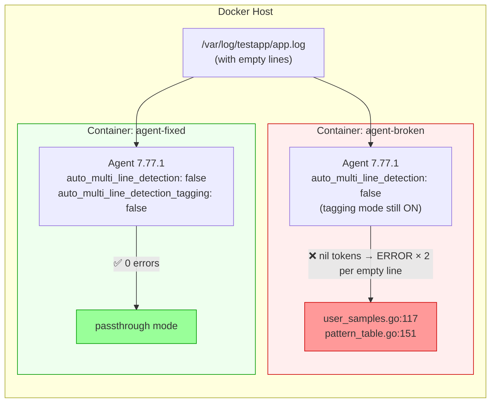

# Auto Multiline Detection - Tagging Mode Error Storm

## Context

In Agent 7.77.x, setting `auto_multi_line_detection: false` in `datadog.yaml` is not sufficient to fully disable the auto multiline heuristic stack. A new parameter introduced in 7.77, `auto_multi_line_detection_tagging`, defaults to `true` and activates a separate "tagging-only" mode that still runs the full detection pipeline (`UserSamples`, `PatternTable`, `TimestampDetector`, `JSONDetector`) on every log line.

When an empty line is processed, the tokenizer returns `nil` tokens, triggering guarded error paths in `user_samples.go` and `pattern_table.go`:

```
ERROR | (pkg/logs/internal/decoder/auto_multiline_detection/user_samples.go:117 in ProcessAndContinue) | Tokens are required to process user samples
ERROR | (pkg/logs/internal/decoder/auto_multiline_detection/pattern_table.go:151 in ProcessAndContinue) | Tokens are required to process patterns
```

On high-volume log sources, this produces thousands of errors per second, filling the filesystem.

**Fix:** Explicitly set `auto_multi_line_detection_tagging: false` in `datadog.yaml`.

## Environment

- **Agent Version:** 7.77.1 (`gcr.io/datadoghq/agent:7.77.1`)
- **Platform:** Docker on Linux / macOS
- **Feature:** Log Management — Auto Multiline Detection

## Schema



## Quick Start

### 1. Set your API key

```bash
export DD_API_KEY=<your_api_key>
```

### 2. Create the shared log directory and config files

```bash
mkdir -p ~/dd-repro/logs/broken ~/dd-repro/logs/fixed ~/dd-repro/logfiles
mkdir -p ~/dd-repro/conf.d/custom_logs.d
```

Create `~/dd-repro/conf.d/custom_logs.d/conf.yaml`:

```yaml
logs:
  - type: file
    path: /var/log/testapp/*.log
    service: testapp
    source: custom
    auto_multi_line_detection: false
```

Create `~/dd-repro/logs/broken/datadog.yaml` (customer config — missing the fix):

```yaml
logs_enabled: true
hostname: repro-broken
logs_config:
  auto_multi_line:
    enable_datetime_detection: false
    enable_json_detection: false
  auto_multi_line_detection: false
```

Create `~/dd-repro/logs/fixed/datadog.yaml` (fixed config):

```yaml
logs_enabled: true
hostname: repro-fixed
logs_config:
  auto_multi_line:
    enable_datetime_detection: false
    enable_json_detection: false
  auto_multi_line_detection: false
  auto_multi_line_detection_tagging: false
```

Seed the log file with a header line:

```bash
echo "app started" > ~/dd-repro/logfiles/app.log
```

### 3. Start the broken container

```bash
docker run -d --name agent-broken \
  -e DD_API_KEY=$DD_API_KEY \
  -v ~/dd-repro/logs/broken/datadog.yaml:/etc/datadog-agent/datadog.yaml:ro \
  -v ~/dd-repro/conf.d/custom_logs.d:/etc/datadog-agent/conf.d/custom_logs.d:ro \
  -v ~/dd-repro/logfiles:/var/log/testapp \
  gcr.io/datadoghq/agent:7.77.1
```

### 4. Start the fixed container

```bash
docker run -d --name agent-fixed \
  -e DD_API_KEY=$DD_API_KEY \
  -v ~/dd-repro/logs/fixed/datadog.yaml:/etc/datadog-agent/datadog.yaml:ro \
  -v ~/dd-repro/conf.d/custom_logs.d:/etc/datadog-agent/conf.d/custom_logs.d:ro \
  -v ~/dd-repro/logfiles:/var/log/testapp \
  gcr.io/datadoghq/agent:7.77.1
```

### 5. Trigger the error storm

Wait ~10 seconds for the agents to start tailing, then inject lines with empties:

```bash
python3 -c "
lines = []
for i in range(1200):
    lines.append(f'log line {i}')
for i in range(800):
    lines.append('')
import random; random.shuffle(lines)
with open(os.path.expanduser('~/dd-repro/logfiles/app.log'), 'a') as f:
    f.write('\n'.join(lines) + '\n')
"
```

Or with a simple shell loop:

```bash
# Append 1000 normal lines and 500 empty lines to the tailed file
{
  for i in $(seq 1 1000); do echo "log line $i"; done
  for i in $(seq 1 500); do echo ""; done
} >> ~/dd-repro/logfiles/app.log
```

## Test Commands

### Check for errors (broken container — should flood)

```bash
docker logs agent-broken 2>&1 | grep "Tokens are required" | wc -l
docker logs agent-broken 2>&1 | grep "Tokens are required" | tail -5
```

### Check for errors (fixed container — should be zero)

```bash
docker logs agent-fixed 2>&1 | grep "Tokens are required" | wc -l
```

### Runtime config check

```bash
# Confirm tagging mode is on (broken)
docker exec agent-broken agent config | grep -A2 "auto_multi_line"

# Confirm tagging mode is off (fixed)
docker exec agent-fixed agent config | grep -A2 "auto_multi_line"
```

## Expected vs Actual

| Container | Config | Expected | Actual (7.77.1) |
|-----------|--------|----------|-----------------|
| agent-broken | `auto_multi_line_detection: false` only | ✅ 0 errors | ❌ 2 errors per empty line |
| agent-fixed | + `auto_multi_line_detection_tagging: false` | ✅ 0 errors | ✅ 0 errors |

**Root cause:** The decoder decision tree in `buildLineHandler` evaluates `auto_multi_line_detection_tagging` as a fallback after `auto_multi_line_detection`, so a `false` on the first flag does not skip the second path (which defaults to `true`).

## Fix / Workaround

Add `auto_multi_line_detection_tagging: false` to `datadog.yaml` under `logs_config`:

```yaml
logs_config:
  auto_multi_line_detection: false
  auto_multi_line_detection_tagging: false
```

Then restart the agent:

```bash
sudo systemctl restart datadog-agent
```

Verify:

```bash
sudo journalctl -u datadog-agent -f | grep "Tokens are required"
# Should show no new output after restart
```

## Troubleshooting

```bash
# Follow live agent logs
docker logs -f agent-broken 2>&1 | grep -E "(ERROR|auto_multi)"

# Check agent status
docker exec agent-broken agent status | grep -A10 "Logs Agent"

# Inspect runtime config for multiline flags
docker exec agent-broken agent config | grep -i "auto_multi"

# Count total error lines
docker logs agent-broken 2>&1 | grep "Tokens are required" | wc -l
```

## Cleanup

```bash
docker rm -f agent-broken agent-fixed
rm -rf ~/dd-repro
```

## References

- [Datadog Docs — Auto Multi-line Log Detection](https://docs.datadoghq.com/agent/logs/advanced_log_collection/?tab=configurationfile#automatic-multi-line-aggregation)
- [Agent Docker Tags](https://hub.docker.com/r/datadog/agent/tags)
