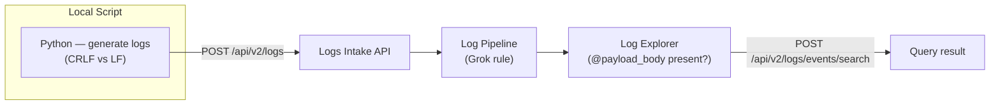

# Grok Parser — CRLF vs LF Line-Ending Mismatch

## Context

Grok rules that use `\n` to match newlines in HTTP-formatted logs silently fail when the log source uses CRLF (`\r\n`) line endings — which is standard in HTTP/1.x wire format (RFC 7230).

**Symptom:** The Grok tester in the UI shows "matched" (test sample was pasted without `\r`), but live logs never produce the expected attribute.

**Pattern:** Any log whose HTTP section uses `\r\n` line endings (Axway API Gateway, NGINX, Apache, Squid, etc.) combined with a Grok rule that uses bare `\n`.

**Fix:** Replace `\n` with `\r\n` (or `\r?\n` for tolerance) after the HTTP version in the match rule.

## Environment

- **Platform:** Datadog Logs API (Tier 1 — no agent or container needed)
- **Credentials:** Datadog API key + App key

## Schema



## Quick Start

### 1. Set credentials

```bash
export DD_API_KEY="<your-api-key>"
export DD_APP_KEY="<your-app-key>"
```

### 2. Verify sandbox org

```bash
curl -s "https://api.datadoghq.com/api/v1/org" \
  -H "DD-API-KEY: $DD_API_KEY" \
  -H "DD-APPLICATION-KEY: $DD_APP_KEY" \
  | python3 -c "import sys,json; d=json.load(sys.stdin); print('Org:', d.get('orgs',[{}])[0].get('name','?'))"
```

### 3. Create pipeline with the broken rule (`\n` only)

```bash
PIPELINE=$(curl -s -X POST "https://api.datadoghq.com/api/v1/logs/config/pipelines" \
  -H "Content-Type: application/json" \
  -H "DD-API-KEY: $DD_API_KEY" \
  -H "DD-APPLICATION-KEY: $DD_APP_KEY" \
  -d '{
    "name": "sandbox grok-crlf-lf-mismatch",
    "is_enabled": true,
    "filter": {"query": "source:sandbox_http_gateway"},
    "processors": [{
      "type": "grok-parser",
      "name": "http_payload BROKEN (LF-only \\n)",
      "is_enabled": true,
      "source": "message",
      "samples": [],
      "grok": {
        "support_rules": "",
        "match_rules": "http_payload %{date(\"MM.dd.yyyy HH:mm:ss,SSS\"):timestamp} Id-%{notSpace:correlation_id} %{data:filter_name}\\n%{word:http_method} %{notSpace:http_url} HTTP/%{number:http_version}\\n(?s)%{data:payload_body}"
      }
    }]
  }')

PIPELINE_ID=$(echo "$PIPELINE" | python3 -c "import sys,json; print(json.load(sys.stdin).get('id','ERROR'))")
echo "Pipeline ID: $PIPELINE_ID"
```

### 4. Send test logs

```python
# reproduce.py
import json, urllib.request, datetime, os

api_key = os.environ["DD_API_KEY"]
ts = datetime.datetime.now(datetime.UTC).strftime("%m.%d.%Y %H:%M:%S")

# Log 1: CRLF after HTTP version (real HTTP/1.x wire format) — BROKEN case
msg_crlf = (
    f"{ts},100 Id-sandbox-crlf Log Message Payload Filter\n"
    f"POST /api/v1/example HTTP/1.0\r\n"          # <-- CRLF here
    f"Content-Type: application/xml\r\n"
    f"Host: gateway.example.com\r\n"
    f"\r\n"
    f"<request><action>confirmDispatch</action></request>"
)

# Log 2: LF only (what the Grok tester uses when you paste manually) — WORKS with broken rule
msg_lf = (
    f"{ts},200 Id-sandbox-lf Log Message Payload Filter\n"
    f"POST /api/v1/example HTTP/1.0\n"            # <-- LF only
    f"Content-Type: application/xml\n"
    f"Host: gateway.example.com\n"
    f"\n"
    f"<request><action>confirmDispatch</action></request>"
)

payload = [
    {"ddsource": "sandbox_http_gateway", "ddtags": "case:crlf_broken", "message": msg_crlf},
    {"ddsource": "sandbox_http_gateway", "ddtags": "case:lf_works",    "message": msg_lf},
]

req = urllib.request.Request(
    "https://http-intake.logs.datadoghq.com/api/v2/logs",
    data=json.dumps(payload).encode(),
    headers={"Content-Type": "application/json", "DD-API-KEY": api_key},
    method="POST"
)
with urllib.request.urlopen(req) as r:
    print("Sent:", r.status)
```

```bash
python3 reproduce.py
sleep 20   # wait for pipeline processing
```

### 5. Query logs

```python
# verify.py
import json, urllib.request, os

api_key = os.environ["DD_API_KEY"]
app_key = os.environ["DD_APP_KEY"]

payload = {
    "filter": {"query": "source:sandbox_http_gateway", "from": "now-5m", "to": "now"},
    "page": {"limit": 10}
}
req = urllib.request.Request(
    "https://api.datadoghq.com/api/v2/logs/events/search",
    data=json.dumps(payload).encode(),
    headers={"Content-Type": "application/json",
             "DD-API-KEY": api_key, "DD-APPLICATION-KEY": app_key},
    method="POST"
)
with urllib.request.urlopen(req) as r:
    logs = json.loads(r.read()).get("data", [])

print(f"{'CASE':<20} {'correlation_id':<20} {'payload_body'}")
print("-" * 70)
for log in logs:
    a = log["attributes"]["attributes"]
    tags = log["attributes"].get("tags", [])
    case = next((t.replace("case:","") for t in tags if t.startswith("case:")), "?")
    pb = repr(a.get("payload_body","NOT PRESENT")[:50]) if a.get("payload_body") else "NOT PRESENT ✗"
    print(f"{case:<20} {a.get('correlation_id','?'):<20} {pb}")
```

```bash
python3 verify.py
```

## Expected vs Actual (broken rule)

| Case | Log line ending | `payload_body` extracted |
|------|-----------------|--------------------------|
| `crlf_broken` | `\r\n` (HTTP/1.x standard) | ✗ NOT PRESENT |
| `lf_works` | `\n` (pasted test sample) | ✓ Present |

**Why the tester lies:** When you paste a log into the Grok tester, editors and YAML parsers strip `\r` characters. So the test passes, but live HTTP logs always have `\r\n`.

## Fix / Workaround

In the Grok parser `match_rules`, change the `\n` after the HTTP version to `\r\n`:

**Before (broken):**
```
http_payload ...HTTP/%{number:http_version}\n(?s)%{data:payload_body}
```

**After (fixed):**
```
http_payload ...HTTP/%{number:http_version}\r\n(?s)%{data:payload_body}
```

For maximum tolerance (handles both `\n` and `\r\n`):
```
http_payload ...HTTP/%{number:http_version}\r?\n(?s)%{data:payload_body}
```

Update via API:
```bash
curl -X PUT "https://api.datadoghq.com/api/v1/logs/config/pipelines/$PIPELINE_ID" \
  -H "Content-Type: application/json" \
  -H "DD-API-KEY: $DD_API_KEY" \
  -H "DD-APPLICATION-KEY: $DD_APP_KEY" \
  -d '{
    "name": "sandbox grok-crlf-lf-mismatch",
    "is_enabled": true,
    "filter": {"query": "source:sandbox_http_gateway"},
    "processors": [{
      "type": "grok-parser",
      "name": "http_payload FIXED (CRLF \\r\\n)",
      "is_enabled": true,
      "source": "message",
      "grok": {
        "support_rules": "",
        "match_rules": "http_payload %{date(\"MM.dd.yyyy HH:mm:ss,SSS\"):timestamp} Id-%{notSpace:correlation_id} %{data:filter_name}\\n%{word:http_method} %{notSpace:http_url} HTTP/%{number:http_version}\\r\\n(?s)%{data:payload_body}"
      }
    }]
  }'
```

Then resend a log with CRLF and re-run `verify.py` — `payload_body` is now extracted.

## Expected vs Actual (after fix)

| Case | Log line ending | `payload_body` extracted |
|------|-----------------|--------------------------|
| `crlf_after_fix` | `\r\n` | ✓ Present |

## Troubleshooting

**Tester shows "matched" but live logs don't have the attribute:**
- Paste the actual raw log from Log Explorer (copy the full `message` field) into the tester
- Look for `\r` characters — they appear as `^M` in some editors
- If the tester now shows "no rule matched", the `\r` is the cause

**Rule matches the tester sample after fix but still no attribute on some logs:**
- Check if only some of the logs have `\r\n` (mixed sources may have inconsistent line endings)
- Use `\r?\n` instead of `\r\n` to handle both

**`log_direction` (Category Processor) still not set:**
- Verify `payload_body` is now present first
- Check that the substring in the Category Processor query (e.g. `*confirmDispatch*`) appears in `payload_body` — use the Grok tester to inspect what `payload_body` actually contains

## Cleanup

```bash
# Delete the sandbox pipeline
curl -X DELETE "https://api.datadoghq.com/api/v1/logs/config/pipelines/$PIPELINE_ID" \
  -H "DD-API-KEY: $DD_API_KEY" \
  -H "DD-APPLICATION-KEY: $DD_APP_KEY"
```

## References

- [Datadog Grok Parser docs](https://docs.datadoghq.com/logs/log_configuration/parsing/)
- [Datadog Log Pipelines docs](https://docs.datadoghq.com/logs/log_configuration/pipelines/)
- [Datadog Log Pipeline API](https://docs.datadoghq.com/api/latest/logs-pipelines/)
- [RFC 7230 — HTTP/1.1 CRLF requirement](https://datatracker.ietf.org/doc/html/rfc7230#section-3)
