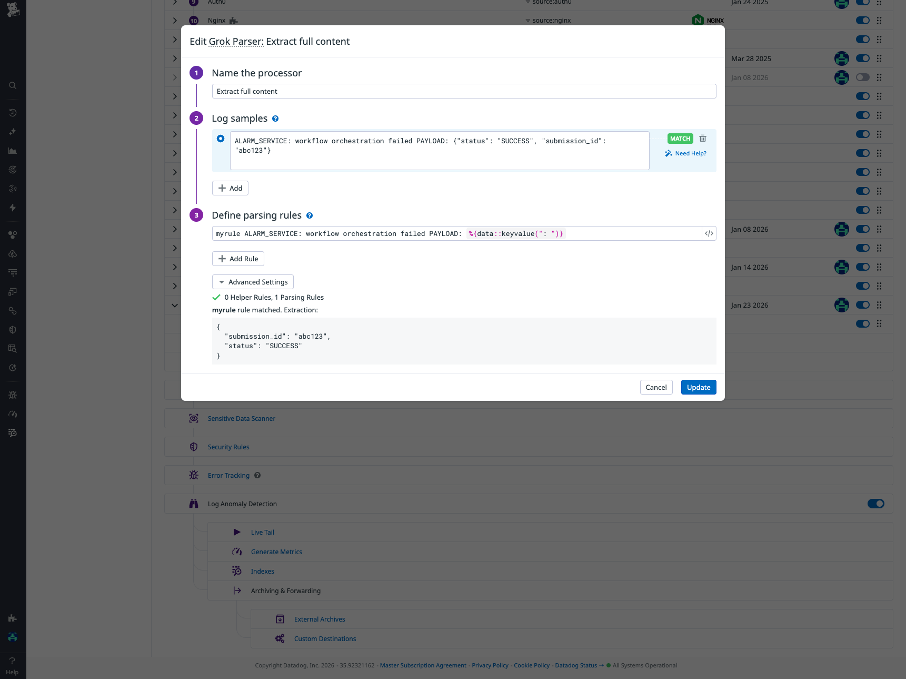
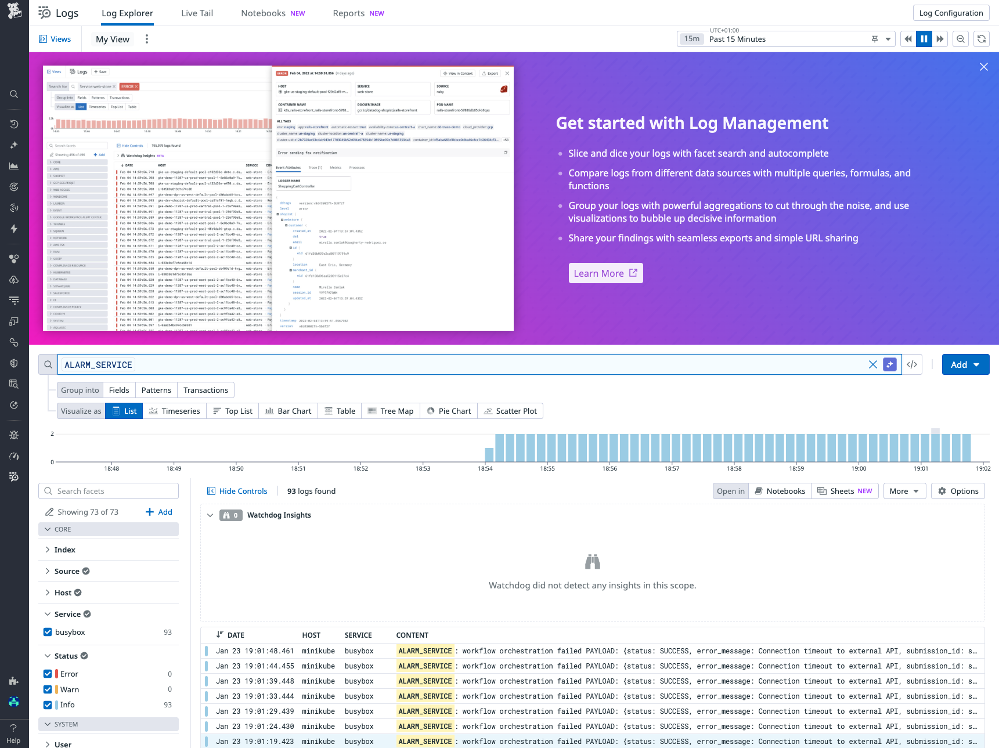
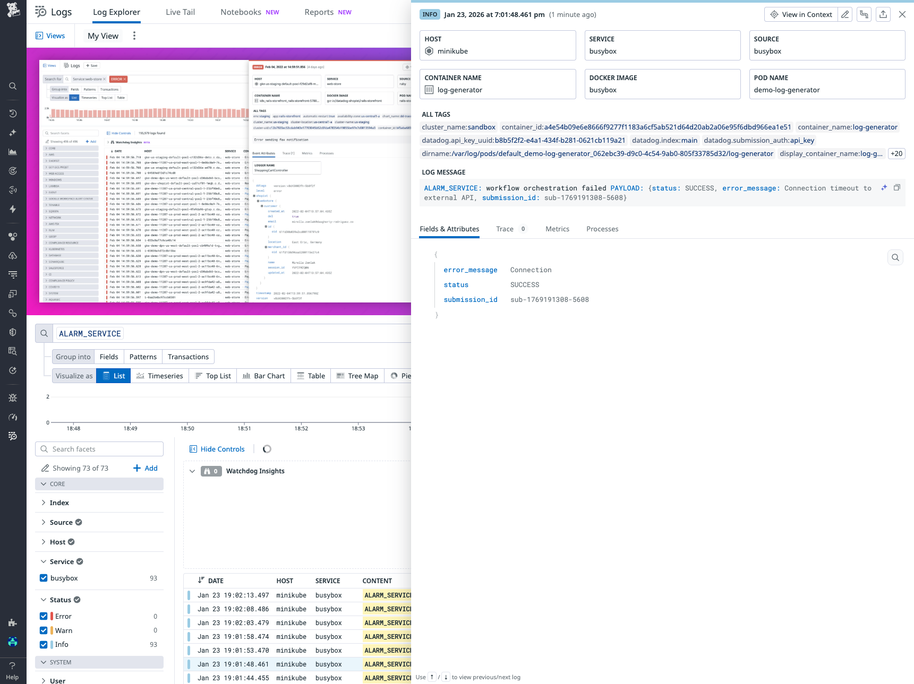

# Grok Log Pipeline - Parsing Service Alarms with Custom Attributes

## Context

This sandbox demonstrates how to create a Datadog log pipeline with multiple Grok processors to extract custom attributes from structured log messages. It shows how to parse a JSON-like payload embedded in log messages and extract specific fields into searchable attributes.

The use case involves parsing logs from a service that generates alarm messages with a JSON payload containing status information, error messages, and submission IDs.

## Environment

- **Agent Version:** 7.74.0
- **Platform:** minikube / Kubernetes
- **Integration:** Log Management, Log Pipelines

## Quick Start

### 1. Start minikube

```bash
minikube delete --all
minikube start --memory=4096 --cpus=2
```

### 2. Deploy log generator pod

This pod generates logs every 5 seconds with a structured message containing status, error_message, and submission_id fields.

```bash
kubectl apply -f - <<'MANIFEST'
apiVersion: v1
kind: Pod
metadata:
  name: demo-log-generator
  namespace: default
spec:
  containers:
  - name: log-generator
    image: busybox:latest
    command: ["/bin/sh", "-c"]
    args: ["while true; do echo 'ALARM_SERVICE: workflow orchestration failed PAYLOAD: {\\'status\\': \\'SUCCESS\\', \\'error_message\\': \\'Connection timeout to external API\\', \\'submission_id\\': \\'sub-\\$(date +%s)-\\$(shuf -i 1000-9999 -n 1)\\'}'; sleep 5; done"]
MANIFEST
```

### 3. Wait for pod to be ready

```bash
kubectl wait --for=condition=ready pod demo-log-generator -n default --timeout=300s
```

### 4. Deploy Datadog Agent

Create `values.yaml`:

```yaml
datadog:
  site: "datadoghq.com"
  apiKeyExistingSecret: "datadog-secret"
  clusterName: "sandbox"
  kubelet:
    tlsVerify: false
  logs:
    enabled: true
    containerCollectAll: true

clusterAgent:
  enabled: true

agents:
  image:
    tag: 7.74.0
```

Install the agent:

```bash
kubectl create namespace datadog
kubectl create secret generic datadog-secret -n datadog --from-literal=api-key=YOUR_API_KEY
helm repo add datadog https://helm.datadoghq.com && helm repo update
helm upgrade --install datadog-agent datadog/datadog -n datadog -f values.yaml
```

### 5. Create the Log Pipeline via API

The pipeline uses multiple Grok processors to:
1. Extract the entire payload content into a `content` attribute
2. Extract `status`, `error_message`, and `submission_id` from the content

```bash
# Set your credentials
export DD_API_KEY="your_api_key"
export DD_APP_KEY="your_app_key"
export DD_SITE="datadoghq.com"

# Create the pipeline
curl -X POST "https://api.${DD_SITE}/api/v1/logs/config/pipelines" \
-H "Content-Type: application/json" \
-H "DD-API-KEY: ${DD_API_KEY}" \
-H "DD-APPLICATION-KEY: ${DD_APP_KEY}" \
-d '{
  "name": "Service Alarm Pipeline",
  "is_enabled": true,
  "filter": {
    "query": "ALARM_SERVICE"
  },
  "processors": [
    {
      "name": "Extract full content",
      "is_enabled": true,
      "source": "message",
      "samples": [
        "ALARM_SERVICE: workflow orchestration failed PAYLOAD: {\"status\": \"SUCCESS\", \"submission_id\": \"abc123\"}"
      ],
      "grok": {
        "support_rules": "",
        "match_rules": "myrule ALARM_SERVICE: workflow orchestration failed PAYLOAD: %{data:content}"
      },
      "type": "grok-parser"
    },
    {
      "name": "Extract status from content",
      "is_enabled": true,
      "source": "content",
      "samples": [],
      "grok": {
        "support_rules": "",
        "match_rules": "statusrule .*'\''status'\'': '\''%{word:payload.status}'\''.*"
      },
      "type": "grok-parser"
    },
    {
      "name": "Extract submission_id from content",
      "is_enabled": true,
      "source": "content",
      "samples": [],
      "grok": {
        "support_rules": "",
        "match_rules": "submissionidrule .*'\''submission_id'\'': '\''%{notSpace:payload.submission_id}'\''.*"
      },
      "type": "grok-parser"
    },
    {
      "name": "Extract error_message from content",
      "is_enabled": true,
      "source": "content",
      "samples": [],
      "grok": {
        "support_rules": "",
        "match_rules": "errormessagerule .*'\''error_message'\'': '\''%{data:payload.error_message}'\''.*"
      },
      "type": "grok-parser"
    }
  ]
}'
```

## Test Commands

### Agent

```bash
# Check agent status
kubectl exec -n datadog daemonset/datadog-agent -c agent -- agent status

# Check log collection
kubectl logs -n datadog -l app=datadog-agent -c agent --tail=100 | grep -i log
```

### Verify log generation

```bash
# Check pod logs
kubectl logs demo-log-generator --tail=20

# Expected output:
# ALARM_SERVICE: workflow orchestration failed PAYLOAD: {'status': 'SUCCESS', 'error_message': 'Connection timeout to external API', 'submission_id': 'sub-1769191308-5608'}
```

## Pipeline Configuration

### Overview

The pipeline is designed to handle logs with the following structure:

```
ALARM_SERVICE: workflow orchestration failed PAYLOAD: {'status': 'SUCCESS', 'error_message': 'Connection timeout to external API', 'submission_id': 'sub-1769191308-5608'}
```

### Processors

1. **Extract full content** (Grok Parser)
   - Source: `message`
   - Pattern: `ALARM_SERVICE: workflow orchestration failed PAYLOAD: %{data:content}`
   - Output: Creates a `content` attribute containing the entire JSON-like payload

2. **Extract status** (Grok Parser)
   - Source: `content`
   - Pattern: `.*'status': '%{word:payload.status}'.*`
   - Output: Creates `payload.status` attribute (e.g., "SUCCESS")

3. **Extract submission_id** (Grok Parser)
   - Source: `content`
   - Pattern: `.*'submission_id': '%{notSpace:payload.submission_id}'.*`
   - Output: Creates `payload.submission_id` attribute (e.g., "sub-1769191308-5608")

4. **Extract error_message** (Grok Parser)
   - Source: `content`
   - Pattern: `.*'error_message': '%{data:payload.error_message}'.*`
   - Output: Creates `payload.error_message` attribute (e.g., "Connection timeout to external API")

### Screenshots

**Grok Parser Configuration:**



## Expected Results

After the pipeline is configured and logs are being generated, you should see:

### Log Explorer View



### Extracted Attributes

When you click on a log entry, you should see the following extracted attributes in the details panel:



| Attribute | Value | Description |
|-----------|-------|-------------|
| `error_message` | Connection | The error message extracted from the payload |
| `status` | SUCCESS | The status of the operation |
| `submission_id` | sub-1769191308-5608 | Unique identifier for the submission |

### Query Examples

You can now query your logs using the extracted attributes:

```
# Find all logs with SUCCESS status
ALARM_SERVICE status:SUCCESS

# Find logs with specific submission_id
ALARM_SERVICE @payload.submission_id:sub-*

# Find logs with connection errors
ALARM_SERVICE @error_message:Connection*
```

## Troubleshooting

```bash
# Check pod logs
kubectl logs -n default demo-log-generator --tail=100

# Check Datadog agent logs
kubectl logs -n datadog -l app=datadog-agent -c agent --tail=100

# Describe pod
kubectl describe pod -n default demo-log-generator
kubectl describe pod -n datadog -l app=datadog-agent

# Get events
kubectl get events -n default --sort-by='.lastTimestamp'

# Check if logs are reaching Datadog
kubectl exec -n datadog daemonset/datadog-agent -c agent -- agent status | grep -A 50 "Logs Agent"
```

### Common Issues

1. **No logs in Datadog UI:**
   - Verify agent status: `kubectl exec -n datadog daemonset/datadog-agent -c agent -- agent status`
   - Check logs.enabled: `true` in `values.yaml`
   - Check containerCollectAll: `true` in `values.yaml`

2. **Attributes not extracted:**
   - Verify pipeline filter matches log query: `ALARM_SERVICE`
   - Check Grok patterns in Pipeline Scanner (Datadog UI)
   - Ensure log format matches the expected structure

3. **Pipeline not processing logs:**
   - Check pipeline is enabled in Datadog UI
   - Verify the filter query matches your logs
   - Use Pipeline Scanner to test patterns with sample logs

## Cleanup

```bash
# Delete the log generator pod
kubectl delete pod demo-log-generator -n default

# Uninstall Datadog agent
helm uninstall datadog-agent -n datadog
kubectl delete namespace datadog

# Stop minikube
minikube stop
minikube delete
```

## References

- [Datadog Grok Parser](https://docs.datadoghq.com/logs/log_configuration/processors/?tab=ui#grok-parser)
- [Datadog Log Pipelines](https://docs.datadoghq.com/logs/log_configuration/pipelines/)
- [Grok Patterns](https://docs.datadoghq.com/logs/log_configuration/parsing/)
- [Log Management](https://docs.datadoghq.com/logs/)
- [Agent Docker Tags](https://hub.docker.com/r/datadog/agent/tags)
- [Grok Debugger](https://grokdebugger.com/) - Online tool to test and validate Grok patterns
