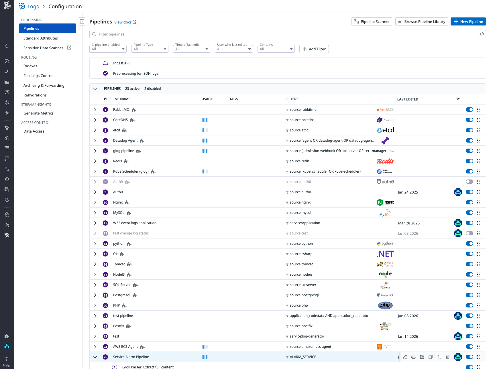

[{"text": "# Grok Log Pipeline - Parsing Service Alarms with Custom Attributes\n\n## Context\n\nThis sandbox demonstrates how to create a Datadog log pipeline with multiple Grok processors to extract custom attributes from structured log messages. It shows how to parse a JSON-like payload embedded in log messages and extract specific fields into searchable attributes.\n\nThe use case involves parsing logs from a service that generates alarm messages with a JSON payload containing status information, error messages, and submission IDs.\n\n## Environment\n\n- **Agent Version:** 7.74.0\n- **Platform:** minikube / Kubernetes\n- **Integration:** Log Management, Log Pipelines\n\n## Quick Start\n\n### 1. Start minikube\n\n```bash\nminikube delete --all\nminikube start --memory=4096 --cpus=2\n```\n\n### 2. Deploy log generator pod\n\nThis pod generates logs every 5 seconds with a structured message containing status, error_message, and submission_id fields.\n\n```bash\nkubectl apply -f - <<'MANIFEST'\napiVersion: v1\nkind: Pod\nmetadata:\n  name: demo-log-generator\n  namespace: default\nspec:\n  containers:\n  - name: log-generator\n    image: busybox:latest\n    command: [\"/bin/sh\", \"-c\"]\n    args: [\"while true; do echo 'ALARM_SERVICE: workflow orchestration failed PAYLOAD: {\\\\'status\\\\': \\\\'SUCCESS\\\\', \\\\'error_message\\\\': \\\\'Connection timeout to external API\\\\', \\\\'submission_id\\\\': \\\\'sub-\\\\$(date +%s)-\\\\$(shuf -i 1000-9999 -n 1)\\\\'}'; sleep 5; done\"]\nMANIFEST\n```\n\n### 3. Wait for pod to be ready\n\n```bash\nkubectl wait --for=condition=ready pod/demo-log-generator -n default --timeout=300s\n```\n\n### 4. Deploy Datadog Agent\n\nCreate `values.yaml`:\n\n```yaml\ndatadog:\n  site: \"datadoghq.com\"\n  apiKeyExistingSecret: \"datadog-secret\"\n  clusterName: \"sandbox\"\n  kubelet:\n    tlsVerify: false\n  logs:\n    enabled: true\n    containerCollectAll: true\n\nclusterAgent:\n  enabled: true\n\nagents:\n  image:\n    tag: 7.74.0\n```\n\nInstall the agent:\n\n```bash\nkubectl create namespace datadog\nkubectl create secret generic datadog-secret -n datadog --from-literal=api-key=YOUR_API_KEY\nhelm repo add datadog https://helm.datadoghq.com && helm repo update\nhelm upgrade --install datadog-agent datadog/datadog -n datadog -f values.yaml\n```\n\n### 5. Create the Log Pipeline via API\n\nThe pipeline uses multiple Grok processors to:\n1. Extract the entire payload content into a `content` attribute\n2. Extract `status`, `error_message`, and `submission_id` from the content\n\n```bash\n# Set your credentials\nexport DD_API_KEY=\"your_api_key\"\nexport DD_APP_KEY=\"your_app_key\"\nexport DD_SITE=\"datadoghq.com\"\n\n# Create the pipeline\ncurl -X POST \"https://api.${DD_SITE}/api/v1/logs/config/pipelines\" \\\n-H \"Content-Type: application/json\" \\\n-H \"DD-API-KEY: ${DD_API_KEY}\" \\\n-H \"DD-APPLICATION-KEY: ${DD_APP_KEY}\" \\\n-d '{\n  \"name\": \"Service Alarm Pipeline\",\n  \"is_enabled\": true,\n  \"filter\": {\n    \"query\": \"ALARM_SERVICE\"\n  },\n  \"processors\": [\n    {\n      \"name\": \"Extract full content\",\n      \"is_enabled\": true,\n      \"source\": \"message\",\n      \"samples\": [\n        \"ALARM_SERVICE: workflow orchestration failed PAYLOAD: {\\\"status\\\": \\\"SUCCESS\\\", \\\"submission_id\\\": \\\"abc123\\\"}\"\n      ],\n      \"grok\": {\n        \"support_rules\": \"\",\n        \"match_rules\": \"myrule ALARM_SERVICE: workflow orchestration failed PAYLOAD: %{data:content}\"\n      },\n      \"type\": \"grok-parser\"\n    },\n    {\n      \"name\": \"Extract status from content\",\n      \"is_enabled\": true,\n      \"source\": \"content\",\n      \"samples\": [],\n      \"grok\": {\n        \"support_rules\": \"\",\n        \"match_rules\": \"statusrule .*'\\''status'\\'': '\\''%{word:payload.status}'\\''.*\"\n      },\n      \"type\": \"grok-parser\"\n    },\n    {\n      \"name\": \"Extract submission_id from content\",\n      \"is_enabled\": true,\n      \"source\": \"content\",\n      \"samples\": [],\n      \"grok\": {\n        \"support_rules\": \"\",\n        \"match_rules\": \"submissionidrule .*'\\''submission_id'\\'': '\\''%{notSpace:payload.submission_id}'\\''.*\"\n      },\n      \"type\": \"grok-parser\"\n    },\n    {\n      \"name\": \"Extract error_message from content\",\n      \"is_enabled\": true,\n      \"source\": \"content\",\n      \"samples\": [],\n      \"grok\": {\n        \"support_rules\": \"\",\n        \"match_rules\": \"errormessagerule .*'\\''error_message'\\'': '\\''%{data:payload.error_message}'\\''.*\"\n      },\n      \"type\": \"grok-parser\"\n    }\n  ]\n}'\n```\n\n## Test Commands\n\n### Agent\n\n```bash\n# Check agent status\nkubectl exec -n datadog daemonset/datadog-agent -c agent -- agent status\n\n# Check log collection\nkubectl logs -n datadog -l app=datadog-agent -c agent --tail=100 | grep -i log\n```\n\n### Verify log generation\n\n```bash\n# Check pod logs\nkubectl logs demo-log-generator --tail=20\n\n# Expected output:\n# ALARM_SERVICE: workflow orchestration failed PAYLOAD: {'status': 'SUCCESS', 'error_message': 'Connection timeout to external API', 'submission_id': 'sub-1769191308-5608'}\n```\n\n## Pipeline Configuration\n\n### Overview\n\nThe pipeline is designed to handle logs with the following structure:\n\n```\nALARM_SERVICE: workflow orchestration failed PAYLOAD: {'status': 'SUCCESS', 'error_message': 'Connection timeout to external API', 'submission_id': 'sub-1769191308-5608'}\n```\n\n### Processors\n\n1. **Extract full content** (Grok Parser)\n   - Source: `message`\n   - Pattern: `ALARM_SERVICE: workflow orchestration failed PAYLOAD: %{data:content}`\n   - Output: Creates a `content` attribute containing the entire JSON-like payload\n\n2. **Extract status** (Grok Parser)\n   - Source: `content`\n   - Pattern: `.*'status': '%{word:payload.status}'.*`\n   - Output: Creates `payload.status` attribute (e.g., \"SUCCESS\")\n\n3. **Extract submission_id** (Grok Parser)\n   - Source: `content`\n   - Pattern: `.*'submission_id': '%{notSpace:payload.submission_id}'.*`\n   - Output: Creates `payload.submission_id` attribute (e.g., \"sub-1769191308-5608\")\n\n4. **Extract error_message** (Grok Parser)\n   - Source: `content`\n   - Pattern: `.*'error_message': '%{data:payload.error_message}'.*`\n   - Output: Creates `payload.error_message` attribute (e.g., \"Connection timeout to external API\")\n\n### Screenshots\n\n**Pipeline Overview:**\n\n\n\n**Pipeline Processors:**\n\n\n\n## Expected Results\n\nAfter the pipeline is configured and logs are being generated, you should see:\n\n### Log Explorer View\n\n\n\n### Extracted Attributes\n\nWhen you click on a log entry, you should see the following extracted attributes in the details panel:\n\n\n\n| Attribute | Example Value | Description |\n|-----------|---------------|-------------|\n| `payload.error_message` | Connection timeout to external API | The error message extracted from the payload |\n| `payload.status` | SUCCESS | The status of the operation |\n| `payload.submission_id` | sub-1769191308-5608 | Unique identifier for the submission |\n\n### Query Examples\n\nYou can now query your logs using the extracted attributes:\n\n```\n# Find all logs with SUCCESS status\nALARM_SERVICE @payload.status:SUCCESS\n\n# Find logs with specific submission_id\nALARM_SERVICE @payload.submission_id:sub-*\n\n# Find logs with connection errors\nALARM_SERVICE @payload.error_message:*Connection*\n```\n\n## Troubleshooting\n\n```bash\n# Check pod logs\nkubectl logs -n default demo-log-generator --tail=100\n\n# Check Datadog agent logs\nkubectl logs -n datadog -l app=datadog-agent -c agent --tail=100\n\n# Describe pod\nkubectl describe pod -n default demo-log-generator\nkubectl describe pod -n datadog -l app=datadog-agent\n\n# Get events\nkubectl get events -n default --sort-by='.lastTimestamp'\n\n# Check if logs are reaching Datadog\nkubectl exec -n datadog daemonset/datadog-agent -c agent -- agent status | grep -A 50 \"Logs Agent\"\n```\n\n### Common Issues\n\n1. **No logs in Datadog UI:**\n   - Verify agent status: `kubectl exec -n datadog daemonset/datadog-agent -c agent -- agent status`\n   - Check logs.enabled: `true` in `values.yaml`\n   - Check containerCollectAll: `true` in `values.yaml`\n\n2. **Attributes not extracted:**\n   - Verify pipeline filter matches log query: `ALARM_SERVICE`\n   - Check Grok patterns in Pipeline Scanner (Datadog UI)\n   - Ensure log format matches the expected structure\n\n3. **Pipeline not processing logs:**\n   - Check pipeline is enabled in Datadog UI\n   - Verify the filter query matches your logs\n   - Use Pipeline Scanner to test patterns with sample logs\n\n## Cleanup\n\n```bash\n# Delete the log generator pod\nkubectl delete pod demo-log-generator -n default\n\n# Uninstall Datadog agent\nhelm uninstall datadog-agent -n datadog\nkubectl delete namespace datadog\n\n# Stop minikube\nminikube stop\nminikube delete\n```\n\n## References\n\n- [Datadog Grok Parser](https://docs.datadoghq.com/logs/log_configuration/processors/?tab=ui#grok-parser)\n- [Datadog Log Pipelines](https://docs.datadoghq.com/logs/log_configuration/pipelines/)\n- [Grok Patterns](https://docs.datadoghq.com/logs/log_configuration/parsing/)\n- [Log Management](https://docs.datadoghq.com/logs/)\n- [Grok Debugger](https://grokdebugger.com/) - Online tool to test and validate Grok patterns\n- [Agent Docker Tags](https://hub.docker.com/r/datadog/agent/tags)\n", "type": "text"}]