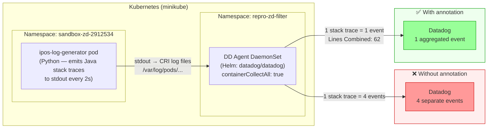

# Java Multi-line Log Aggregation — Stack Trace Fragmentation

## Context

By default, the Datadog Log Agent treats each newline as a separate log event. Java stack traces naturally span multiple lines — the first line contains the exception type, followed by one or more `at com.example...` frame lines. Without explicit configuration, a 4-line `NullPointerException` trace arrives in Datadog as 4 independent events, losing the causal chain.

**Impact:**
- Log search for `NullPointerException` returns only the exception headline — the frames that caused it are detached
- In high-traffic environments, logs from concurrent threads interleave between frames, making the trace unreadable
- Alerting on error patterns fails because the triggering line may be split from its context
- Ingestion cost inflates: a 30-line stack trace becomes 30 events, each carrying duplicate metadata (hostname, tags, timestamps)
- APM trace-to-log correlation breaks when the relevant log entry is fragmented

**Fix:**
Add a `log_processing_rules` entry with `type: multi_line` and a regex matching the timestamp prefix of the first line. The agent buffers subsequent lines until the next timestamp match, then flushes them as a single event.

## Environment

- **Agent Version:** 7 (latest)
- **Platform:** Kubernetes (minikube) — Helm deployment
- **Feature:** Log Management — Multi-line aggregation
- **Configuration method:** Pod autodiscovery annotation (`ad.datadoghq.com/<container>.logs`)

## Schema



## Quick Start

### 1. Prerequisites

```bash
minikube status   # cluster must be running
helm repo add datadog https://helm.datadoghq.com
helm repo update
```

### 2. Create namespaces and API key secret

```bash
kubectl create namespace sandbox-zd-java-multiline
kubectl create namespace datadog-java-multiline

kubectl create secret generic datadog-secret \
  -n datadog-java-multiline \
  --from-literal=api-key=<YOUR_DD_API_KEY>
```

### 3. Deploy the Datadog agent (no multi-line config — broken state)

Create `values-noml.yaml`:

```yaml
datadog:
  site: "datadoghq.com"
  apiKeyExistingSecret: "datadog-secret"
  clusterName: "sandbox-java-multiline"
  kubelet:
    tlsVerify: false
  logs:
    enabled: true
    containerCollectAll: true

clusterAgent:
  enabled: true

agents:
  image:
    tag: "7"
```

```bash
helm upgrade --install dd-java-multiline datadog/datadog \
  -n datadog-java-multiline \
  -f values-noml.yaml \
  --wait --timeout 4m
```

### 4. Deploy the Java log generator (broken state — no annotation)

```bash
kubectl apply -f - << 'MANIFEST'
apiVersion: apps/v1
kind: Deployment
metadata:
  name: ipos-log-generator
  namespace: sandbox-zd-java-multiline
spec:
  replicas: 1
  selector:
    matchLabels:
      app: ipos-log-generator
  template:
    metadata:
      labels:
        app: ipos-log-generator
    spec:
      containers:
        - name: ipos-app
          image: python:3.11-alpine
          command: ["python3", "-c"]
          args:
            - |
              import time, random
              errors = [
                ("java.lang.NullPointerException",
                 ["com.example.myproject.Book.getTitle(Book.java:16)",
                  "com.example.myproject.Author.getBookTitles(Author.java:25)",
                  "com.example.myproject.Bootstrap.main(Bootstrap.java:14)"]),
                ("java.lang.IllegalStateException: Cart session expired",
                 ["com.example.myproject.Cart.checkout(Cart.java:88)",
                  "com.example.myproject.OrderService.process(OrderService.java:42)",
                  "com.example.myproject.Bootstrap.handleRequest(Bootstrap.java:55)",
                  "java.util.concurrent.ThreadPoolExecutor.runWorker(ThreadPoolExecutor.java:1149)"]),
              ]
              infos = ["Starting iPOS bootstrap", "Connected to database", "Health check passed", "Transaction committed"]
              i = 0
              while True:
                  ts = time.strftime("%Y-%m-%d %H:%M:%S")
                  if i % 5 == 0:
                      exc, frames = random.choice(errors)
                      print(f"{ts} [ERROR] Exception in thread \"main\" {exc}", flush=True)
                      for f in frames:
                          print(f"\tat {f}", flush=True)
                  else:
                      print(f"{ts} [INFO] {random.choice(infos)}", flush=True)
                  i += 1
                  time.sleep(2)
MANIFEST
```

### 5. Observe fragmentation

Wait ~30 seconds, then query Datadog Log Explorer with `kube_deployment:ipos-log-generator`. You will see stack trace frames arriving as isolated events:

```
[ERROR] Exception in thread "main" java.lang.NullPointerException   ← event 1
	at com.example.myproject.Book.getTitle(Book.java:16)              ← event 2 (detached)
	at com.example.myproject.Author.getBookTitles(Author.java:25)     ← event 3 (detached)
	at com.example.myproject.Bootstrap.main(Bootstrap.java:14)        ← event 4 (detached)
```

Or via API:

```bash
export DD_API_KEY=<your_api_key>
export DD_APP_KEY=<your_app_key>

curl -s -X POST "https://api.datadoghq.com/api/v2/logs/events/search" \
  -H "Content-Type: application/json" \
  -H "DD-API-KEY: $DD_API_KEY" \
  -H "DD-APPLICATION-KEY: $DD_APP_KEY" \
  -d '{
    "filter": {
      "query": "kube_deployment:ipos-log-generator",
      "from": "now-10m",
      "to": "now"
    },
    "page": {"limit": 20}
  }' | python3 -c "
import sys, json
d = json.load(sys.stdin)
events = d.get('data', [])
print(f'Events received: {len(events)}')
for i, e in enumerate(events[:10]):
    print(f'  [{i+1}] {e[\"attributes\"][\"message\"][:80]}')
"
```

### 6. Apply the fix — add autodiscovery annotation

```bash
kubectl patch deployment ipos-log-generator \
  -n sandbox-zd-java-multiline \
  --type='json' \
  -p='[{
    "op": "add",
    "path": "/spec/template/metadata/annotations",
    "value": {
      "ad.datadoghq.com/ipos-app.logs": "[{\"source\":\"java\",\"service\":\"ipos\",\"log_processing_rules\":[{\"type\":\"multi_line\",\"name\":\"java_stack_trace_aggregation\",\"pattern\":\"\\\\d{4}-\\\\d{2}-\\\\d{2} \\\\d{2}:\\\\d{2}:\\\\d{2}\"}]}]"
    }
  }]'
```

Wait for rollout:

```bash
kubectl rollout status deployment/ipos-log-generator \
  -n sandbox-zd-java-multiline --timeout=60s
```

### 7. Verify aggregation

Wait ~30 seconds, then re-run the API query above scoped to `service:ipos`. Each ERROR event should now contain the full stack trace embedded as a single message:

```
[ERROR] Exception in thread "main" java.lang.NullPointerException
	at com.example.myproject.Book.getTitle(Book.java:16)
	at com.example.myproject.Author.getBookTitles(Author.java:25)
	at com.example.myproject.Bootstrap.main(Bootstrap.java:14)
```

Confirm via agent status:

```bash
AGENT_POD=$(kubectl get pod -n datadog-java-multiline -l app=dd-java-multiline -o jsonpath='{.items[0].metadata.name}')
kubectl exec -n datadog-java-multiline $AGENT_POD -c agent -- agent status 2>/dev/null | grep -A 15 "ipos-log-generator"
```

Look for:

```
Lines Combined: <non-zero>
MultiLine matches: <non-zero>
```

## Test Commands

```bash
# Live agent status — check Lines Combined counter
AGENT_POD=$(kubectl get pod -n datadog-java-multiline -l app=dd-java-multiline -o jsonpath='{.items[0].metadata.name}')
kubectl exec -n datadog-java-multiline $AGENT_POD -c agent -- agent status 2>/dev/null | grep -A 20 "ipos-log-generator"

# Verify annotation is set on the pod
kubectl get pod -n sandbox-zd-java-multiline -l app=ipos-log-generator \
  -o jsonpath='{.items[0].metadata.annotations}' | python3 -m json.tool | grep ad.datadoghq

# Tail live pod logs
kubectl logs -n sandbox-zd-java-multiline deployment/ipos-log-generator -f

# Agent config check — see active log sources
kubectl exec -n datadog-java-multiline $AGENT_POD -c agent -- agent config-check 2>/dev/null | grep -A5 "ipos"
```

## Expected vs Actual

| State | Config | Events per 4-line stack trace | Stack trace searchable? |
|-------|--------|-------------------------------|-------------------------|
| Broken (no annotation) | `containerCollectAll: true`, no multi_line rule | **4 events** (fragmented) | ❌ frames detached |
| Fixed (with annotation) | `ad.datadoghq.com/ipos-app.logs` with `multi_line` pattern | **1 event** (aggregated) | ✅ full trace in single event |

**Evidence from sandbox run (ZD-2912534):**

Without fix — 20+ events in 10 min window, isolated `at ...` lines:
```
[5]  'at at java.util.concurrent.ThreadPoolExecutor.runWorker(ThreadPoolExecutor.java:...'
[8]  'at at com.example.myproject.Cart.checkout(Cart.java:88)'
[9]  '2026-06-05 14:19:34 [ERROR] Exception in thread "main" java.lang.IllegalStateExc...'
```

With fix — aggregated events, stack trace embedded with `\n\t`:
```
[1] '2026-06-05 14:20:31 [ERROR] Exception in thread "main" java.lang.NullPointerException\n\tat ...'
[6] '2026-06-05 14:20:41 [ERROR] Exception in thread "main" java.lang.NullPointerException\n\tat ...'
```

Agent status: `Lines Combined: 62`, `MultiLine matches: 87`

## Fix / Workaround

### Option A — Pod annotation (Kubernetes / recommended)

Add to the pod spec's `metadata.annotations`:

```yaml
annotations:
  ad.datadoghq.com/<container-name>.logs: |
    [{
      "source": "java",
      "service": "ipos",
      "log_processing_rules": [{
        "type": "multi_line",
        "name": "java_stack_trace_aggregation",
        "pattern": "\\d{4}-\\d{2}-\\d{2} \\d{2}:\\d{2}:\\d{2}"
      }]
    }]
```

Adjust the `pattern` to match the actual timestamp format in the first line of each log entry. Common variants:

| Log format | Pattern |
|-----------|---------|
| `2026-06-05 12:00:00 [ERROR]` | `\d{4}-\d{2}-\d{2} \d{2}:\d{2}:\d{2}` |
| `2026-06-05T12:00:00.123Z` | `\d{4}-\d{2}-\d{2}T\d{2}:\d{2}:\d{2}` |
| `12:00:00.123 [ERROR]` | `\d{2}:\d{2}:\d{2}\.\d{3}` |
| `[ERROR] 2026-06-05` | `\[ERROR\|\WARN\|\INFO\]` |

### Option B — conf.d file (non-Kubernetes / file-based collection)

In `/etc/datadog-agent/conf.d/ipos.d/conf.yaml`:

```yaml
logs:
  - type: file
    path: /path/to/ipos/application.log
    service: ipos
    source: java
    log_processing_rules:
      - type: multi_line
        name: java_stack_trace_aggregation
        pattern: \d{4}-\d{2}-\d{2} \d{2}:\d{2}:\d{2}
```

Restart the agent after applying:

```bash
sudo systemctl restart datadog-agent
sudo datadog-agent status | grep -A 10 "ipos"
```

## Troubleshooting

```bash
# Verify annotation JSON is valid
kubectl get pod -n sandbox-zd-java-multiline -l app=ipos-log-generator \
  -o jsonpath='{.items[0].metadata.annotations.ad\.datadoghq\.com/ipos-app\.logs}' | python3 -m json.tool

# Check if agent picked up the autodiscovery config
kubectl exec -n datadog-java-multiline $AGENT_POD -c agent -- agent config-check 2>/dev/null

# Agent internal log for multi-line decoder activity
kubectl exec -n datadog-java-multiline $AGENT_POD -c agent -- \
  grep -i "multi_line\|multiline\|lines combined" /var/log/datadog/agent.log 2>/dev/null | tail -10

# Confirm log source is tailing the right file
kubectl exec -n datadog-java-multiline $AGENT_POD -c agent -- agent status 2>/dev/null \
  | grep -A 25 "ipos-log-generator"
```

## Cleanup

```bash
# Remove sandbox namespaces
kubectl delete namespace sandbox-zd-java-multiline
kubectl delete namespace datadog-java-multiline

# Remove Helm release (if you created a dedicated one)
helm uninstall dd-java-multiline -n datadog-java-multiline
```

## References

- [Datadog Docs — Manually aggregate multi-line logs](https://docs.datadoghq.com/agent/logs/advanced_log_collection/?tab=configurationfile#manually-aggregate-multi-line-logs)
- [Datadog Docs — Kubernetes Log Collection with Autodiscovery](https://docs.datadoghq.com/containers/kubernetes/log/)
- [Agent Docker Tags](https://hub.docker.com/r/datadog/agent/tags)
- ZD-2910713 — similar Java multi-line issue on EKS resolved with same pattern
