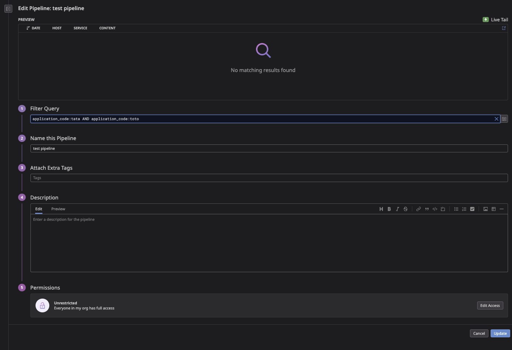
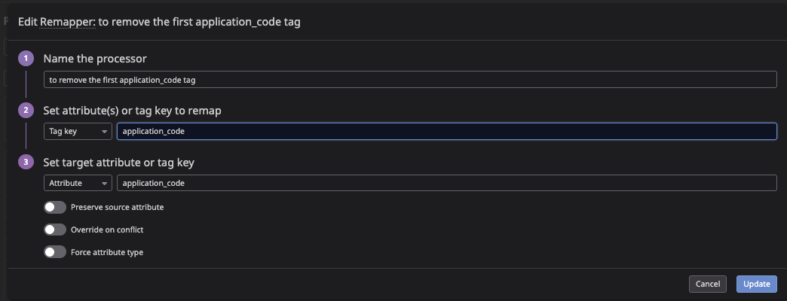
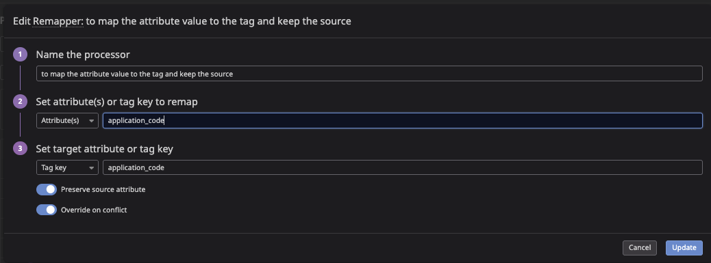
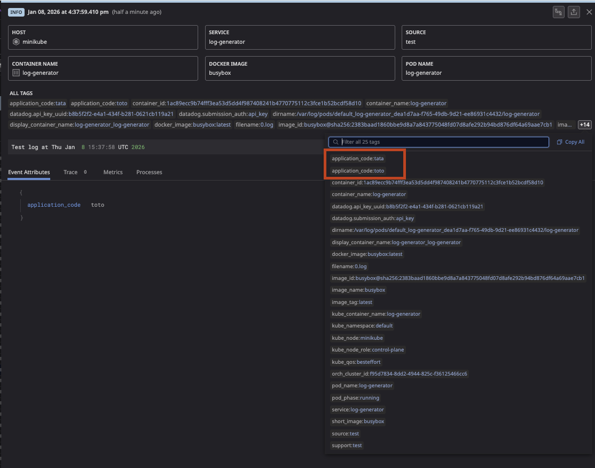
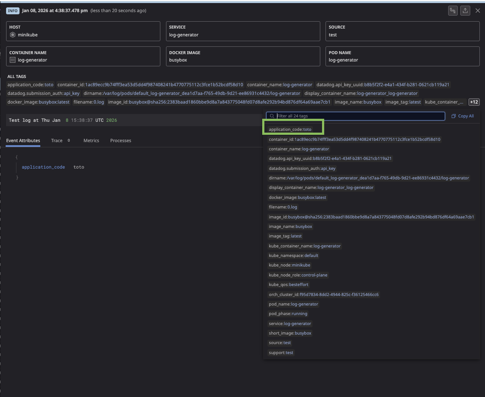

# Datadog Log Generator Sandbox

A simple sandbox environment to generate test logs with custom tags and attributes for Datadog.

## Prerequisites

- [Minikube](https://minikube.sigs.k8s.io/docs/start/)
- [Helm](https://helm.sh/docs/intro/install/)
- [kubectl](https://kubernetes.io/docs/tasks/tools/)
- Datadog API Key

## Quick Start

### 1. Start Minikube

```bash
minikube delete --all  # Clean up any existing clusters
minikube start
```

### 2. Create Datadog API Key Secret

```bash
kubectl create secret generic datadog-secret \
  --from-literal=api-key=<YOUR_API_KEY>
```

### 3. Add Datadog Helm Repository

```bash
helm repo add datadog https://helm.datadoghq.com
helm repo update
```

### 4. Install Datadog Agent

```bash
helm install datadog-agent datadog/datadog \
  --set datadog.apiKeyExistingSecret=datadog-secret \
  --set datadog.logs.enabled=true \
  --set datadog.logs.containerCollectAll=true \
  --set datadog.site=datadoghq.com \
  --set datadog.kubelet.tlsVerify=false
```

### 5. Deploy Log Generator Pod

```bash
kubectl apply -f - <<EOF
apiVersion: v1
kind: Pod
metadata:
  name: log-generator
  annotations:
    ad.datadoghq.com/log-generator.logs: '[{"source": "test", "service": "log-generator", "tags": ["application_code:toto", "application_code:tata"]}]'
spec:
  containers:
  - name: log-generator
    image: busybox
    command: ["/bin/sh", "-c"]
    args:
      - 'while true; do echo "{\"message\": \"Test log at \$(date)\", \"application_code\": \"toto\"}"; sleep 1; done'
EOF
```

## Verification

### Check Pods Status

```bash
kubectl get pods
```

Expected output:
```
NAME                                           READY   STATUS    RESTARTS   AGE
datadog-agent-xxxxx                            2/2     Running   0          1m
datadog-agent-cluster-agent-xxxxx              1/1     Running   0          1m
datadog-agent-operator-xxxxx                   1/1     Running   0          1m
log-generator                                  1/1     Running   0          30s
```

### Check Log Generator Logs

```bash
kubectl logs log-generator --tail=5
```

Expected output:
```json
{"message": "Test log at Thu Jan  8 15:35:42 UTC 2026", "application_code": "toto"}
{"message": "Test log at Thu Jan  8 15:35:43 UTC 2026", "application_code": "toto"}
```

### Check Agent Status

```bash
kubectl exec -it $(kubectl get pods -l app=datadog -o jsonpath='{.items[0].metadata.name}') -c agent -- agent status | grep -A 15 "Logs Agent"
```

### Stream Logs from Agent

```bash
kubectl exec $(kubectl get pods -l app=datadog -o jsonpath='{.items[0].metadata.name}') -c agent -- agent stream-logs
```

## Configuration Details

### Log Generator Pod

| Component | Value |
|-----------|-------|
| **Source** | `test` |
| **Service** | `log-generator` |
| **Tags** | `application_code:toto`, `application_code:tata` |
| **Attribute** | `application_code: toto` |

### Datadog Agent Helm Values

| Setting | Value | Description |
|---------|-------|-------------|
| `datadog.apiKeyExistingSecret` | `datadog-secret` | K8s secret containing API key |
| `datadog.logs.enabled` | `true` | Enable log collection |
| `datadog.logs.containerCollectAll` | `true` | Collect logs from all containers |
| `datadog.site` | `datadoghq.com` | Datadog site (US1) |
| `datadog.kubelet.tlsVerify` | `false` | Disable TLS verification for kubelet (minikube) |

## Log Pipeline Configuration

To dynamically set the `application_code` tag from the log attribute (instead of static annotation tags), configure a Datadog Log Pipeline:

### Pipeline Setup

1. **Go to**: [Logs > Configuration > Pipelines](https://app.datadoghq.com/logs/pipelines)

2. **Create a new Pipeline**:

   

3. **Add Processor 1 - Remapper** (Remove duplicate tag):

   

4. **Add Processor 2 - Remapper** (Map attribute to tag):

   

### View Logs in Datadog

Navigate to: https://app.datadoghq.com/logs?query=service%3Alog-generator

Filter by tags:
- `application_code:toto`

### Result

**Before pipeline:**



**After pipeline:**



This allows to deduplicate the tags.

## Troubleshooting

### Kubelet TLS Verification Error

If you see errors like:
```
Error: impossible to reach Kubelet with host: xxx. Please check if your setup requires kubelet_tls_verify = false
```

Solution: Add `--set datadog.kubelet.tlsVerify=false` to your Helm install command.

### Logs Not Appearing in Datadog

1. Check agent logs status:
   ```bash
   kubectl exec <agent-pod> -c agent -- agent status | grep -A 20 "Logs Agent"
   ```

2. Stream logs to verify collection:
   ```bash
   kubectl exec <agent-pod> -c agent -- agent stream-logs
   ```

3. Verify pod annotations:
   ```bash
   kubectl get pod log-generator -o jsonpath='{.metadata.annotations}'
   ```

## Cleanup

### Delete Log Generator Pod

```bash
kubectl delete pod log-generator
```

### Uninstall Datadog Agent

```bash
helm uninstall datadog-agent
```

### Delete Secret

```bash
kubectl delete secret datadog-secret
```

### Delete Minikube Cluster

```bash
minikube delete --all
```

