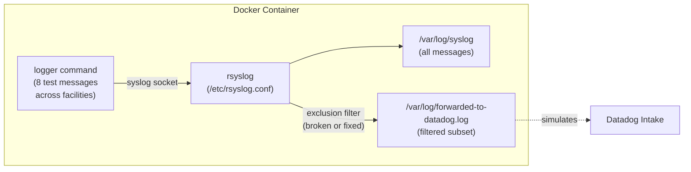

# rsyslog - Facility-Based Exclusion Filter Logic

## Context

This sandbox demonstrates how rsyslog facility-based exclusion filters work, and validates a common logic mistake where the filter condition is accidentally inverted.

**The bug:** using `!= / and` instead of `== / or` in an exclusion filter causes the opposite behavior — the facilities you intend to *block* are the only ones *forwarded*, and everything else is silently dropped.

This is reproduced entirely in Docker, no Datadog Agent required. The TCP forwarding rule is replaced with a local file output so you can inspect exactly which messages would have been sent to Datadog.

## Environment

- **Platform:** Docker (Debian Bookworm, rsyslog 8.23)
- **Integration:** Log Management — rsyslog forwarding
- **No Datadog Agent required** — forwarding is simulated with a local file

## Schema



## Quick Start

### 1. Create the Dockerfile

```dockerfile
FROM debian:bookworm-slim
RUN apt-get update && apt-get install -y rsyslog && rm -rf /var/lib/apt/lists/*
COPY entrypoint.sh /entrypoint.sh
RUN chmod +x /entrypoint.sh
CMD ["/entrypoint.sh"]
```

### 2. Create the entrypoint script

```bash
#!/bin/bash
set -e

CONFIG="${CONFIG:-broken}"

echo "========================================================"
echo "  rsyslog filter sandbox — config: $CONFIG"
echo "========================================================"

cp /configs/rsyslog-${CONFIG}.conf /etc/rsyslog.conf

touch /var/log/syslog /var/log/forwarded-to-datadog.log /var/log/rsyslog-debug.log
rsyslogd
sleep 1

echo ""
echo "────────────────────────────────────────────────────────"
echo "  Sending test messages via logger"
echo "────────────────────────────────────────────────────────"

logger -p user.info    "TEST [user.info] - generic system log → SHOULD be forwarded"
logger -p kern.info    "TEST [kern.info] - kernel log → SHOULD be forwarded"
logger -p daemon.info  "TEST [daemon.info] - daemon log → SHOULD be forwarded"
logger -p mail.info    "TEST [mail.info] - mail → MUST NOT be forwarded"
logger -p authpriv.info "TEST [authpriv.info] - authpriv → MUST NOT be forwarded"
logger -p cron.info    "TEST [cron.info] - cron → MUST NOT be forwarded"
logger -p local3.info  "TEST [local3.info] - local3 → MUST NOT be forwarded"
logger -p local0.info  "TEST [local0.info] - local0 (not excluded) → SHOULD be forwarded"

sleep 1

echo ""
echo "════════════════════════════════════════════════════════"
echo "  RESULT: /var/log/forwarded-to-datadog.log"
echo "════════════════════════════════════════════════════════"
cat /var/log/forwarded-to-datadog.log 2>/dev/null || echo "(empty — nothing forwarded)"

echo ""
echo "────────────────────────────────────────────────────────"
echo "  rsyslog debug log (filter decisions)"
echo "────────────────────────────────────────────────────────"
grep -i "filter\|stop\|TEST\|discard\|action" /var/log/rsyslog-debug.log 2>/dev/null | tail -60

echo ""
echo "Done."
```

### 3. Create the rsyslog config files

**`rsyslog-broken.conf`** — inverted logic (common mistake):

```
module(load="imuxsock")
module(load="imklog")

$DebugFile /var/log/rsyslog-debug.log
$DebugLevel 2

*.* /var/log/syslog

# BROKEN: != / and stops general logs; only mail/authpriv/cron/local3 reach the forwarder
if ( $syslogfacility-text != "mail" and $syslogfacility-text != "authpriv" and $syslogfacility-text != "cron" and $syslogfacility-text != "local3" )
then {
    stop
}

*.* /var/log/forwarded-to-datadog.log
```

**`rsyslog-fixed-a.conf`** — correct logic using `== / or`:

```
module(load="imuxsock")
module(load="imklog")

$DebugFile /var/log/rsyslog-debug.log
$DebugLevel 2

*.* /var/log/syslog

# FIX A: stop only if the facility IS one of the excluded ones
if ( $syslogfacility-text == "mail" or $syslogfacility-text == "authpriv" or $syslogfacility-text == "cron" or $syslogfacility-text == "local3" )
then {
    stop
}

*.* /var/log/forwarded-to-datadog.log
```

**`rsyslog-fixed-b.conf`** — native facility selector (most idiomatic):

```
module(load="imuxsock")
module(load="imklog")

$DebugFile /var/log/rsyslog-debug.log
$DebugLevel 2

*.* /var/log/syslog

# FIX B: mirrors the traditional /var/log/messages rule exactly
*.info;mail.none;authpriv.none;cron.none;local3.none /var/log/forwarded-to-datadog.log
```

### 4. Build and run

```bash
docker build -t rsyslog-sandbox .

# Test the broken config
docker run --rm -e CONFIG=broken -v $(pwd):/configs rsyslog-sandbox

# Test Fix A (== / or)
docker run --rm -e CONFIG=fixed-a -v $(pwd):/configs rsyslog-sandbox

# Test Fix B (native facility selector)
docker run --rm -e CONFIG=fixed-b -v $(pwd):/configs rsyslog-sandbox
```

## Expected vs Actual

### Broken config (`!= / and`)

| Facility | Expected (forwarded to DD?) | Actual |
|---|---|---|
| `user.info` | ✅ Yes | ❌ Dropped (STOP fires) |
| `kern.info` | ✅ Yes | ❌ Dropped |
| `daemon.info` | ✅ Yes | ❌ Dropped |
| `local0.info` | ✅ Yes | ❌ Dropped |
| `mail.info` | ❌ No | ✅ Forwarded (escapes STOP) |
| `authpriv.info` | ❌ No | ✅ Forwarded |
| `cron.info` | ❌ No | ✅ Forwarded |
| `local3.info` | ❌ No | ✅ Forwarded |

### Fixed config (Fix A or Fix B)

| Facility | Expected (forwarded to DD?) | Actual |
|---|---|---|
| `user.info` | ✅ Yes | ✅ Forwarded |
| `kern.info` | ✅ Yes | ✅ Forwarded |
| `daemon.info` | ✅ Yes | ✅ Forwarded |
| `local0.info` | ✅ Yes | ✅ Forwarded |
| `mail.info` | ❌ No | ❌ Dropped |
| `authpriv.info` | ❌ No | ❌ Dropped |
| `cron.info` | ❌ No | ❌ Dropped |
| `local3.info` | ❌ No | ❌ Dropped |

## Root Cause Explanation

The broken filter reads:

```
if ( $syslogfacility-text != "mail" AND != "authpriv" AND != "cron" AND != "local3" )
then { stop }
```

For a `user.info` message: all four conditions are `true` (it is NOT any of those), so the whole `AND` chain is `true` → `stop` fires → message is dropped.

For a `mail.info` message: the first condition is `false` (it IS mail), so the `AND` short-circuits to `false` → `stop` is skipped → message reaches the forwarder.

**De Morgan's law**: `NOT (A OR B OR C OR D)` equals `NOT A AND NOT B AND NOT C AND NOT D`. The customer wrote the `AND NOT` form but intended the exclusion behavior of `NOT (A OR B OR C OR D)` — i.e., they wanted to stop when the facility IS one of the excluded ones, not when it is NOT.

## Fix / Workaround

Replace the broken block in `/etc/rsyslog.d/50-datadog.conf` with one of these:

**Option A — Explicit stop-list (`== / or`):**

```conf
if ( $syslogfacility-text == "mail" or $syslogfacility-text == "authpriv" or $syslogfacility-text == "cron" or $syslogfacility-text == "local3" )
then { stop }

*.* @@intake.logs.datadoghq.com:10516;DatadogFormat
```

**Option B — Native facility selector (simplest, no scripting needed):**

```conf
*.info;mail.none;authpriv.none;cron.none;local3.none @@intake.logs.datadoghq.com:10516;DatadogFormat
```

Option B mirrors the traditional `/var/log/messages` rule syntax and is the most idiomatic approach in rsyslog.

## Enable rsyslog Debug Logging on the Host

To capture filter decisions on the actual server:

```bash
# Enable debug logging
cat <<'EOF' | sudo tee /etc/rsyslog.d/00-debug.conf
$DebugFile /var/log/rsyslog-debug.log
$DebugLevel 2
EOF

sudo systemctl restart rsyslog

# Send a test message and inspect
logger -p user.info "TEST general log"
logger -p mail.info "TEST mail log"
grep "STOP\|TEST" /var/log/rsyslog-debug.log
```

## Troubleshooting

```bash
# Validate rsyslog config syntax before restarting
sudo rsyslogd -N1 -f /etc/rsyslog.d/50-datadog.conf

# Check rsyslog status and recent errors
sudo systemctl status rsyslog
sudo journalctl -u rsyslog --since "5 minutes ago"

# Find which facility/program maps to a log file
grep "/var/log/example.log" /etc/rsyslog.conf /etc/rsyslog.d/*.conf

# Test a specific facility
logger -p local2.info "TEST local2 log"
grep "TEST" /var/log/syslog
```

## References

- [Datadog Docs — Log Collection with rsyslog](https://docs.datadoghq.com/logs/log_collection/?tab=rsyslog)
- [rsyslog Filter Conditions](https://www.rsyslog.com/doc/v8-stable/configuration/filters.html)
- [rsyslog Facility/Severity-based Filters](https://www.rsyslog.com/doc/v8-stable/configuration/filters.html#facility-and-severity-based-filters)
