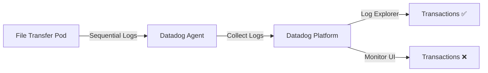

# Sequential Log Monitoring - Transaction Feature Limitation

## Context

This sandbox reproduces a scenario where customers want to monitor **sequential log events** with strict timing requirements. Specifically:

1. Multiple file transfer progress logs for the same file
2. A "Done Transferring" completion message within 1-2 seconds
3. Alert **only** when both events occur in sequence with proper correlation

The issue: The **Transactions feature** exists in **Log Explorer** for analysis but is **not available in Monitor creation UI**, making it impossible to create monitors based on log transaction patterns.

## Environment

* **Agent Version:** 7.75.0
* **Platform:** Minikube with Colima (Docker driver)
* **Kubernetes:** v1.31.0

## Schema



## Quick Start

### 1. Start Minikube with Colima

```bash
# Start Colima (Docker runtime)
colima start --cpu 4 --memory 8 --disk 30

# Start Minikube
minikube start --driver=docker --cpus=2 --memory=3500

# Verify
minikube status
```

### 2. Deploy Log Simulator

This pod generates sequential logs matching a file transfer pattern:

```bash
kubectl apply -f - <<'MANIFEST'
apiVersion: v1
kind: Namespace
metadata:
  name: sequential-logs-test
---
apiVersion: v1
kind: Pod
metadata:
  name: file-transfer-simulator
  namespace: sequential-logs-test
  labels:
    app: sequential-logs
    service: ftp-job
spec:
  containers:
  - name: app
    image: busybox
    command: ["/bin/sh", "-c"]
    args:
      - |
        while true; do
          FILE="transfer-file-$(date +%Y%m%d-%H-%M).txt"
          TIMESTAMP=$(date '+%Y-%m-%d %H:%M:%S')
          echo "$TIMESTAMP INFO [Worker-1] FileTransferJob\$ProgressMonitor : File [$FILE] bytes transferred [1285078]"
          sleep 0.5
          TIMESTAMP=$(date '+%Y-%m-%d %H:%M:%S')
          echo "$TIMESTAMP INFO [Worker-1] FileTransferJob\$ProgressMonitor : File [$FILE] bytes transferred [3604425]"
          sleep 0.5
          TIMESTAMP=$(date '+%Y-%m-%d %H:%M:%S')
          echo "$TIMESTAMP INFO [Worker-1] FileTransferJob\$ProgressMonitor : File [$FILE] bytes transferred [5285078]"
          sleep 1
          TIMESTAMP=$(date '+%Y-%m-%d %H:%M:%S')
          echo "$TIMESTAMP INFO [Worker-1] FileTransferJob : Done Transferring [1] files."
          sleep 0.2
          TIMESTAMP=$(date '+%Y-%m-%d %H:%M:%S')
          echo "$TIMESTAMP INFO [Worker-1] FileTransferJob : Quitting client"
          sleep 0.1
          TIMESTAMP=$(date '+%Y-%m-%d %H:%M:%S')
          echo "$TIMESTAMP INFO [Worker-1] FileTransferJob : Complete"
          sleep 15
        done
MANIFEST
```

### 3. Wait for Ready

```bash
kubectl wait --for=condition=ready pod -n sequential-logs-test file-transfer-simulator --timeout=60s
```

### 4. Deploy Datadog Agent

Create the Datadog secret:

```bash
kubectl create secret generic datadog-secret --from-literal=api-key=YOUR_API_KEY
```

Install Datadog Agent with log collection:

```bash
helm repo add datadog https://helm.datadoghq.com && helm repo update

helm install datadog-agent datadog/datadog -f - <<'VALUES'
datadog:
  apiKeyExistingSecret: datadog-secret
  site: datadoghq.com
  clusterName: "sequential-logs-sandbox"
  
  # Disable kubelet TLS Verification in minikube
  kubelet:
    tlsVerify: false

  # Enable log collection
  logs:
    enabled: true
    containerCollectAll: true

  # Enable APM (optional)
  apm:
    portEnabled: true

  # These 3 integrations error by default in minikube
  ignoreAutoConfig:
    - etcd
    - kube_controller_manager 
    - kube_scheduler

  tags:
    - "env:sandbox"
    - "test:sequential-logs"

clusterAgent:
  enabled: true
VALUES
```

## Test Commands

### Agent Status

```bash
# Get agent pod name
AGENT_POD=$(kubectl get pods -l app.kubernetes.io/name=datadog -o jsonpath='{.items[0].metadata.name}')

# Check agent status
kubectl exec -it $AGENT_POD -- agent status

# Check log collection
kubectl exec -it $AGENT_POD -- agent status | grep -A 20 "Log Agent"
```

### View Logs Locally

```bash
# Follow simulator logs
kubectl logs -n sequential-logs-test file-transfer-simulator -f

# View last 20 lines
kubectl logs -n sequential-logs-test file-transfer-simulator --tail=20
```

### Sample Output

```
2026-02-01 17:06:01 INFO [Worker-1] FileTransferJob$ProgressMonitor : File [transfer-file-20260201-17-06.txt] bytes transferred [1285078]
2026-02-01 17:06:02 INFO [Worker-1] FileTransferJob$ProgressMonitor : File [transfer-file-20260201-17-06.txt] bytes transferred [3604425]
2026-02-01 17:06:02 INFO [Worker-1] FileTransferJob$ProgressMonitor : File [transfer-file-20260201-17-06.txt] bytes transferred [5285078]
2026-02-01 17:06:03 INFO [Worker-1] FileTransferJob : Done Transferring [1] files.
2026-02-01 17:06:03 INFO [Worker-1] FileTransferJob : Quitting client
2026-02-01 17:06:04 INFO [Worker-1] FileTransferJob : Complete
```

**Key timing**: "Done Transferring" appears ~1-2 seconds after the last progress log.

## Expected vs Actual

| Feature                                | Expected                      | Actual                        |
| -------------------------------------- | ----------------------------- | ----------------------------- |
| Transactions in Log Explorer           | ✅ Available for analysis      | ✅ Available for analysis      |
| Transactions in Monitor Creation UI    | ✅ Should be available         | ❌ Not available               |
| Monitor sequential logs with timing    | ✅ Direct transaction monitor  | ❌ Requires workarounds        |

### Screenshots - Log Explorer

In **Logs → Explorer**, you can:
- Group logs by transaction ID
- Analyze sequential patterns
- View correlated events

### Screenshots - Monitor UI

In **Monitors → New Monitor → Logs**:
- ❌ No "Group into Transactions" option
- ❌ Cannot enforce sequential timing
- ❌ Cannot correlate by shared identifier

## Workarounds

### Option 1: Composite Monitor ⚠️

Create two separate log monitors and combine them with a Composite Monitor:

**Monitor A** - Detect file transfer logs:
```
service:ftp-job "File [transfer" "bytes transferred"
```

**Monitor B** - Detect completion:
```
service:ftp-job "Done Transferring"
```

**Composite Monitor**:
```
(A && B)
```

**Limitation**: Cannot correlate by filename, may trigger false positives if logs from different files arrive within the time window.

### Option 2: Log-to-Metrics ✅ (Recommended)

1. Create a **Generate Metrics** rule from log pattern
2. Extract filename as a tag
3. Create metric-based monitor for sequential detection

**Example Metric Rule**:
```
Pattern: FileTransferJob "Done Transferring"
Tag: filename:$filename
Metric name: logs.file_transfer.complete
```

**Advantage**: Can correlate events by filename tag, more reliable alerting.

### Option 3: Log Pattern with Aggregation

Use a single log query with both patterns:
```
service:ftp-job ("File [transfer" AND "Done Transferring")
```

**Limitation**: Cannot enforce strict 1-2 second timing, may miss timing-specific issues.

## Troubleshooting

### Pod Logs

```bash
# Simulator logs
kubectl logs -n sequential-logs-test file-transfer-simulator --tail=100

# Agent logs
kubectl logs -l app.kubernetes.io/name=datadog -c agent --tail=100
```

### Describe Resources

```bash
# Describe simulator pod
kubectl describe pod -n sequential-logs-test file-transfer-simulator

# Describe agent
kubectl describe pod -l app.kubernetes.io/name=datadog
```

### Get Events

```bash
kubectl get events -n sequential-logs-test --sort-by='.lastTimestamp'
```

### Verify in Datadog UI

1. Go to **Logs → Explorer**
2. Filter: `service:ftp-job` or `kube_namespace:sequential-logs-test`
3. Observe the sequential pattern repeating every ~15 seconds
4. Try grouping by transaction (works in Explorer)
5. Attempt to create a monitor with transactions (not available)

## Cleanup

```bash
# Remove simulator
kubectl delete namespace sequential-logs-test

# Remove Datadog Agent
helm uninstall datadog-agent

# Stop Minikube and Colima
minikube stop
colima stop
```

## References

- [Datadog Logs Transactions](https://docs.datadoghq.com/logs/explorer/analytics/transactions/)
- [Datadog Log Monitors](https://docs.datadoghq.com/monitors/types/log/)
- [Log-to-Metrics](https://docs.datadoghq.com/logs/log_configuration/logs_to_metrics/)
- [Composite Monitors](https://docs.datadoghq.com/monitors/types/composite/)
- [Datadog Agent Tags](https://hub.docker.com/r/datadog/agent/tags)
