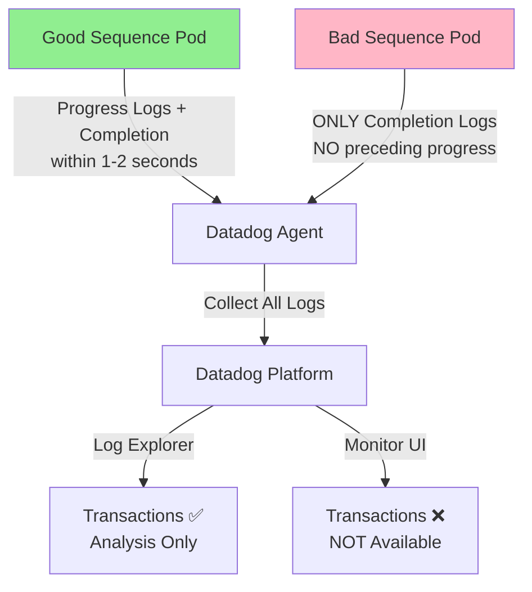

# Sequential Log Monitoring - Transaction Feature Limitation

## Context

This sandbox reproduces a scenario where customers want to monitor **sequential log events** with strict timing requirements:

1. Multiple file transfer progress logs for the same file
2. A "Done Transferring" completion message within 1-2 seconds
3. Alert **only** when both events occur in sequence with proper correlation

**Customer's exact requirement**:
> "I want an email notification sent only when this specific 1-2 second sequence is detected. If the 'Done Transferring' message appears without being preceded by the file transfer line within that timeframe, it should not trigger."

**The issue**: The **Transactions feature** exists in **Log Explorer** for analysis but is **not available in Monitor creation UI**, making it impossible to create monitors based on log transaction patterns with strict timing.

## Environment

* **Agent Version:** 7.75.0
* **Platform:** Minikube with Colima (Docker driver)
* **Kubernetes:** v1.31.0

## Schema



## Quick Start

### 1. Start Minikube with Colima

```bash
# Start Colima (Docker runtime)
colima start --cpu 4 --memory 8 --disk 30

# Start Minikube
minikube start --driver=docker --cpus=2 --memory=3500

# Verify
minikube status
```

### 2. Deploy Test Pods

This creates **TWO test scenarios** - one good, one bad:

```bash
kubectl apply -f - <<'MANIFEST'
apiVersion: v1
kind: Namespace
metadata:
  name: sequential-logs-test
---
# ========================================
# TEST SCENARIO 1: GOOD SEQUENCE (Should Alert ✅)
# File transfers followed by completion within 1-2 seconds
# ========================================
apiVersion: v1
kind: Pod
metadata:
  name: file-transfer-simulator
  namespace: sequential-logs-test
  labels:
    app: sequential-logs
    service: ftp-job
    test: good-sequence
spec:
  containers:
  - name: app
    image: busybox
    command: ["/bin/sh", "-c"]
    args:
      - |
        while true; do
          FILE="fflynsl-$(date +%Y%m%d-%H-%M).txt"
          TIMESTAMP=$(date '+%Y-%m-%d %H:%M:%S')
          echo "$TIMESTAMP INFO [Worker-1] FileTransferJob\$ProgressMonitor : File [$FILE] bytes transferred [1285078]"
          sleep 0.5
          TIMESTAMP=$(date '+%Y-%m-%d %H:%M:%S')
          echo "$TIMESTAMP INFO [Worker-1] FileTransferJob\$ProgressMonitor : File [$FILE] bytes transferred [3604425]"
          sleep 0.5
          TIMESTAMP=$(date '+%Y-%m-%d %H:%M:%S')
          echo "$TIMESTAMP INFO [Worker-1] FileTransferJob\$ProgressMonitor : File [$FILE] bytes transferred [5285078]"
          sleep 1
          TIMESTAMP=$(date '+%Y-%m-%d %H:%M:%S')
          echo "$TIMESTAMP INFO [Worker-1] FileTransferJob : Done Transferring [1] files."
          sleep 0.2
          TIMESTAMP=$(date '+%Y-%m-%d %H:%M:%S')
          echo "$TIMESTAMP INFO [Worker-1] FileTransferJob : Quitting client"
          sleep 0.1
          TIMESTAMP=$(date '+%Y-%m-%d %H:%M:%S')
          echo "$TIMESTAMP INFO [Worker-1] FileTransferJob : Complete"
          sleep 15
        done
---
# ========================================
# TEST SCENARIO 2: BAD SEQUENCE (Should NOT Alert ❌)
# Orphan completion logs WITHOUT preceding file transfers
# ========================================
apiVersion: v1
kind: Pod
metadata:
  name: orphan-completion-logs
  namespace: sequential-logs-test
  labels:
    app: sequential-logs
    service: ftp-job
    test: orphan-logs
spec:
  containers:
  - name: app
    image: busybox
    command: ["/bin/sh", "-c"]
    args:
      - |
        echo "Waiting 30 seconds before starting orphan logs..."
        sleep 30
        while true; do
          TIMESTAMP=$(date '+%Y-%m-%d %H:%M:%S')
          echo "$TIMESTAMP INFO [Worker-1] FileTransferJob : Done Transferring [1] files."
          sleep 25
        done
MANIFEST
```

### 3. Wait for Ready

```bash
kubectl wait --for=condition=ready pod -n sequential-logs-test file-transfer-simulator --timeout=60s
kubectl wait --for=condition=ready pod -n sequential-logs-test orphan-completion-logs --timeout=90s
```

### 4. Deploy Datadog Agent

Create the Datadog secret:

```bash
kubectl create secret generic datadog-secret --from-literal=api-key=YOUR_API_KEY
```

Install Datadog Agent with log collection:

```bash
helm repo add datadog https://helm.datadoghq.com && helm repo update

helm install datadog-agent datadog/datadog -f - <<'VALUES'
datadog:
  apiKeyExistingSecret: datadog-secret
  site: datadoghq.com
  clusterName: "sequential-logs-sandbox"
  
  # Disable kubelet TLS Verification in minikube
  kubelet:
    tlsVerify: false

  # Enable log collection
  logs:
    enabled: true
    containerCollectAll: true

  # Enable APM (optional)
  apm:
    portEnabled: true

  # These 3 integrations error by default in minikube
  ignoreAutoConfig:
    - etcd
    - kube_controller_manager 
    - kube_scheduler

  tags:
    - "env:sandbox"
    - "test:sequential-logs"

clusterAgent:
  enabled: true
VALUES
```

## Test Commands

### View Both Test Scenarios

```bash
# Good sequence (should alert)
kubectl logs -n sequential-logs-test file-transfer-simulator --tail=10

# Bad sequence (should NOT alert)
kubectl logs -n sequential-logs-test orphan-completion-logs --tail=5

# Both together
kubectl logs -n sequential-logs-test -l service:ftp-job -f
```

### Agent Status

```bash
# Get agent pod name
AGENT_POD=$(kubectl get pods -l app.kubernetes.io/name=datadog -o jsonpath='{.items[0].metadata.name}')

# Check agent status
kubectl exec -it $AGENT_POD -- agent status

# Check log collection
kubectl exec -it $AGENT_POD -- agent status | grep -A 20 "Log Agent"
```

## Expected vs Actual

### Test Scenario 1: Good Sequence ✅

**Sample Output**:
```
17:19:35 INFO [Worker-1] FileTransferJob$ProgressMonitor : File [fflynsl-20260201-17-19.txt] bytes transferred [1285078]
17:19:36 INFO [Worker-1] FileTransferJob$ProgressMonitor : File [fflynsl-20260201-17-19.txt] bytes transferred [3604425]
17:19:36 INFO [Worker-1] FileTransferJob$ProgressMonitor : File [fflynsl-20260201-17-19.txt] bytes transferred [5285078]
17:19:37 INFO [Worker-1] FileTransferJob : Done Transferring [1] files.
```

**Timing**: "Done Transferring" appears 1 second after last progress log ✅  
**Expected**: Should trigger alert  
**Pattern**: Progress → Completion (correlated by filename)

### Test Scenario 2: Orphan Logs ❌

**Sample Output**:
```
17:20:01 INFO [Worker-1] FileTransferJob : Done Transferring [1] files.
17:20:26 INFO [Worker-1] FileTransferJob : Done Transferring [1] files.
```

**Timing**: NO preceding progress logs  
**Expected**: Should NOT trigger alert  
**Pattern**: Completion only (orphan logs)

### What Datadog Can/Cannot Do

| Feature                                | Expected                      | Actual                        |
| -------------------------------------- | ----------------------------- | ----------------------------- |
| Transactions in Log Explorer           | ✅ Available for analysis      | ✅ Available for analysis      |
| Transactions in Monitor Creation UI    | ✅ Should be available         | ❌ Not available               |
| Monitor sequential logs with timing    | ✅ 1-2 second precision        | ❌ Minimum 1 minute window     |
| Correlate by shared identifier         | ✅ In monitors                 | ❌ Only in Explorer            |
| Filter orphan completion logs          | ✅ With sequence logic         | ❌ Cannot enforce sequence     |

## Workarounds

### Option 1: Log-to-Metrics ✅ (Recommended - 90% Solution)

**Pros**:
- Native Datadog feature
- Can correlate by filename tags
- Reliable alerting

**Cons**:
- Cannot enforce strict 1-2 second timing (uses 2-minute window)
- May include orphan logs within same evaluation window

**Implementation**:

1. **Create Generate Metrics rules** (Logs → Configuration → Generate Metrics):

```
Rule 1: Track File Transfers
Filter: service:ftp-job "File [fflynsl" "bytes transferred"
Metric: custom.logs.file_transfer.progress
Tag extraction: @filename from log message
```

```
Rule 2: Track Completions
Filter: service:ftp-job "Done Transferring"
Metric: custom.logs.file_transfer.complete
Tag extraction: @filename from log message
```

2. **Create Metric Monitor**:

```
Query:
sum(last_2m):sum:custom.logs.file_transfer.complete{*} by {filename}.as_count() > 0
AND
sum(last_2m):sum:custom.logs.file_transfer.progress{*} by {filename}.as_count() > 2

Alert when: Both conditions met
Group by: filename (ensures correlation)
```

**Result**: Catches the pattern but timing is approximate (2-minute window instead of 1-2 seconds)

### Option 2: Composite Monitor ⚠️ (Partial Solution)

Create two separate log monitors:

**Monitor A** - File transfers detected:
```
Query: service:ftp-job "File [fflynsl" "bytes transferred"
Threshold: count > 0 over 1 minute
```

**Monitor B** - Completion detected:
```
Query: service:ftp-job "Done Transferring"
Threshold: count > 0 over 1 minute
```

**Composite**: `(A && B)`

**Problems**:
- ❌ Cannot enforce 1-2 second timing (minimum 1 minute)
- ❌ Cannot correlate by filename
- ❌ Will trigger on orphan logs if they occur within same window

### Option 3: Custom Service (100% Solution)

For exact requirements, deploy a custom service:

**Architecture**:
```
Custom Service → Queries Datadog Logs API every second
              → Maintains 2-second sliding window
              → Detects exact sequence pattern
              → Sends alert via email/webhook
```

**Pseudo-code logic**:
```python
recent_transfers = {}  # filename -> timestamp

for log in log_stream:
    if "File [fflynsl" in log:
        filename = extract_filename(log)
        recent_transfers[filename] = log.timestamp
    
    elif "Done Transferring" in log:
        # Check for preceding transfer within 2 seconds
        if any(
            (log.timestamp - ts).seconds <= 2 
            for ts in recent_transfers.values()
        ):
            send_alert()  # ✅ Valid sequence
        else:
            pass  # ❌ Orphan log - ignore
```

**Result**: Exactly matches customer requirements

## Verify in Datadog UI

1. **Go to Logs → Explorer**
2. **Filter**: `service:ftp-job`
3. **Observe**:
   - ✅ Good sequences: File transfers → Completion (every 15 sec)
   - ❌ Bad sequences: Orphan completions only (every 25 sec)

4. **Try Transactions** (in Explorer):
   - Can group logs
   - Can analyze patterns
   - ✅ Works for analysis

5. **Try Monitors → New Monitor → Logs**:
   - Look for "Group into Transactions" option
   - ❌ NOT available
   - ❌ Cannot enforce sequential patterns

## Troubleshooting

### View Logs

```bash
# Good sequence logs
kubectl logs -n sequential-logs-test file-transfer-simulator --tail=20

# Orphan logs
kubectl logs -n sequential-logs-test orphan-completion-logs --tail=10

# Agent logs
kubectl logs -l app.kubernetes.io/name=datadog -c agent --tail=50
```

### Describe Resources

```bash
kubectl describe pod -n sequential-logs-test file-transfer-simulator
kubectl describe pod -n sequential-logs-test orphan-completion-logs
kubectl get events -n sequential-logs-test --sort-by='.lastTimestamp'
```

### Check Datadog Agent

```bash
# Get pod name
AGENT_POD=$(kubectl get pods -l app.kubernetes.io/name=datadog -o jsonpath='{.items[0].metadata.name}')

# Full status
kubectl exec -it $AGENT_POD -- agent status
```

## Cleanup

```bash
# Remove test pods
kubectl delete namespace sequential-logs-test

# Remove Datadog Agent
helm uninstall datadog-agent

# Stop Minikube and Colima
minikube stop
colima stop
```

## Customer Answer

**Question**: Can I monitor sequential logs with 1-2 second timing and only alert when both events occur in order?

**Short Answer**: ❌ No, not with native Datadog Log Monitors.

**Why**:
1. **Transactions feature** exists only in Log Explorer (analysis), not in Monitor creation UI
2. **Minimum evaluation window** for log monitors is 1 minute (not 1-2 seconds)
3. **Sequential pattern detection** is not supported in monitors

**Recommended Solutions**:

| Solution | Accuracy | Effort | Maintenance |
|----------|----------|--------|-------------|
| Log-to-Metrics (2-min window) | 90% | Low | None |
| Custom Service (exact timing) | 100% | Medium | Medium |

**Best Path Forward**:
1. Try **Log-to-Metrics** with 2-minute evaluation window
2. If strict 1-2 second timing is critical, implement custom service
3. Accept that Transactions are analysis-only in current Datadog functionality

## References

- [Datadog Logs Transactions](https://docs.datadoghq.com/logs/explorer/analytics/transactions/)
- [Datadog Log Monitors](https://docs.datadoghq.com/monitors/types/log/)
- [Log-to-Metrics](https://docs.datadoghq.com/logs/log_configuration/logs_to_metrics/)
- [Composite Monitors](https://docs.datadoghq.com/monitors/types/composite/)
- [Datadog Agent Tags](https://hub.docker.com/r/datadog/agent/tags)
