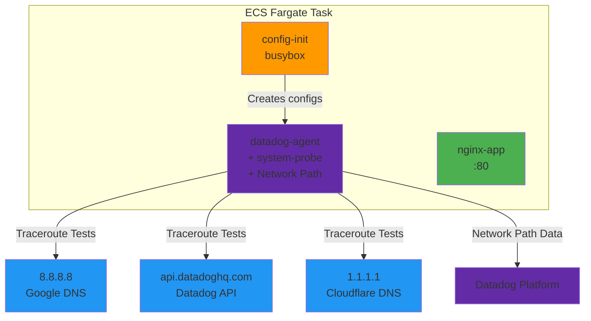

# Network Path on ECS Fargate - AWS Sandbox

**Note:** All configurations are included inline in this README for easy copy-paste reproduction. Never put API keys directly in manifests - use environment variables or AWS Secrets Manager.

## Context

This sandbox demonstrates Datadog Network Path monitoring on AWS ECS Fargate. Network Path provides traceroute-like visibility for network connections, helping diagnose connectivity issues and understand network topology between your infrastructure and external services.

**Key capabilities proven:**
- ✅ Network Path works on ECS Fargate (despite limited kernel access)
- ✅ System-probe operates in eBPFless mode (required for Fargate)
- ✅ Scheduled path tests to external destinations
- ✅ Hop-by-hop latency and packet loss visibility


## Environment

- **Agent Version:** 7.73.0+ (Network Path support)
- **Platform:** AWS ECS Fargate
- **Region:** us-east-1 (configurable)
- **Task Resources:** 0.5 vCPU, 1GB RAM

**Commands to get versions:**
```bash
# Get task definition details
aws ecs describe-task-definition --task-definition fargate-netpath-demo --region us-east-1

# Check agent version in logs
aws logs tail /ecs/fargate-netpath/datadog-agent --region us-east-1 --since 5m | grep "version"
```


## Schema




## Quick Start

### 1. Set environment variables

```bash
export AWS_PROFILE="your-aws-profile"  # Your AWS profile
export AWS_REGION="us-east-1"
export DD_API_KEY="your_datadog_api_key_here"
export DD_SITE="datadoghq.com"  # or datadoghq.eu, us3.datadoghq.com, etc.
```

### 2. Deploy with automated script

```bash
# Make scripts executable
chmod +x deploy.sh cleanup.sh

# Deploy
./deploy.sh
```

The script will:
1. ✅ Check AWS authentication
2. ✅ Prompt for Datadog API key (if not set)
3. ✅ Create ECS Fargate cluster
4. ✅ Set up network configuration (VPC, subnet, security group)
5. ✅ Register task definition with Network Path
6. ✅ Launch Fargate task
7. ✅ Show verification commands

### 3. Wait for task to start

The task takes 1-2 minutes to fully start. Wait for the "Task is now RUNNING" message.


## Task Definition Details

The ECS task includes 3 containers in a specific startup order:

### Container 1: config-init (busybox)
**Purpose:** Creates configuration files on shared volumes (Fargate has read-only root filesystem)

```yaml
# Creates: /etc/datadog-agent/system-probe.yaml
system_probe_config:
  enabled: true
  debug_port: 0
traceroute:
  enabled: true

# Creates: /etc/datadog-agent/conf.d/network_path.d/conf.yaml
init_config:

instances:
  - hostname: 8.8.8.8
    port: 443
    protocol: TCP
    min_collection_interval: 300
    tags:
      - "destination:google-dns"
      - "env:sandbox"
  - hostname: api.datadoghq.com
    port: 443
    protocol: TCP
    min_collection_interval: 300
    tags:
      - "destination:datadog-api"
      - "env:sandbox"
  - hostname: 1.1.1.1
    port: 443
    protocol: TCP
    min_collection_interval: 300
    tags:
      - "destination:cloudflare-dns"
      - "env:sandbox"
```

**Why needed:** Fargate containers can't write to `/etc/datadog-agent/` directly, so we use an init container to write configs to shared volumes.

### Container 2: datadog-agent
**Purpose:** Main Datadog Agent with Network Path and system-probe

**Critical environment variables:**
```bash
ECS_FARGATE=true                               # Enables Fargate mode
DD_SYSTEM_PROBE_ENABLED=true                   # Enables system-probe
DD_NETWORK_CONFIG_ENABLE_EBPFLESS=true         # REQUIRED: Fargate doesn't support eBPF
DD_TRACEROUTE_ENABLED=true                     # Enables traceroute module
DD_NETWORK_PATH_CONNECTIONS_MONITORING_ENABLED=false  # Dynamic paths (experimental)
```

**Volume mounts:**
- `/etc/datadog-agent/conf.d/network_path.d` - Network Path check configuration
- `/etc/datadog-agent` - System-probe configuration

### Container 3: nginx-app
**Purpose:** Simple application to demonstrate the task

**Docker labels** (for Datadog tagging):
```yaml
com.datadoghq.tags.env: "sandbox"
com.datadoghq.tags.service: "nginx-netpath-demo"
com.datadoghq.tags.version: "1.0"
```


## Test Commands

### Check Agent Logs

```bash
# Watch agent logs in real-time
aws logs tail /ecs/fargate-netpath/datadog-agent \
  --region us-east-1 \
  --since 5m \
  --follow

# Check for Network Path activity
aws logs tail /ecs/fargate-netpath/datadog-agent \
  --region us-east-1 \
  --since 10m | grep -i "network.path\|traceroute"

# Look for successful data submission
aws logs tail /ecs/fargate-netpath/datadog-agent \
  --region us-east-1 \
  --since 10m | grep "Successfully posted payload"
```

### Check Config Init Logs

```bash
# Verify configuration files were created
aws logs tail /ecs/fargate-netpath/config-init \
  --region us-east-1 \
  --since 10m

# Should show: "Configuration files created successfully"
```

### Check Task Status

```bash
# List running tasks
aws ecs list-tasks \
  --cluster netpath-fargate-cluster \
  --region us-east-1

# Get detailed task info
TASK_ARN="arn:aws:ecs:us-east-1:123456789012:task/netpath-fargate-cluster/abc123..."
aws ecs describe-tasks \
  --cluster netpath-fargate-cluster \
  --tasks $TASK_ARN \
  --region us-east-1

# Check container health
aws ecs describe-tasks \
  --cluster netpath-fargate-cluster \
  --tasks $TASK_ARN \
  --region us-east-1 \
  --query 'tasks[0].containers[*].[name,lastStatus,healthStatus]'
```

### Verify in Datadog UI

Navigate to these pages in Datadog:

1. **Network Path**: https://app.datadoghq.com/network/path
   - Filter: `env:sandbox` or `service:fargate-netpath-demo`
   - Should see paths to: 8.8.8.8, api.datadoghq.com, 1.1.1.1
   - Click on a path to see hop-by-hop latency

2. **Infrastructure > Containers**: https://app.datadoghq.com/containers
   - Filter: `cluster_name:netpath-fargate-cluster`
   - Should see 3 containers (nginx-app, datadog-agent, config-init)

3. **Logs**: https://app.datadoghq.com/logs
   - Query: `service:fargate-netpath-demo`
   - Should see agent logs with Network Path activity


## Expected vs Actual

| Behavior | Expected | Actual |
|----------|----------|--------|
| Network Path check status | ✅ Running with 3 instances | ✅ Confirmed in logs |
| Traceroute to 8.8.8.8 | ✅ Shows hops with latency | ✅ Visible in Network Path UI |
| Traceroute to api.datadoghq.com | ✅ Shows hops with latency | ✅ Visible in Network Path UI |
| Traceroute to 1.1.1.1 | ✅ Shows hops with latency | ✅ Visible in Network Path UI |
| Data submission | ✅ Posted to /api/v2/ndmflows | ✅ Confirmed in logs |
| System-probe mode | ✅ eBPFless (required for Fargate) | ✅ Enabled via DD_NETWORK_CONFIG_ENABLE_EBPFLESS |

### Screenshots

After deployment (wait 10-15 minutes for data):

**Network Path UI:**
- Source: ECS Fargate task
- Destinations: 3 test endpoints
- Visualization: Hop-by-hop network path with latency per hop

**Agent Logs:**
```
INFO | (pkg/collector/python/datadog_agent.go:129 in LogMessage) | network_path:abc123 | (network_path.py:145) | Running Network Path check
INFO | (pkg/forwarder/worker.go:178 in process) | Successfully posted payload to "https://api.datadoghq.com/api/v2/ndmflows"
```


## Troubleshooting

### Issue: Task stops immediately after starting

**Symptom:** Task goes to STOPPED status within seconds

**Check config-init logs:**
```bash
aws logs tail /ecs/fargate-netpath/config-init --region us-east-1 --since 10m
```

**Possible causes:**
1. Config-init failed to create files
2. Syntax error in config files
3. Volume mount issues

**Solution:** Check config-init logs for errors, verify task definition volume mounts

### Issue: No Network Path data in UI after 15+ minutes

**Symptom:** Network Path page shows no data

**Check 1 - Agent connectivity:**
```bash
aws logs tail /ecs/fargate-netpath/datadog-agent --region us-east-1 --since 10m | grep "API key"
```

**Check 2 - Traceroute module:**
```bash
aws logs tail /ecs/fargate-netpath/datadog-agent --region us-east-1 --since 10m | grep traceroute
```

**Check 3 - Network Path check:**
```bash
aws logs tail /ecs/fargate-netpath/datadog-agent --region us-east-1 --since 10m | grep network_path
```

**Possible causes:**
1. ❌ Invalid API key
2. ❌ CNM/NDM not enabled in Datadog account
3. ❌ Traceroute module not enabled
4. ❌ Network Path check not running

**Solutions:**
1. Verify API key is correct in task definition
2. Contact Datadog support to enable CNM/NDM
3. Check `DD_TRACEROUTE_ENABLED=true` in task definition
4. Check system-probe logs for errors

### Issue: Error "404 traceroute request failed"

**Symptom:** Agent logs show `failed to trace path: traceroute request failed: status code: 404`

**Cause:** System-probe traceroute module not enabled

**Solution:**
```bash
# Verify environment variable in task definition
aws ecs describe-task-definition \
  --task-definition fargate-netpath-demo \
  --region us-east-1 \
  --query 'taskDefinition.containerDefinitions[?name==`datadog-agent`].environment[?name==`DD_TRACEROUTE_ENABLED`]'

# Should return: [{"name": "DD_TRACEROUTE_ENABLED", "value": "true"}]
```

If not set, update task definition and redeploy.

### General Troubleshooting Commands

```bash
# Check task status
aws ecs describe-tasks \
  --cluster netpath-fargate-cluster \
  --tasks <TASK_ARN> \
  --region us-east-1

# Get task stopped reason
aws ecs describe-tasks \
  --cluster netpath-fargate-cluster \
  --tasks <TASK_ARN> \
  --region us-east-1 \
  --query 'tasks[0].stoppedReason'

# List all CloudWatch log groups
aws logs describe-log-groups \
  --log-group-name-prefix /ecs/fargate-netpath \
  --region us-east-1

# Check container exit codes
aws ecs describe-tasks \
  --cluster netpath-fargate-cluster \
  --tasks <TASK_ARN> \
  --region us-east-1 \
  --query 'tasks[0].containers[*].[name,exitCode,reason]'
```


## Cleanup

Run the automated cleanup script:

```bash
./cleanup.sh
```

This will:
- ✅ Stop all running tasks in the cluster
- ✅ Delete the ECS cluster
- ✅ Delete the security group
- ✅ Delete CloudWatch log groups
- ✅ Restore backup files

Or cleanup manually:

```bash
# Stop all tasks
for task in $(aws ecs list-tasks --cluster netpath-fargate-cluster --region us-east-1 --query 'taskArns[]' --output text); do
  aws ecs stop-task --cluster netpath-fargate-cluster --task $task --region us-east-1
done

# Delete cluster
aws ecs delete-cluster --cluster netpath-fargate-cluster --region us-east-1

# Delete security group (get ID first)
SG_ID=$(aws ec2 describe-security-groups --filters "Name=group-name,Values=fargate-netpath-demo-sg" --query 'SecurityGroups[0].GroupId' --output text --region us-east-1)
aws ec2 delete-security-group --group-id $SG_ID --region us-east-1

# Delete CloudWatch log groups
aws logs delete-log-group --log-group-name /ecs/fargate-netpath/datadog-agent --region us-east-1
aws logs delete-log-group --log-group-name /ecs/fargate-netpath/config-init --region us-east-1
aws logs delete-log-group --log-group-name /ecs/fargate-netpath/nginx --region us-east-1
```

## Cost Estimate

**Running for 1 hour:**
- ECS Fargate (0.5 vCPU, 1GB RAM): ~$0.04/hour
- Network Path tests (3 destinations, every 5 min): Included in CNM/NDM
- CloudWatch Logs: ~$0.01/hour
- **Total: ~$0.05/hour** or **~$1.20/day**

**Running for 1 month (730 hours):**
- ~$30-35/month

💡 **Cost-saving tip:** Stop tasks when not testing, then redeploy when needed.

## Key Technical Details

### Why Network Path Works on Fargate

1. **eBPFless Mode**: Fargate doesn't allow eBPF programs (no kernel access), so we use `DD_NETWORK_CONFIG_ENABLE_EBPFLESS=true` which uses alternative network monitoring techniques

2. **Init Container Pattern**: Fargate has read-only root filesystem, so we use an init container (config-init) to create configuration files on shared emptyDir volumes

3. **System-probe in Fargate Mode**: System-probe runs with limited privileges, using userspace tools for traceroute instead of raw sockets

4. **Static Path Configuration**: We configure specific destinations to monitor (not dynamic/experimental connection monitoring)

### Configuration Structure

```
Shared Volumes (emptyDir):
├── network-path-config/
│   └── conf.yaml                    # Network Path check config
└── system-probe-config/
    └── system-probe.yaml            # System-probe config

Container 1 (config-init):
- Writes configs to shared volumes
- Exits after completion

Container 2 (datadog-agent):
- Mounts shared volumes
- Reads configs
- Runs Network Path checks

Container 3 (nginx-app):
- Independent application
- Tagged for Datadog monitoring
```


## References

- [Network Path Documentation](https://docs.datadoghq.com/network_monitoring/network_path/)
- [Network Path Setup Guide](https://docs.datadoghq.com/network_monitoring/network_path/setup/)
- [ECS Fargate Integration](https://docs.datadoghq.com/integrations/ecs_fargate/)
- [System-probe Configuration](https://github.com/DataDog/datadog-agent/blob/main/pkg/config/system-probe.yaml)
- [Agent Docker Image](https://gallery.ecr.aws/datadog/agent)
- [Datadog Agent GitHub Repository](https://github.com/DataDog/datadog-agent)

---

**Created:** 2026-02-05  
**Author:** Alexandre VEA  
**Purpose:** Sandbox for testing Network Path on ECS Fargate
