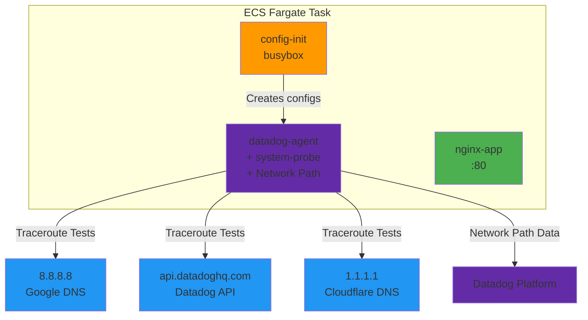

# Network Path on ECS Fargate - AWS Sandbox

**Note:** All configurations are included inline in this README for easy copy-paste reproduction. Never put API keys directly in manifests - use environment variables or AWS Secrets Manager.

## Context

This sandbox demonstrates Datadog Network Path monitoring on AWS ECS Fargate. Network Path provides traceroute-like visibility for network connections, helping diagnose connectivity issues and understand network topology between your infrastructure and external services.

**Key capabilities proven:**
- ✅ Network Path works on ECS Fargate (despite limited kernel access)
- ✅ System-probe operates in eBPFless mode (required for Fargate)
- ✅ Scheduled path tests to external destinations
- ✅ Hop-by-hop latency and packet loss visibility

## Environment

- **Agent Version:** 7.73.0+ (Network Path support)
- **Platform:** AWS ECS Fargate
- **Region:** us-east-1 (configurable)
- **Task Resources:** 0.5 vCPU, 1GB RAM

**Commands to get versions:**
```bash
# Get task definition details
aws ecs describe-task-definition --task-definition fargate-netpath-demo --region us-east-1

# Check agent version in logs
aws logs tail /ecs/fargate-netpath/datadog-agent --region us-east-1 --since 5m | grep "version"
```

## Schema



## Quick Start

### 1. Set environment variables

```bash
export AWS_PROFILE="your-aws-profile"  # Your AWS profile
export AWS_REGION="us-east-1"
export DD_API_KEY="your_datadog_api_key_here"
export DD_SITE="datadoghq.com"  # or datadoghq.eu, us3.datadoghq.com, etc.
```

### 2. Create task definition

Save the following to `task-definition.json`:

```bash
cat > task-definition.json <<'EOF'
{
  "family": "fargate-netpath-demo",
  "networkMode": "awsvpc",
  "requiresCompatibilities": ["FARGATE"],
  "cpu": "512",
  "memory": "1024",
  "executionRoleArn": "arn:aws:iam::YOUR_ACCOUNT_ID:role/ecsTaskExecutionRole",
  "containerDefinitions": [
    {
      "name": "nginx-app",
      "image": "nginx:alpine",
      "essential": true,
      "cpu": 128,
      "memory": 256,
      "portMappings": [
        {
          "containerPort": 80,
          "protocol": "tcp"
        }
      ],
      "logConfiguration": {
        "logDriver": "awslogs",
        "options": {
          "awslogs-group": "/ecs/fargate-netpath/nginx",
          "awslogs-region": "us-east-1",
          "awslogs-stream-prefix": "nginx",
          "awslogs-create-group": "true"
        }
      },
      "dockerLabels": {
        "com.datadoghq.tags.env": "sandbox",
        "com.datadoghq.tags.service": "nginx-netpath-demo",
        "com.datadoghq.tags.version": "1.0"
      }
    },
    {
      "name": "datadog-agent",
      "image": "public.ecr.aws/datadog/agent:latest",
      "essential": true,
      "cpu": 256,
      "memory": 512,
      "environment": [
        {"name": "DD_API_KEY", "value": "YOUR_DD_API_KEY"},
        {"name": "DD_SITE", "value": "datadoghq.com"},
        {"name": "ECS_FARGATE", "value": "true"},
        {"name": "DD_ENV", "value": "sandbox"},
        {"name": "DD_SERVICE", "value": "fargate-netpath-demo"},
        {"name": "DD_TAGS", "value": "env:sandbox project:network-path-poc"},
        {"name": "DD_SYSTEM_PROBE_ENABLED", "value": "true"},
        {"name": "DD_SYSTEM_PROBE_NETWORK_ENABLED", "value": "true"},
        {"name": "DD_NETWORK_CONFIG_ENABLE_EBPFLESS", "value": "true"},
        {"name": "DD_TRACEROUTE_ENABLED", "value": "true"},
        {"name": "DD_NETWORK_PATH_CONNECTIONS_MONITORING_ENABLED", "value": "false"},
        {"name": "DD_SYSTEM_PROBE_CONFIG", "value": "/etc/datadog-agent-system-probe/system-probe.yaml"},
        {"name": "DD_LOG_LEVEL", "value": "info"}
      ],
      "logConfiguration": {
        "logDriver": "awslogs",
        "options": {
          "awslogs-group": "/ecs/fargate-netpath/datadog-agent",
          "awslogs-region": "us-east-1",
          "awslogs-stream-prefix": "datadog-agent",
          "awslogs-create-group": "true"
        }
      },
      "mountPoints": [
        {"sourceVolume": "system-probe-config", "containerPath": "/etc/datadog-agent-system-probe", "readOnly": false},
        {"sourceVolume": "network-path-config", "containerPath": "/etc/datadog-agent/conf.d/network_path.d", "readOnly": false}
      ]
    },
    {
      "name": "config-init",
      "image": "busybox:latest",
      "essential": false,
      "command": [
        "sh", "-c",
        "mkdir -p /system-probe-config && printf 'system_probe_config:\\n  enabled: true\\n  debug_port: 0\\ntraceroute:\\n  enabled: true\\n' > /system-probe-config/system-probe.yaml && mkdir -p /network-path-config && printf 'init_config:\\n\\ninstances:\\n  - hostname: 8.8.8.8\\n    port: 443\\n    protocol: TCP\\n    min_collection_interval: 300\\n    tags:\\n      - destination:google-dns\\n      - test:connectivity\\n  - hostname: api.datadoghq.com\\n    port: 443\\n    protocol: TCP\\n    min_collection_interval: 300\\n    tags:\\n      - destination:datadog-intake\\n      - test:monitoring\\n  - hostname: 1.1.1.1\\n    port: 443\\n    protocol: TCP\\n    min_collection_interval: 300\\n    tags:\\n      - destination:cloudflare-dns\\n      - test:connectivity\\n' > /network-path-config/conf.yaml && echo 'Configuration files created successfully' && cat /system-probe-config/system-probe.yaml && cat /network-path-config/conf.yaml"
      ],
      "mountPoints": [
        {"sourceVolume": "network-path-config", "containerPath": "/network-path-config", "readOnly": false},
        {"sourceVolume": "system-probe-config", "containerPath": "/system-probe-config", "readOnly": false}
      ],
      "logConfiguration": {
        "logDriver": "awslogs",
        "options": {
          "awslogs-group": "/ecs/fargate-netpath/config-init",
          "awslogs-region": "us-east-1",
          "awslogs-stream-prefix": "config-init",
          "awslogs-create-group": "true"
        }
      }
    }
  ],
  "volumes": [
    {"name": "network-path-config"},
    {"name": "system-probe-config"}
  ]
}
EOF
```

Replace placeholders:
```bash
ACCOUNT_ID=$(aws sts get-caller-identity --query Account --output text)
sed -i "s/YOUR_ACCOUNT_ID/$ACCOUNT_ID/g" task-definition.json
sed -i "s/YOUR_DD_API_KEY/$DD_API_KEY/g" task-definition.json
```

### 3. Deploy infrastructure

```bash
# Create ECS cluster
aws ecs create-cluster \
  --cluster-name netpath-fargate-cluster \
  --region $AWS_REGION \
  --capacity-providers FARGATE

# Get network config
VPC_ID=$(aws ec2 describe-vpcs --filters "Name=isDefault,Values=true" --region $AWS_REGION --query 'Vpcs[0].VpcId' --output text)
SUBNET_ID=$(aws ec2 describe-subnets --filters "Name=vpc-id,Values=$VPC_ID" --region $AWS_REGION --query 'Subnets[0].SubnetId' --output text)

# Create security group
SG_ID=$(aws ec2 create-security-group \
  --group-name fargate-netpath-demo-sg \
  --description "Security group for Fargate Network Path demo" \
  --vpc-id $VPC_ID \
  --region $AWS_REGION \
  --query 'GroupId' \
  --output text)

aws ec2 authorize-security-group-egress \
  --group-id $SG_ID \
  --protocol all \
  --cidr 0.0.0.0/0 \
  --region $AWS_REGION

# Register task definition
aws ecs register-task-definition \
  --cli-input-json file://task-definition.json \
  --region $AWS_REGION

# Run task
aws ecs run-task \
  --cluster netpath-fargate-cluster \
  --task-definition fargate-netpath-demo \
  --launch-type FARGATE \
  --network-configuration "awsvpcConfiguration={subnets=[$SUBNET_ID],securityGroups=[$SG_ID],assignPublicIp=ENABLED}" \
  --region $AWS_REGION
```

### 4. Wait for task to be running

```bash
# Get task ARN
TASK_ARN=$(aws ecs list-tasks \
  --cluster netpath-fargate-cluster \
  --region $AWS_REGION \
  --query 'taskArns[0]' \
  --output text)

# Wait for running status
aws ecs wait tasks-running \
  --cluster netpath-fargate-cluster \
  --tasks $TASK_ARN \
  --region $AWS_REGION

echo "✅ Task is running!"
```

## Test Commands

### Check Agent Logs

```bash
# Watch agent logs in real-time
aws logs tail /ecs/fargate-netpath/datadog-agent \
  --region us-east-1 \
  --since 5m \
  --follow

# Check for Network Path activity
aws logs tail /ecs/fargate-netpath/datadog-agent \
  --region us-east-1 \
  --since 10m | grep -i "network.path\|traceroute"

# Look for successful data submission
aws logs tail /ecs/fargate-netpath/datadog-agent \
  --region us-east-1 \
  --since 10m | grep "Successfully posted payload"
```

### Check Config Init Logs

```bash
# Verify configuration files were created
aws logs tail /ecs/fargate-netpath/config-init \
  --region us-east-1 \
  --since 10m

# Should show: "Configuration files created successfully"
```

### Check Task Status

```bash
# List running tasks
aws ecs list-tasks \
  --cluster netpath-fargate-cluster \
  --region us-east-1

# Get detailed task info
aws ecs describe-tasks \
  --cluster netpath-fargate-cluster \
  --tasks $TASK_ARN \
  --region us-east-1

# Check container health
aws ecs describe-tasks \
  --cluster netpath-fargate-cluster \
  --tasks $TASK_ARN \
  --region us-east-1 \
  --query 'tasks[0].containers[*].[name,lastStatus,healthStatus]'
```

### Verify in Datadog UI

Navigate to these pages in Datadog:

1. **Network Path**: https://app.datadoghq.com/network/path
   - Filter: `env:sandbox` or `service:fargate-netpath-demo`
   - Should see paths to: 8.8.8.8, api.datadoghq.com, 1.1.1.1
   - Click on a path to see hop-by-hop latency

2. **Infrastructure > Containers**: https://app.datadoghq.com/containers
   - Filter: `cluster_name:netpath-fargate-cluster`
   - Should see 3 containers (nginx-app, datadog-agent, config-init)

3. **Logs**: https://app.datadoghq.com/logs
   - Query: `service:fargate-netpath-demo`
   - Should see agent logs with Network Path activity

## Expected vs Actual

| Behavior | Expected | Actual |
|----------|----------|--------|
| Network Path check status | ✅ Running with 3 instances | ✅ Confirmed in logs |
| Traceroute to 8.8.8.8 | ✅ Shows hops with latency | ✅ Visible in Network Path UI |
| Traceroute to api.datadoghq.com | ✅ Shows hops with latency | ✅ Visible in Network Path UI |
| Traceroute to 1.1.1.1 | ✅ Shows hops with latency | ✅ Visible in Network Path UI |
| Data submission | ✅ Posted to /api/v2/ndmflows | ✅ Confirmed in logs |
| System-probe mode | ✅ eBPFless (required for Fargate) | ✅ Enabled via DD_NETWORK_CONFIG_ENABLE_EBPFLESS |

### Screenshots

After deployment (wait 10-15 minutes for data):

**Network Path UI:**
- Source: ECS Fargate task
- Destinations: 3 test endpoints
- Visualization: Hop-by-hop network path with latency per hop

**Agent Logs:**
```
INFO | (pkg/collector/python/datadog_agent.go:129 in LogMessage) | network_path:abc123 | (network_path.py:145) | Running Network Path check
INFO | (pkg/forwarder/worker.go:178 in process) | Successfully posted payload to "https://api.datadoghq.com/api/v2/ndmflows"
```

## Troubleshooting

### Issue: Task stops immediately after starting

**Symptom:** Task goes to STOPPED status within seconds

**Check config-init logs:**
```bash
aws logs tail /ecs/fargate-netpath/config-init --region us-east-1 --since 10m
```

**Possible causes:**
1. Config-init failed to create files
2. Syntax error in config files
3. Volume mount issues

**Solution:** Check config-init logs for errors, verify task definition volume mounts

### Issue: No Network Path data in UI after 15+ minutes

**Symptom:** Network Path page shows no data

**Check 1 - Agent connectivity:**
```bash
aws logs tail /ecs/fargate-netpath/datadog-agent --region us-east-1 --since 10m | grep "API key"
```

**Check 2 - Traceroute module:**
```bash
aws logs tail /ecs/fargate-netpath/datadog-agent --region us-east-1 --since 10m | grep traceroute
```

**Check 3 - Network Path check:**
```bash
aws logs tail /ecs/fargate-netpath/datadog-agent --region us-east-1 --since 10m | grep network_path
```

**Possible causes:**
1. ❌ Invalid API key
2. ❌ CNM/NDM not enabled in Datadog account
3. ❌ Traceroute module not enabled
4. ❌ Network Path check not running

**Solutions:**
1. Verify API key is correct in task definition
2. Contact Datadog support to enable CNM/NDM
3. Check `DD_TRACEROUTE_ENABLED=true` in task definition
4. Check system-probe logs for errors

### General Troubleshooting Commands

```bash
# Check task status
aws ecs describe-tasks \
  --cluster netpath-fargate-cluster \
  --tasks $TASK_ARN \
  --region us-east-1

# Get task stopped reason
aws ecs describe-tasks \
  --cluster netpath-fargate-cluster \
  --tasks $TASK_ARN \
  --region us-east-1 \
  --query 'tasks[0].stoppedReason'

# List all CloudWatch log groups
aws logs describe-log-groups \
  --log-group-name-prefix /ecs/fargate-netpath \
  --region us-east-1

# Check container exit codes
aws ecs describe-tasks \
  --cluster netpath-fargate-cluster \
  --tasks $TASK_ARN \
  --region us-east-1 \
  --query 'tasks[0].containers[*].[name,exitCode,reason]'
```

## Cleanup

```bash
# Stop all tasks
for task in $(aws ecs list-tasks --cluster netpath-fargate-cluster --region us-east-1 --query 'taskArns[]' --output text); do
  aws ecs stop-task --cluster netpath-fargate-cluster --task $task --region us-east-1
done

# Delete cluster
aws ecs delete-cluster --cluster netpath-fargate-cluster --region us-east-1

# Delete security group
aws ec2 delete-security-group --group-id $SG_ID --region us-east-1

# Delete CloudWatch log groups
aws logs delete-log-group --log-group-name /ecs/fargate-netpath/datadog-agent --region us-east-1
aws logs delete-log-group --log-group-name /ecs/fargate-netpath/config-init --region us-east-1
aws logs delete-log-group --log-group-name /ecs/fargate-netpath/nginx --region us-east-1
```

## Key Technical Details

### Why Network Path Works on Fargate

1. **eBPFless Mode**: Fargate doesn't allow eBPF programs (no kernel access), so we use `DD_NETWORK_CONFIG_ENABLE_EBPFLESS=true` which uses alternative network monitoring techniques

2. **Init Container Pattern**: Fargate has read-only root filesystem, so we use an init container (config-init) to create configuration files on shared emptyDir volumes

3. **System-probe in Fargate Mode**: System-probe runs with limited privileges, using userspace tools for traceroute instead of raw sockets

4. **Static Path Configuration**: We configure specific destinations to monitor (not dynamic/experimental connection monitoring)

### Configuration Files Created by Init Container

**system-probe.yaml:**
```yaml
system_probe_config:
  enabled: true
  debug_port: 0
traceroute:
  enabled: true
```

**network_path.d/conf.yaml:**
```yaml
init_config:

instances:
  - hostname: 8.8.8.8
    port: 443
    protocol: TCP
    min_collection_interval: 300
    tags:
      - "destination:google-dns"
      - "env:sandbox"
  - hostname: api.datadoghq.com
    port: 443
    protocol: TCP
    min_collection_interval: 300
    tags:
      - "destination:datadog-api"
      - "env:sandbox"
  - hostname: 1.1.1.1
    port: 443
    protocol: TCP
    min_collection_interval: 300
    tags:
      - "destination:cloudflare-dns"
      - "env:sandbox"
```

## Cost Estimate

**Running for 1 hour:**
- ECS Fargate (0.5 vCPU, 1GB RAM): ~$0.04/hour
- Network Path tests (3 destinations, every 5 min): Included in CNM/NDM
- CloudWatch Logs: ~$0.01/hour
- **Total: ~$0.05/hour** or **~$1.20/day**

**Running for 1 month (730 hours):**
- ~$30-35/month

💡 **Cost-saving tip:** Stop tasks when not testing, then redeploy when needed.

## References

- [Network Path Documentation](https://docs.datadoghq.com/network_monitoring/network_path/)
- [Network Path Setup Guide](https://docs.datadoghq.com/network_monitoring/network_path/setup/)
- [ECS Fargate Integration](https://docs.datadoghq.com/integrations/ecs_fargate/)
- [System-probe Configuration](https://github.com/DataDog/datadog-agent/blob/main/pkg/config/system-probe.yaml)
- [Agent Docker Image](https://gallery.ecr.aws/datadog/agent)

---

**Created:** 2026-02-05  
**Author:** Alexandre VEA  
**Purpose:** Sandbox for testing Network Path on ECS Fargate
