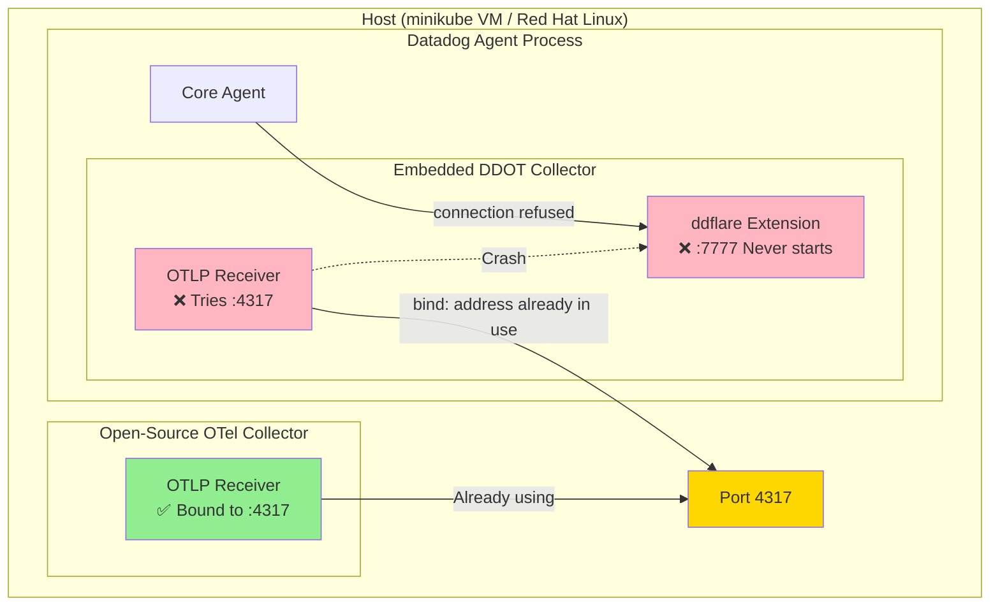

# OTel Collector Port 4317 Conflict - DDOT vs Open-Source OTel Collector

## Context

This sandbox reproduces an issue where the **Datadog OpenTelemetry Collector (DDOT)** fails to start because port **4317** is already in use by another **open-source OpenTelemetry Collector** running on the same host.

When the DDOT Collector fails to bind to port 4317:
1. The DDOT Collector crashes with `address already in use`
2. The `ddflare` extension (port 7777) never starts
3. The Core Agent cannot fetch OTel configuration → `connection refused` on port 7777

This scenario is common when migrating from an open-source OTel Collector to Datadog's embedded OTel Collector.

## Environment

* **Agent Version:** 7.75.0
* **DDOT Package:** datadog-agent-ddot 1:7.75.0-1
* **Platform:** minikube (simulating bare-metal Linux host)
* **Open-Source OTel Collector:** otelcol-contrib 0.96.0

## Schema



### Flow of Events

1. **Open-Source OTel Collector** starts first → binds to port **4317** ✅
2. **Datadog Agent** starts → spawns **embedded DDOT Collector**
3. **DDOT Collector** tries to bind to port **4317** → ❌ `address already in use`
4. **DDOT Collector crashes** → `ddflare` extension on port **7777** never starts
5. **Core Agent** tries to fetch OTel config from **:7777** → ❌ `connection refused`

## Quick Start

### 1. Start minikube

```bash
minikube delete --all
minikube start --memory=4096 --cpus=2
```

### 2. Create Datadog Secret

```bash
kubectl create secret generic datadog-secret --from-literal=api-key=<YOUR_API_KEY>
```

### 3. SSH into minikube and deploy open-source OTel Collector

```bash
# Download and configure open-source OTel Collector
minikube ssh << 'EOF'
# Download otelcol-contrib
curl -LO https://github.com/open-telemetry/opentelemetry-collector-releases/releases/download/v0.96.0/otelcol-contrib_0.96.0_linux_arm64.tar.gz
tar -xzf otelcol-contrib_0.96.0_linux_arm64.tar.gz

# Create config (using port 9999 for metrics to isolate 4317 conflict)
cat > otel-config.yaml << 'CONFIG'
receivers:
  otlp:
    protocols:
      grpc:
        endpoint: 0.0.0.0:4317
      http:
        endpoint: 0.0.0.0:4318

exporters:
  debug:
    verbosity: detailed

service:
  telemetry:
    metrics:
      address: 0.0.0.0:9999
  pipelines:
    traces:
      receivers: [otlp]
      exporters: [debug]
CONFIG

# Start open-source OTel Collector
nohup ./otelcol-contrib --config otel-config.yaml > otel.log 2>&1 &
sleep 3

# Verify it's running on port 4317
ss -tlnp | grep 4317
EOF
```

### 4. Install DDOT Collector (will fail due to port conflict)

```bash
# Get API key from secret
DD_API_KEY=$(kubectl get secret datadog-secret -o jsonpath='{.data.api-key}' | base64 -d)

# Install Datadog Agent with DDOT Collector enabled
minikube ssh "curl -L https://install.datadoghq.com/scripts/install_script_agent7.sh -o /tmp/install.sh && chmod +x /tmp/install.sh"

minikube ssh "sudo DD_API_KEY='$DD_API_KEY' DD_SITE='datadoghq.com' DD_OTELCOLLECTOR_ENABLED=true bash /tmp/install.sh"
```

### 5. Add hostname to config (required for minikube)

```bash
minikube ssh 'sudo bash -c "echo \"hostname: minikube\" >> /etc/datadog-agent/datadog.yaml"'
minikube ssh 'sudo systemctl restart datadog-agent'
```

## Test Commands

### Verify port 4317 is occupied by open-source OTel Collector

```bash
minikube ssh 'ss -tlnp | grep 4317'
# Expected: LISTEN ... users:(("otelcol-contrib",...))
```

### Check DDOT Collector logs for port conflict

```bash
minikube ssh 'sudo cat /var/log/datadog/otel-agent.log | grep -i "4317\|address already"'
```

### Check Core Agent logs for 7777 connection refused

```bash
minikube ssh 'sudo grep -i "7777" /var/log/datadog/agent.log'
```

### Check Agent status

```bash
minikube ssh 'sudo datadog-agent status 2>&1 | grep -A 5 "OTel Agent"'
```

## Expected vs Actual

| Behavior | Expected | Actual |
|----------|----------|--------|
| DDOT binds to :4317 | ✅ Success | ❌ `address already in use` |
| ddflare extension on :7777 | ✅ Running | ❌ Never starts |
| Core Agent fetches OTel config | ✅ Success | ❌ `connection refused` |

### Error Messages

**otel-agent.log:**
```
ERROR | listen tcp 0.0.0.0:4317: bind: address already in use
ERROR | Error running the collector pipeline: cannot start pipelines: failed to start "otlp" receiver: listen tcp 0.0.0.0:4317: bind: address already in use
```

**agent.log:**
```
ERROR | error fetching remote otel config: Get "https://localhost:7777": dial tcp [::1]:7777: connect: connection refused
ERROR | Unable to fetch fresh inventory metadata: error fetching remote otel config...
```

## Fix / Workaround

### Option 1: Stop the open-source OTel Collector

```bash
minikube ssh 'sudo pkill otelcol-contrib'
minikube ssh 'sudo systemctl restart datadog-agent'
```

### Option 2: Configure DDOT to use different ports

Add to `/etc/datadog-agent/otel-config.yaml`:

```yaml
receivers:
  otlp:
    protocols:
      grpc:
        endpoint: 0.0.0.0:43170  # Custom port
      http:
        endpoint: 0.0.0.0:43180  # Custom port
```

Or add to `/etc/datadog-agent/datadog.yaml`:

```yaml
otlp_config:
  receiver:
    protocols:
      grpc:
        endpoint: 0.0.0.0:43170
      http:
        endpoint: 0.0.0.0:43180
```

Then restart:

```bash
minikube ssh 'sudo systemctl restart datadog-agent'
```

## Troubleshooting

```bash
# Check all listening ports
minikube ssh 'ss -tlnp | grep -E "4317|4318|7777|8888"'

# View full otel-agent log
minikube ssh 'sudo cat /var/log/datadog/otel-agent.log'

# View full agent log
minikube ssh 'sudo cat /var/log/datadog/agent.log | tail -100'

# Check installed packages
minikube ssh 'dpkg -l | grep datadog'

# Check systemd services
minikube ssh 'sudo systemctl status datadog-agent datadog-agent-trace'

# Check otel-config.yaml
minikube ssh 'sudo cat /etc/datadog-agent/otel-config.yaml'
```

## Cleanup

```bash
# Stop services in minikube
minikube ssh 'sudo pkill otelcol-contrib; sudo systemctl stop datadog-agent datadog-agent-trace'

# Uninstall Datadog Agent
minikube ssh 'sudo apt-get remove -y datadog-agent datadog-agent-ddot'

# Delete minikube
minikube delete
```

## References

* [DDOT Collector Linux Installation](https://docs.datadoghq.com/opentelemetry/setup/ddot_collector/install/linux)
* [OTel Collector Contrib Releases](https://github.com/open-telemetry/opentelemetry-collector-releases/releases)
* [Datadog Agent Docker Tags](https://hub.docker.com/r/datadog/agent/tags)
