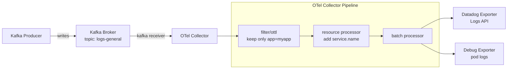

# OTel Collector - Kafka Receiver to Datadog Exporter

**Note:** All configurations are included inline in this README for easy copy-paste reproduction. Never put API keys directly in manifests - use Kubernetes secrets.

## Context

This sandbox demonstrates a working OpenTelemetry Collector setup that:
- Consumes log messages from a Kafka topic using the Kafka receiver
- Filters logs using OTTL (only keeps messages matching a specific application)
- Enriches logs with resource attributes
- Exports logs to Datadog using the Datadog exporter
- Includes the debug exporter for pipeline visibility

Useful for troubleshooting scenarios where logs from Kafka don't appear in Datadog Log Explorer.

## Environment

- **OTel Collector:** otel/opentelemetry-collector-contrib:0.131.1
- **Kafka:** apache/kafka:3.7.0 (KRaft mode, no Zookeeper)
- **Platform:** minikube

## Schema



## Quick Start

### 1. Start minikube

```bash
minikube delete --all
minikube start --memory=4096 --cpus=2
```

### 2. Deploy Kafka and OTel Collector

```bash
kubectl apply -f - <<'MANIFEST'
---
apiVersion: v1
kind: Namespace
metadata:
  name: monitoring
---
apiVersion: v1
kind: Service
metadata:
  name: kafka
  namespace: monitoring
spec:
  ports:
    - port: 9092
      name: broker
  selector:
    app: kafka
---
apiVersion: apps/v1
kind: Deployment
metadata:
  name: kafka
  namespace: monitoring
spec:
  replicas: 1
  selector:
    matchLabels:
      app: kafka
  template:
    metadata:
      labels:
        app: kafka
    spec:
      containers:
        - name: kafka
          image: apache/kafka:3.7.0
          ports:
            - containerPort: 9092
          env:
            - name: KAFKA_NODE_ID
              value: "1"
            - name: KAFKA_PROCESS_ROLES
              value: "broker,controller"
            - name: KAFKA_LISTENERS
              value: "PLAINTEXT://0.0.0.0:9092,CONTROLLER://0.0.0.0:9093"
            - name: KAFKA_ADVERTISED_LISTENERS
              value: "PLAINTEXT://kafka.monitoring.svc.cluster.local:9092"
            - name: KAFKA_CONTROLLER_LISTENER_NAMES
              value: "CONTROLLER"
            - name: KAFKA_LISTENER_SECURITY_PROTOCOL_MAP
              value: "CONTROLLER:PLAINTEXT,PLAINTEXT:PLAINTEXT"
            - name: KAFKA_CONTROLLER_QUORUM_VOTERS
              value: "1@localhost:9093"
            - name: KAFKA_OFFSETS_TOPIC_REPLICATION_FACTOR
              value: "1"
            - name: KAFKA_LOG_DIRS
              value: "/tmp/kraft-combined-logs"
            - name: CLUSTER_ID
              value: "MkU3OEVBNTcwNTJENDM2Qg"
          resources:
            requests:
              memory: "512Mi"
              cpu: "250m"
            limits:
              memory: "1Gi"
              cpu: "500m"
MANIFEST
```

### 3. Wait for Kafka

```bash
kubectl wait --for=condition=ready pod -l app=kafka -n monitoring --timeout=120s
```

### 4. Create the OTel Collector ConfigMap and Deployment

```bash
kubectl apply -f - <<'MANIFEST'
---
apiVersion: v1
kind: ConfigMap
metadata:
  name: otel-collector-conf
  namespace: monitoring
data:
  otel-collector-config.yaml: |
    receivers:
      kafka:
        brokers:
          - kafka.monitoring.svc.cluster.local:9092
        topic: logs-general
        encoding: text
        group_id: otel-collector-sandbox

    processors:
      batch:
        send_batch_max_size: 1000
        send_batch_size: 100
        timeout: 10s

      resource:
        attributes:
          - key: service.name
            value: myapp
            action: upsert

      filter/ottl:
        error_mode: ignore
        logs:
          log_record:
            - not IsMatch(body, "application\":\"myapp\"")

    exporters:
      datadog:
        api:
          site: datadoghq.com
          key: ${DD_API_KEY}
      debug:
        verbosity: detailed

    extensions:
      zpages:
      health_check:

    service:
      extensions: [zpages, health_check]
      pipelines:
        logs:
          receivers: [kafka]
          processors: [filter/ottl, resource, batch]
          exporters: [debug, datadog]
---
apiVersion: v1
kind: Secret
metadata:
  name: datadog-secret
  namespace: monitoring
type: Opaque
stringData:
  api-key: "REPLACE_WITH_YOUR_API_KEY"
---
apiVersion: apps/v1
kind: Deployment
metadata:
  name: otel-collector
  namespace: monitoring
spec:
  replicas: 1
  selector:
    matchLabels:
      app: opentelemetry
  template:
    metadata:
      labels:
        app: opentelemetry
    spec:
      containers:
        - name: otel-collector
          image: otel/opentelemetry-collector-contrib:0.131.1
          args:
            - --config=/conf/otel-collector-config.yaml
          ports:
            - containerPort: 55679
            - containerPort: 4317
            - containerPort: 4318
            - containerPort: 13133
          env:
            - name: DD_API_KEY
              valueFrom:
                secretKeyRef:
                  name: datadog-secret
                  key: api-key
          resources:
            requests:
              cpu: "500m"
              memory: "512Mi"
            limits:
              cpu: "1"
              memory: "2Gi"
          volumeMounts:
            - name: config
              mountPath: /conf
      volumes:
        - name: config
          configMap:
            name: otel-collector-conf
MANIFEST
```

### 5. Wait for OTel Collector

```bash
kubectl wait --for=condition=ready pod -l app=opentelemetry -n monitoring --timeout=120s
```

### 6. Produce Test Messages

```bash
kubectl apply -f - <<'MANIFEST'
apiVersion: batch/v1
kind: Job
metadata:
  name: kafka-producer
  namespace: monitoring
spec:
  backoffLimit: 3
  template:
    spec:
      restartPolicy: Never
      initContainers:
        - name: wait-for-kafka
          image: apache/kafka:3.7.0
          command:
            - sh
            - -c
            - |
              echo "Waiting for Kafka..."
              until /opt/kafka/bin/kafka-topics.sh --bootstrap-server kafka.monitoring.svc.cluster.local:9092 --list 2>/dev/null; do
                sleep 5
              done
      containers:
        - name: producer
          image: apache/kafka:3.7.0
          command:
            - sh
            - -c
            - |
              /opt/kafka/bin/kafka-topics.sh --bootstrap-server kafka.monitoring.svc.cluster.local:9092 \
                --create --topic logs-general --partitions 3 --replication-factor 1 --if-not-exists

              # 30 messages that MATCH the filter (application=myapp)
              for i in $(seq 1 30); do
                echo "{\"application\":\"myapp\",\"level\":\"info\",\"message\":\"request processed $i\",\"status\":200}" | \
                  /opt/kafka/bin/kafka-console-producer.sh --bootstrap-server kafka.monitoring.svc.cluster.local:9092 --topic logs-general
              done

              # 20 messages that DON'T match the filter (should be dropped)
              for i in $(seq 1 20); do
                echo "{\"application\":\"other-service\",\"level\":\"info\",\"message\":\"should be filtered $i\"}" | \
                  /opt/kafka/bin/kafka-console-producer.sh --bootstrap-server kafka.monitoring.svc.cluster.local:9092 --topic logs-general
              done

              echo "Done! Produced 30 matching + 20 filtered messages."
MANIFEST
```

Wait for completion:

```bash
kubectl wait --for=condition=complete job/kafka-producer -n monitoring --timeout=180s
```

## Test Commands

### Check OTel Collector logs (debug exporter output)

```bash
# Full logs - debug exporter prints each log record
kubectl logs -n monitoring -l app=opentelemetry --tail=100

# Check for errors
kubectl logs -n monitoring -l app=opentelemetry | grep -E "(error|warn|queue|rejected)"
```

When working, you should see output like this from the debug exporter:

```
info  Logs  {"otelcol.component.id": "debug", "resource logs": 11, "log records": 11}
ResourceLog #0
Resource attributes:
     -> service.name: Str(myapp)
LogRecord #0
ObservedTimestamp: 2026-02-12 13:12:40...
Body: Str({"application":"myapp","level":"info","message":"request processed 1","status":200})
```

### Verify in Datadog

Check Datadog Log Explorer or Live Tail:
- Filter: `service:myapp`
- You should see 30 log entries (the 20 "other-service" messages are filtered out)

### Describe pod

```bash
kubectl describe pod -n monitoring -l app=opentelemetry
```

### Check configmap

```bash
kubectl get configmap otel-collector-conf -n monitoring -o yaml
```

## Expected vs Actual

| Behavior | Expected | Actual |
|----------|----------|--------|
| Matching logs (application=myapp) | ✅ 30 logs in Datadog | ✅ 30 logs in Datadog |
| Filtered logs (application=other-service) | ✅ Dropped by filter/ottl | ✅ Dropped |
| Debug exporter output in pod logs | ✅ Prints each log record | ✅ Prints each log record |
| service.name resource attribute | ✅ Set to "myapp" | ✅ Set to "myapp" |

## Key Configuration Notes

### API Key via Secret (not hardcoded)

The API key is passed as an environment variable from a Kubernetes Secret, referenced in the config as `${DD_API_KEY}`. Never hardcode API keys in ConfigMaps.

### Debug Exporter in Pipeline

The `debug` exporter is included in the pipeline `exporters: [debug, datadog]` to provide visibility into what the pipeline processes. This prints each log record to the pod's stdout, visible via `kubectl logs`. Remove it from the pipeline (but keep it defined) once troubleshooting is complete.

### filter/ottl Processor

The filter uses OTTL to drop logs that do NOT match a specific pattern:

```yaml
filter/ottl:
  error_mode: ignore
  logs:
    log_record:
      - not IsMatch(body, "application\":\"myapp\"")
```

This means: drop the log record if the body does NOT contain `application":"myapp"`. Only matching logs pass through.

## Troubleshooting

### "sending queue is full" error

If the Kafka topic has high volume, the exporter queue may overflow. Tune the sending queue:

```yaml
exporters:
  datadog:
    api:
      site: datadoghq.com
      key: ${DD_API_KEY}
    sending_queue:
      enabled: true
      num_consumers: 10
      queue_size: 5000
    retry_on_failure:
      enabled: true
      initial_interval: 5s
      max_interval: 30s
      max_elapsed_time: 300s
```

### No logs in Datadog but debug exporter prints them

The pipeline works but the Datadog exporter is failing. Check:
- API key is valid
- Network connectivity from the pod to `datadoghq.com`
- Look for HTTP error codes in the collector logs

### Debug exporter prints nothing

Logs are not reaching the pipeline. Check:
- Kafka connectivity: `kubectl logs -n monitoring -l app=opentelemetry | grep kafka`
- Topic has messages: exec into Kafka pod and consume directly
- Filter might be dropping everything: temporarily remove `filter/ottl` from the pipeline

### Logs arrive without body content

The Kafka message encoding might not match. Try changing `encoding: text` to `encoding: raw` or `encoding: json`.

## Cleanup

```bash
kubectl delete namespace monitoring
```

## References

- [OTel Collector Kafka Receiver](https://github.com/open-telemetry/opentelemetry-collector-contrib/tree/main/receiver/kafkareceiver)
- [OTel Collector Datadog Exporter](https://github.com/open-telemetry/opentelemetry-collector-contrib/tree/main/exporter/datadogexporter)
- [Datadog OTLP Ingestion Docs](https://docs.datadoghq.com/opentelemetry/setup/collector_exporter/install/)
- [OTel Collector filter/ottl Processor](https://github.com/open-telemetry/opentelemetry-collector-contrib/tree/main/processor/filterprocessor)
- [OTel Collector Debug Exporter](https://github.com/open-telemetry/opentelemetry-collector/tree/main/exporter/debugexporter)
