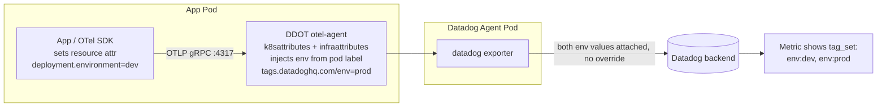

# OTLP Metrics via DDOT Collector - Duplicate `env` Tag Values on a Single Metric

**Note:** All configurations are included inline in this README for easy copy-paste reproduction. Never put API keys directly in manifests - use Kubernetes secrets.

## Context

This sandbox demonstrates why a single metric ingested through the Datadog Distribution of
OpenTelemetry (DDOT) Collector can end up with **two values for the same tag key** (e.g.
`env:prod` and `env:dev`) attached to one time series, instead of a single clean value.

Symptom customers report: querying a metric in Metrics Explorer shows a single datapoint/group
with a comma-joined tag value, e.g. `env:dev,prod`, even though "only one env" is supposedly
configured.

Root cause: the Agent/DDOT Collector **does not deduplicate or override tags coming from
different sources** for the same key - it's documented, intentional behavior. If an
application (or its OTel SDK / auto-instrumentation) sets its own `deployment.environment`
resource attribute independently of the Kubernetes-level `env` tag (injected via the
`k8sattributes`/`infraattributes` processors from a pod label), **both** values get attached to
the same metric context.

This is officially confirmed in [DataDog/datadog-agent#44483](https://github.com/DataDog/datadog-agent/issues/44483):
> "The Agent is working as designed. It collects tags from all sources and doesn't override
> them... grouping by env shows a group called `env:foo,bar`."

## Environment

- **Agent / DDOT Collector:** 7.80.1 (`datadog/datadog` Helm chart v3.229.0, `datadog.otelCollector.enabled: true`)
- **Platform:** minikube
- **Pipeline:** OTLP/gRPC (app) → DDOT `otel-agent` container → `datadog` exporter → Datadog metrics backend

## Schema



## Quick Start

### 1. Start minikube

```bash
minikube delete --all
minikube start --memory=6000 --cpus=4 --driver=docker
```

### 2. Deploy the Datadog Agent with the DDOT Collector enabled

```bash
kubectl create namespace datadog
kubectl create secret generic datadog-secret -n datadog --from-literal=api-key=YOUR_API_KEY

helm repo add datadog https://helm.datadoghq.com && helm repo update

cat <<'EOF' > values.yaml
datadog:
  operator:
    enabled: false        # skip if the datadog-operator CRDs aren't already installed cluster-wide
  apiKeyExistingSecret: datadog-secret
  site: "datadoghq.com"
  clusterName: "sandbox"
  kubelet:
    tlsVerify: false
  otelCollector:
    enabled: true          # this is what enables the DDOT / otel-agent container
  env:
    - name: DD_ENV
      value: "prod"        # agent/k8s-level env source

clusterAgent:
  enabled: false
clusterChecksRunner:
  enabled: false

agents:
  image:
    tag: 7.80.1
EOF

helm upgrade --install dd-repro datadog/datadog -n datadog -f values.yaml --wait --timeout 180s
```

### 3. Wait for ready and grab the agent pod IP

```bash
kubectl wait --for=condition=ready pod -l app=dd-repro-datadog -n datadog --timeout=180s

AGENT_IP=$(kubectl get pod -n datadog -l app=dd-repro-datadog -o jsonpath='{.items[0].status.podIP}')
echo "Agent pod IP: $AGENT_IP"
```

### 4. Deploy the metric emitter ("before" - reproduces the bug)

This simulates an app / auto-instrumentation library that sets its own `deployment.environment`
resource attribute (`dev`), independent of the agent-level `env` (`prod`):

```bash
kubectl apply -f - <<MANIFEST
apiVersion: v1
kind: ConfigMap
metadata:
  name: otlp-emitter-script
  namespace: datadog
data:
  emit_metric.py: |
    import sys, time
    from opentelemetry import metrics
    from opentelemetry.exporter.otlp.proto.grpc.metric_exporter import OTLPMetricExporter
    from opentelemetry.sdk.metrics import MeterProvider
    from opentelemetry.sdk.metrics.export import PeriodicExportingMetricReader
    from opentelemetry.sdk.resources import Resource

    endpoint = sys.argv[1]
    app_env = sys.argv[2]        # "NONE" to disable the app-level attribute
    metric_name = sys.argv[3]

    attrs = {"service.name": "otlp-emitter-sandbox", "messaging.system": "kafka"}
    if app_env != "NONE":
        attrs["deployment.environment"] = app_env   # <-- the conflicting source

    resource = Resource.create(attrs)
    exporter = OTLPMetricExporter(endpoint=endpoint, insecure=True)
    reader = PeriodicExportingMetricReader(exporter, export_interval_millis=5000)
    provider = MeterProvider(resource=resource, metric_readers=[reader])
    metrics.set_meter_provider(provider)

    counter = metrics.get_meter("otlp-emitter-sandbox").create_counter(metric_name, unit="1")
    print(f"Emitting {metric_name} to {endpoint} attrs={attrs}", flush=True)
    for _ in range(24):
        counter.add(1, {"messaging.destination.name": "orders-topic"})
        time.sleep(5)
    provider.shutdown()
---
apiVersion: batch/v1
kind: Job
metadata:
  name: otlp-emitter-before
  namespace: datadog
spec:
  backoffLimit: 0
  template:
    metadata:
      labels:
        tags.datadoghq.com/env: "prod"
        app: otlp-emitter
    spec:
      restartPolicy: Never
      containers:
        - name: emitter
          image: python:3.11-slim
          command: ["/bin/sh", "-c"]
          args:
            - |
              pip install --quiet opentelemetry-sdk opentelemetry-exporter-otlp-proto-grpc && \
              python3 /scripts/emit_metric.py "$OTEL_EXPORTER_OTLP_ENDPOINT" "dev" "sandbox.otlp.duplicate_env_tag.count"
          env:
            - name: OTEL_EXPORTER_OTLP_ENDPOINT
              value: "$AGENT_IP:4317"
          volumeMounts:
            - name: script
              mountPath: /scripts
      volumes:
        - name: script
          configMap:
            name: otlp-emitter-script
MANIFEST
```

```bash
kubectl wait --for=condition=complete job/otlp-emitter-before -n datadog --timeout=180s
```

### 5. Deploy the metric emitter ("after" - applies the workaround)

Same pod/label, but the app no longer sets its own `deployment.environment` at all - i.e.
standardize on a single source of truth for `env` (the agent/k8s-injected one). A different
metric name is used to keep the two test runs cleanly separated in the backend:

```bash
kubectl apply -f - <<MANIFEST
apiVersion: batch/v1
kind: Job
metadata:
  name: otlp-emitter-after
  namespace: datadog
spec:
  backoffLimit: 0
  template:
    metadata:
      labels:
        tags.datadoghq.com/env: "prod"
        app: otlp-emitter
    spec:
      restartPolicy: Never
      containers:
        - name: emitter
          image: python:3.11-slim
          command: ["/bin/sh", "-c"]
          args:
            - |
              pip install --quiet opentelemetry-sdk opentelemetry-exporter-otlp-proto-grpc && \
              python3 /scripts/emit_metric.py "$OTEL_EXPORTER_OTLP_ENDPOINT" "NONE" "sandbox.otlp.duplicate_env_tag_fixed.count"
          env:
            - name: OTEL_EXPORTER_OTLP_ENDPOINT
              value: "$AGENT_IP:4317"
          volumeMounts:
            - name: script
              mountPath: /scripts
      volumes:
        - name: script
          configMap:
            name: otlp-emitter-script
MANIFEST
```

## Test Commands

### Agent

```bash
kubectl exec -n datadog daemonset/dd-repro-datadog -c agent -- agent status
kubectl exec -n datadog daemonset/dd-repro-datadog -c otel-agent -- agent status 2>&1 | grep -A5 "OTel"
```

### Verify via the Metrics API (outside the Agent)

```bash
DD_API_KEY="YOUR_API_KEY"
DD_APP_KEY="YOUR_APP_KEY"
NOW=$(date +%s)
FROM=$((NOW-600))

# "before" - expect BOTH env:dev and env:prod on one series
curl -s -G "https://api.datadoghq.com/api/v1/query" \
  -H "DD-API-KEY: $DD_API_KEY" -H "DD-APPLICATION-KEY: $DD_APP_KEY" \
  --data-urlencode "from=$FROM" --data-urlencode "to=$NOW" \
  --data-urlencode "query=sum:sandbox.otlp.duplicate_env_tag.count{*} by {env}.as_count()" \
  | python3 -c "import json,sys; d=json.load(sys.stdin); print([s['tag_set'] for s in d.get('series',[])])"

# "after" - expect only env:prod
curl -s -G "https://api.datadoghq.com/api/v1/query" \
  -H "DD-API-KEY: $DD_API_KEY" -H "DD-APPLICATION-KEY: $DD_APP_KEY" \
  --data-urlencode "from=$FROM" --data-urlencode "to=$NOW" \
  --data-urlencode "query=sum:sandbox.otlp.duplicate_env_tag_fixed.count{*} by {env}.as_count()" \
  | python3 -c "import json,sys; d=json.load(sys.stdin); print([s['tag_set'] for s in d.get('series',[])])"
```

## Expected vs Actual

| Behavior | Expected | Actual (confirmed via API) |
|----------|----------|--------|
| "before" metric, app sets its own `deployment.environment=dev` while agent injects `env:prod` | Single clean `env` value | `tag_set: ["env:dev", "env:prod"]` on **one** series (`scope: "env:dev,env:prod"`) |
| "after" metric, app does not set `deployment.environment` (single source of truth) | Single clean `env` value | `tag_set: ["env:prod"]` |

### Screenshots

[Add screenshots of Metrics Explorer here - filter by `sandbox.otlp.duplicate_env_tag.count`, group by `env`, and observe the combined tag value on the graph legend]

## Fix / Workaround

Pick **one** source for `env` in the pipeline instead of letting the app and the
Agent/k8s layer both set it:

**Option A - stop the app from setting its own resource attribute** (preferred):
Remove `OTEL_RESOURCE_ATTRIBUTES=deployment.environment=...` (or any hardcoded
`deployment.environment` default in the app/SDK/auto-instrumentation config) and rely solely on
the Kubernetes/Agent-injected `env` (`tags.datadoghq.com/env` pod label → `k8sattributes` /
`infraattributes` processors).

**Option B - strip/normalize the attribute in the Collector pipeline** (if the app must set its
own resource attributes for other purposes), using a `transform` processor before the `datadog`
exporter:

```yaml
processors:
  transform/drop_app_env:
    metric_statements:
      - context: resource
        statements:
          - delete_key(attributes, "deployment.environment")

service:
  pipelines:
    metrics:
      processors: [transform/drop_app_env, batch]
      exporters: [datadog]
```

## Troubleshooting

```bash
# otel-agent (DDOT collector) logs
kubectl logs -n datadog -l app=dd-repro-datadog -c otel-agent --tail=100

# Confirm the OTLP receiver is listening
kubectl logs -n datadog -l app=dd-repro-datadog -c otel-agent | grep "otlp.*Starting"

# Emitter logs
kubectl logs -n datadog -l app=otlp-emitter --tail=50

# Describe pods / events
kubectl describe pod -n datadog -l app=dd-repro-datadog
kubectl get events -n datadog --sort-by='.lastTimestamp'
```

### No data reaching Datadog

- Confirm `datadog.otelCollector.enabled: true` is set (this is what creates the `otel-agent`
  container / OTLP receiver on ports 4317/4318).
- Confirm `OTEL_EXPORTER_OTLP_ENDPOINT` in the emitter points at the **Agent pod IP** (or a
  Service in front of it), not `localhost`.
- Check for `series payloads are disabled` warnings in `otel-agent` logs - these refer to an
  unrelated internal extension and are not a sign of failure; look for exporter-level errors
  instead.

### Metric shows up but `env` tag looks fine

Case only reproduces cleanly if both sources genuinely emit *different* values for the same
concept. If the app-level default happens to match the agent-level value, no duplicate will be
visible - this is exactly what makes the real-world version of this issue intermittent and easy
to miss.

## Cleanup

```bash
kubectl delete namespace datadog
minikube delete
```

## References

- [DataDog/datadog-agent#44483 - Duplicate tags when using both OTEL_RESOURCE_ATTRIBUTES and DD_ENV/DD_VERSION](https://github.com/DataDog/datadog-agent/issues/44483)
- [Datadog Unified Service Tagging](https://docs.datadoghq.com/getting_started/tagging/unified_service_tagging/)
- [Datadog OpenTelemetry Environment Variable Interoperability](https://docs.datadoghq.com/opentelemetry/config/environment_variable_support/)
- [Datadog Getting Started with Tags](https://docs.datadoghq.com/getting_started/tagging/)
- [DDOT Collector setup docs](https://docs.datadoghq.com/opentelemetry/setup/ddot_collector/)
